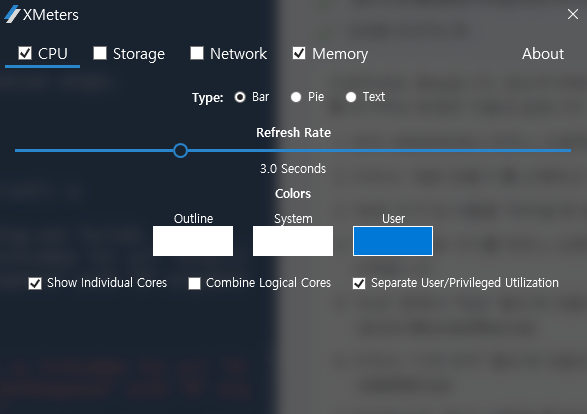
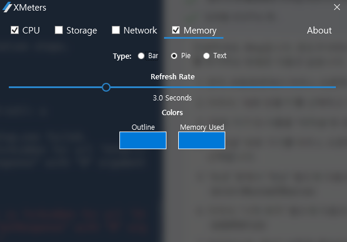
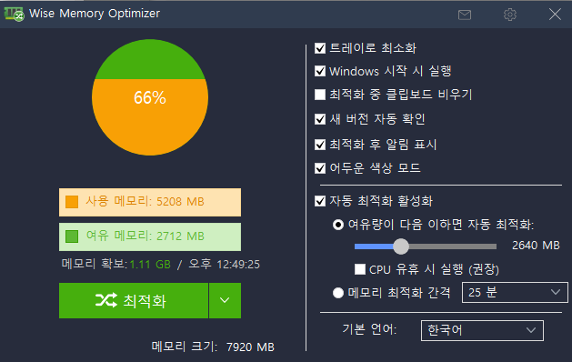
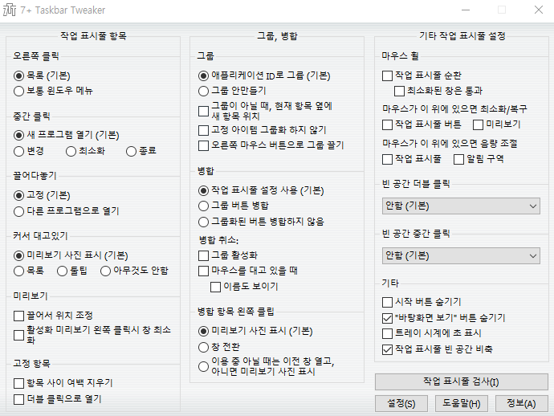
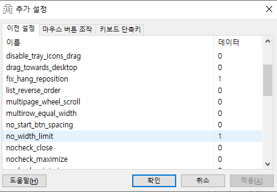
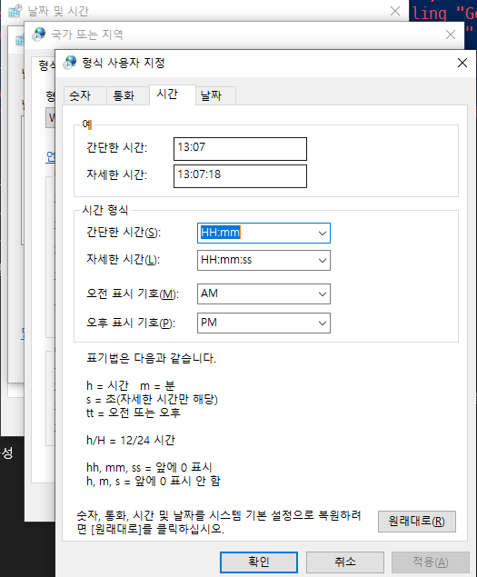
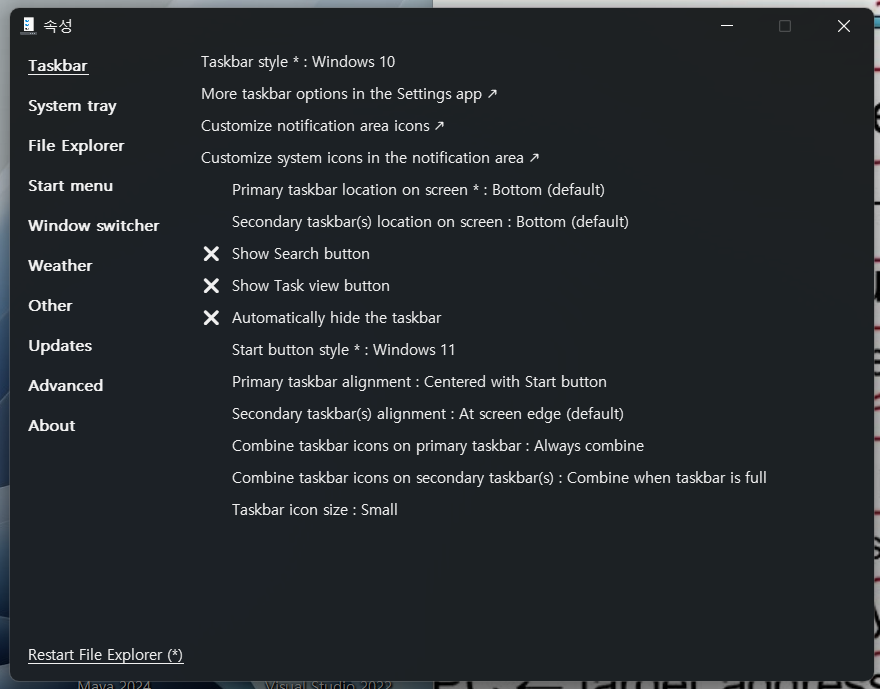

# 윈도우10 & 11 작업표시줄 꾸미기

> **Summary**
> 윈도우 10과 11의 작업표시줄을 꾸미기 위한 다양한 방법을 소개합니다. CPU 및 메모리 사용량 표시를 위한 XMeters, 메모리 최적화를 위한 Wise Memory Optimizer, 작업표시줄 커스터마이징을 위한 7+ Taskbar Tweaker, 24시간 표기 변경, 작업표시줄 오른쪽 고정 및 우클릭 메뉴 스타일 변경 방법 등이 포함되어 있습니다.

---


> 💡 **목차**
> ---
>
>

# XMeters - 작업표시줄 CPU,메모리 사용량 표시

🔗 [https://loveuceci.tistory.com/2451](https://loveuceci.tistory.com/2451)

> 💡 **XMeters 설정은 다음과 같이 설정**
> ---
>
> 
>
> 
>
>

# Wise Memory Optimizer - 메모리 최적화 프로그램

🔗 [https://www.wisecleaner.com/wise-memory-optimizer.html](https://www.wisecleaner.com/wise-memory-optimizer.html)

> 💡 **설정은 다음과 같음**
> ---
>
> 
>
>


# **7+ Taskbar Tweaker - 작업표시줄 굵기 설정 및 커스터마이징**

🔗 [https://ramensoftware.com/7-taskbar-tweaker](https://ramensoftware.com/7-taskbar-tweaker)

> 💡 **세팅정보**
> ---
>
> 
>
> 
>
>

# 윈도우 10시간 24시간 표기로 변경

🔗 [https://tttap.tistory.com/166](https://tttap.tistory.com/166)

> 💡 **위 링크를 따라 형식 사용자 지정의 시간으로 이동하여 다음 옵션 적용**
> ---
>
> 
>
>


# 윈도우 11 작업표시줄 오른쪽 고정

🔗 [https://www.itworld.co.kr/news/297307](https://www.itworld.co.kr/news/297307)

```javascript
컴퓨터\HKEY_CURRENT_USER\Software\Microsoft\Windows\CurrentVersion\Explorer\StuckRects3
```


# 윈도우 11 우클릭 윈도우10처럼

🔗 [https://naggong.tistory.com/entry/윈도우11-우클릭-메뉴-변경-방법](https://naggong.tistory.com/entry/윈도우11-우클릭-메뉴-변경-방법)


# 윈도우 11 태스크바 윈도우 10처럼

🔗 [https://github.com/valinet/ExplorerPatcher](https://github.com/valinet/ExplorerPatcher)



