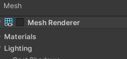
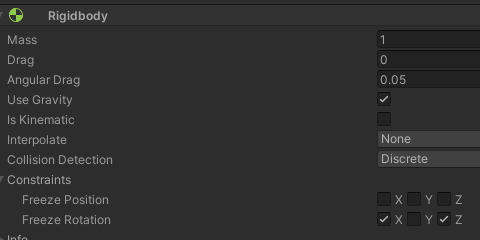
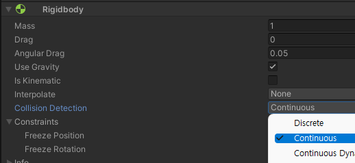
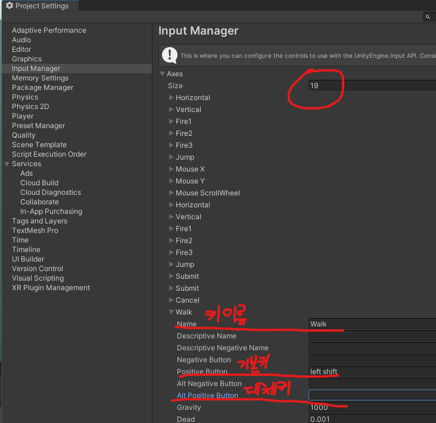
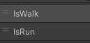
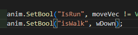
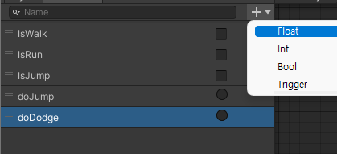

# 유니티 3D게임 쿼드뷰 01

> **Summary**
> 플레이어를 생성하고 필요한 컴포넌트인 Rigidbody와 Collider를 설정하며, Input.GetAxisRaw()를 사용하여 캐릭터의 움직임을 제어한다. Collision Detection을 Continuous로 변경하여 충돌 버그를 방지하고, LookAt() 함수를 사용하여 캐릭터가 이동 방향을 바라보게 한다. 카메라를 따라오게 만들고, bool 연산자를 사용하여 코드의 간결성을 높인다. 애니메이션 트리거 설정 시 주의가 필요하다.

---

🎥 [동영상 보기](https://www.youtube.com/watch?v=WkMM7Uu2AoA&list=PLO-mt5Iu5TeYkrBzWKuTCl6IUm_bA6BKy&index=1)

플레이어를 생성하고 기본적으로 필요한 컴포넌트들은

`Rigidbody`

`Collider`








> 🔥 ****캐릭터 움직이는 코드****
> ## `Input.GetAxisRaw()`
>
> - Axis 값을 정수로 반환하는 함수
> - 0 / 1 반환
>
> ## `moveVec = new Vector3(hAxis,0,vAxis).normalized;`
>
> - normalized는 방향값을 1로 고정함
>


## 입력 키 추가

> 🔥 **Edit - Project Settings - Input Manager**




> 🔥 **버그 뒤지게나서 뭔가했더니 역시나 대소문자 이슈였음**
> 
>
> 
>
>
>

> 🔥 **걸을땐 속도 느려지게**
> ```c#
> //걸을땐 느리게
>         transform.position += moveVec * speed * (wDown ? 0.3f : 1f) * Time.deltaTime;
> ```
>
> 삼항연산자 이용해서 wDown이 트루일때는 0.3을 곱해서 느리게
>
>

> 🔥 **`LookAt()` 이용해서 캐릭터 로테이션**
> 일단 LookAt()은 지정된 벡터를 향해서 회전시켜주는 함수
>
> ```c#
> transform.LookAt(transform.position + moveVec);
> ```
>
> 나아가는 방향으로 바라볼거라는 뜻
>
>

> 🔥 **카메라 따라오게만들기**
> 카메라에 스크립트 만든다음에 해당코드 작성
>
> ```c#
> public class Follow : MonoBehaviour
> {
>     public Transform target;
>     public Vector3 offset;
>     void Update()
>     {
>         //해당 스크립트는 타겟의 포지션에 오프셋을 더한 값이다
>         transform.position = target.position + offset;
>     }
> }
> ```
>
>

🎥 [동영상 보기](https://www.youtube.com/watch?v=eZ8Dm809j4c&list=PLO-mt5Iu5TeYkrBzWKuTCl6IUm_bA6BKy&index=3)

> 🔥 **bool 연산자 사용시에 할 수 있는 문법**
> ## `!bool`
>
> 변수내부에 연산자의 반대값일때 라는 뜻
>
> 굳이 if (bool == true)
>
> 이런식으로 true 혹은 falus를 입력해주지 않아도 된다
>
>

> 🔥 **실수다… 왜 애니메이션이 안뜨나 했더니 Trigger로 생성해야할걸 bool로 생성했다**
> 
>
>

