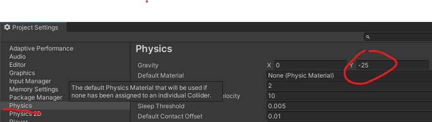
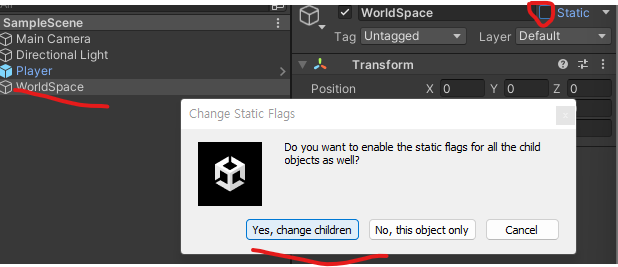
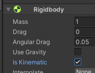
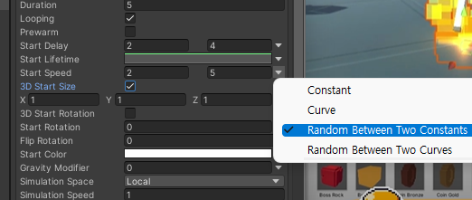
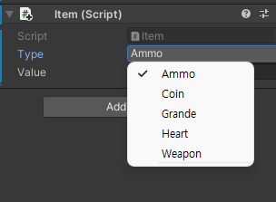

# 유니티 3D게임 쿼드뷰 02

> **Summary**
> 중력 설정, 물리 충돌 강화, 특정 시간 후 함수 실행, 회피 구현, 아이템 제작 및 열거형 사용 방법에 대한 설명이 포함되어 있다. 파티클 시스템의 설정과 아이템 코드 선언부도 다루고 있다.

---

🎥 [동영상 보기](https://www.youtube.com/watch?v=eZ8Dm809j4c&list=PLO-mt5Iu5TeYkrBzWKuTCl6IUm_bA6BKy&index=3)

> 🔥 **중력설정방법**
> Edit - Project Settings - Physics
>
> 
>
>

> 🔥 **물리충돌 강화방법 - 충돌 들어있는 그룹 스태틱으로 전환 후 자식들까지 적용**
> 
>
> 컨티뉴스를 제대로 사용하기 위해서 부딪히는상태를 정적으로해둬야 제대로 작동한다
>
> 
>
> 또한 WorldSpace에 충돌을 위한 리지드바디를 추가해주고 중력값을 받지 않게하기위해서 Use Gravity를 꺼주고 Is Kinematic 을 켜준다
>
>
>

> 🔥 **유니티에서 특정시간을 두고 함수를 실행시키는 메소드**
> `Invoke("실행함수이름 문자열로",시간f);`
>
>

> 🔥 **`moveVec == Vector3.zero`**
> 가만히 있을때만 실행되게 하는 코드
>
> moveVec 내부에는
>
> `moveVec = new Vector3(hAxis,0,vAxis).normalized;`
>
> 플레이어의 방향값을 포함하고있으며
>
> ```c#
> void Dodge()
>     {
>         if(jDown && moveVec != Vector3.zero && !isJump && !isDodge)
>         {
>             speed *= 2;
>             anim.SetTrigger("doDoge");
>             isDodge = true;
>
>             Invoke("DogeOut",0.4f); //함수이름을 문자열로 저장해줘야한다
>         }
>     }
> ```
>
> 비교연산자를 활용하여 점프가 눌린상태이고 방향키가 입력되지 않았으며 점프상태가 아니며 닷지상태가 아닐때만 닷지가 작동된다는 뜻
>
>

> 🔥 **닷지중에 방향전환 차단**
> ```c#
> void Move()
>     {
>         moveVec = new Vector3(hAxis,0,vAxis).normalized;
>
>         **//혹시 지금 닷지중입니까?
>         //닷지를 했을때 dodgeVec에 moveVec이 담겨서 방향값이 고정된다
>         if(isDodge)
>             moveVec = dodgeVec;**
>
>         //걸을땐 느리게
>         transform.position += moveVec * speed * (wDown ? 0.3f : 1f) * Time.deltaTime;
>         anim.SetBool("IsRun", moveVec != Vector3.zero); // 0,0,0만 아니면 isRun을 받는다
>         anim.SetBool("IsWalk", wDown);
>     }
>
> void Dodge()
>     {
>         if(jDown && moveVec != Vector3.zero && !isJump && !isDodge)
>         {
>             **//방향전환을 막기위해서
>             //현재 방향값을 받아온다
>             dodgeVec = moveVec;**
>             speed *= 2;
>             anim.SetTrigger("doDodge");
>             isDodge = true;
>
>             Invoke("DodgeOut",0.4f); //함수이름을 문자열로 저장해줘야한다
>         }
>     }
> ```
>
> 닷지를할때 moveVec값을 받아와서 직전 방향을 받아온 후 Move에서 닷지상태일경우에는 고정된 방향을 그대로 사용하게 moveVec값을 받아온다
>
>

🎥 [동영상 보기](https://youtu.be/u2DLOay5oO8)

> 🔥 **아이템제작**
> > 🔥 **프리팹 내부에서 Create Empty 후 컴포넌트에서 파티클시스템 추가 후 내부 옵션 설정**
>
> - Emmision - 파티클 양
> - Render - 파티클 머터리얼 설정 가능
> - Shape - 파티클 모양 설정가능
> - ColorOverLifetime - 시간에따른 파티클 색상변화
> - SizeOverLifetime - 시간에따른 파티클 크기변화
> - LimitVelocityOverLifetime - 시간에따른 파티클 속도변화
> - StartLifeTime - 파티클 생존 시간
> - Start Speed 에서 토글눌러서 랜덤값도 추가 가능
> 
>
>

> 🔥 **아이템 코드선언부**
> > 🔥 **`enum` = 열거형 상수를 표현하기위한것**
> > **상수 숫자들을 보다 의미있는 단어들로 표현**
> > 할 수 있어서 프로그램을 읽기 쉽게 해준다.
> >
> > 
> >
> >
>
> ```c#
> public class Item : MonoBehaviour
> {
>     //enum은 타입일뿐, 해당 인덱스에 값을 담기위해 변수를 지정해줘야한다
>     public enum Type {Ammo, Coin, Grande, Heart, Weapon};
>     //enum의 Type을 받기위한 type변수 선언
>     public Type type;
>     public int value;
>
> }
> ```
>
>

