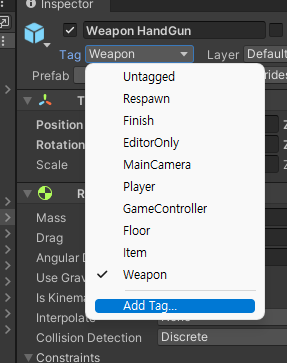
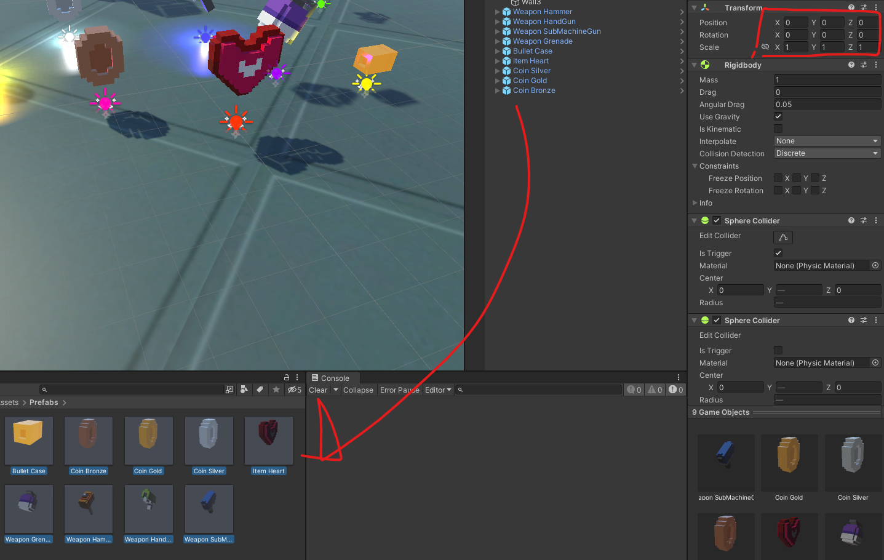
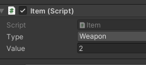
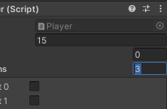

# 유니티 3D게임 쿼드뷰 03

> **Summary**
> 프리팹 태그 설정과 무기 선택 후 애니메이션 작업에 대한 설명. 아이템 종류에 맞춰 플레이어 변수 설정, 무기 스왑 및 선택 코드 작성, 애니메이션 실행 시 무기 유무 체크를 포함한 코드 예시 제공.

---

🎥 [동영상 보기](https://youtu.be/u2DLOay5oO8)

> 🔥 **프리팹 만들고 나서 태그를 추가해서 enum으로 지정한 값과 Tag값을 둘 다 설정해줘야합니다 굳이 따지자면 Tag가 더 상위의 개념이 아닐까**
> 
>
>

> 🔥 **프리팹 만들고 나서 꼭 포지션을 000 으로 바꿔주세요**
> 
>
>

🎥 [동영상 보기](https://www.youtube.com/watch?v=APS9OY_p6wo&t=423s)

> 🔥 **아이템이 3종류니까 플레이어 퍼블릭 변수도 인덱스 길이를 제대로 설정해줘야 오류가 나지 않습니다**
> ```c#
> public GameObject[] Weapons; //player.cs 에 public변수 설정
> ```
>
> 
>
> 
>
>

> 🔥 **아이템 스왑 및 무기선택 코드 작성**
> ```c#
> public GameObject[] Weapons; //게임오브젝트를 받는 배열 게임 모델을 배열안에 넣을 수 있음
> public bool[] hasWeapons; //무기를 가지고있는지 아닌지 확인하는 배열
>
> bool sDown1; //아이템변경(swuap) 이 눌렸냐? 1
> bool sDown2; //아이템변경(swuap) 이 눌렸냐? 2
> bool sDown3; //아이템변경(swuap) 이 눌렸냐? 3
>
> void Swap()
>     {
>         int weponIndex = -1; //weaponIndex 기본값은 -1 즉 없는값 입니다
>         if (sDown1) weponIndex = 0; // 1번이 눌린다면 weaponIndex는 0의 값을 가집니다
>         if (sDown2) weponIndex = 1;
>         if (sDown3) weponIndex = 2;
>
>         if((sDown1 || sDown2 || sDown3) && !isJump && !isDodge) //1 2 3 키 중 하나만 눌린 상태이고 점프와 회피상태가 아닐떄 실행됩니다
>         {
>             //게임오브젝트[] Weapons 값은 위에서 if로 weaponIndex을 받아오고 해당 오브젝트를 활성화시켜 보이게합니다
>             Weapons[weponIndex].SetActive(true);
>         }
>     }
> ```
>
> > 🔥 **새로운 무기를 얻으면 기존무기를 off합시다 중복으로 못들게**
> > ```javascript
> > void Swap()
> >     {
> >         int weaponsIndex = -1; //weaponsIndex 기본값은 -1 즉 없는값 입니다
> >         if (sDown1) weaponsIndex = 0; // 1번이 눌린다면 weaponsIndex는 0의 값을 가집니다
> >         if (sDown2) weaponsIndex = 1;
> >         if (sDown3) weaponsIndex = 2;
> >
> >         if((sDown1 || sDown2 || sDown3) && !isJump && !isDodge) //1 2 3 키 중 하나만 눌린 상태이고 점프와 회피상태가 아닐떄 실행됩니다
> >         {
> >             **//처음시작하면 손에 아무것도 없는 Null상태기 때문에 false를 하면 에러가뜬다
> >             //고로 비어있는상태가 아닐때만 현재 쥐고있는 무기를 off하는 코드작성
> >             if(equipweapon != null)
> >             {
> >                 equipweapon.SetActive(false); //현재 활성화중인 무기를 안보이게
> >             }
> >             equipweapon = Weapons[weaponsIndex];
> >             //게임오브젝트[] Weapons 값은 위에서 if로 weaponsIndex을 받아오고 해당 오브젝트를 활성화시켜 보이게합니다
> >             equipweapon.SetActive(true);**
> >         }
> >     }
> > ```
> >
> >
>
>

> 🔥 **무기가 없는데 애니메이션이 실행되어버리는 현상**
> ```c#
> if (sDown1 && hasWeapons[0] == true) weaponsIndex = 0;
> if (sDown2 && hasWeapons[1] == true) weaponsIndex = 1;
> if (sDown3 && hasWeapons[2] == true) weaponsIndex = 2;
> ```
>
> 연산자 때려박아서 사용함 근데 이러면 계속 인덱스 에러가 뜨는데..
>
> ```c#
> int equipweaponIndex = -1;
>
> void Swap()
>     {
>         if(sDown1 && (!hasWeapons[0] || equipweaponIndex == 0)) **return;**
>         if(sDown2 && (!hasWeapons[1] || equipweaponIndex == 1)) **return;**
>         if(sDown3 && (!hasWeapons[2] || equipweaponIndex == 2)) **return;
> //스왑버튼이 눌려있고 무기를 가지고있지 않거나 현재 무기 인덱스가 해당무기를 가지고 있을때 리턴시켜서 함수를 종료시킨다**
>
>         int weaponsIndex = -1; //weaponsIndex 기본값은 -1 즉 없는값 입니다
>         if (sDown1) weaponsIndex = 0;
>         if (sDown2) weaponsIndex = 1;
>         if (sDown3) weaponsIndex = 2;
>
>         if((sDown1 || sDown2 || sDown3) && !isJump && !isDodge) //1 2 3 키 중 하나만 눌린 상태이고 점프와 회피상태가 아닐떄 실행됩니다
>         {
>             //처음시작하면 손에 아무것도 없는 Null상태기 때문에 false를 하면 에러가뜬다
>             //고로 비어있는상태가 아닐때만 현재 쥐고있는 무기를 off하는 코드작성
>             if(equipweapon != null) equipweapon.SetActive(false);
>
>             equipweaponIndex = weaponsIndex;
>             equipweapon = Weapons[weaponsIndex];
>             //게임오브젝트[] Weapons 값은 위에서 if로 weaponsIndex을 받아오고 해당 오브젝트를 활성화시켜 보이게합니다
>             equipweapon.SetActive(true);
>             isSwap = true;
>
>             anim.SetTrigger("doSwap");
>             Invoke("SwapOut",0.4f); //0.4초뒤에 isSwap을 다시 false로 되돌린다
>         }
>     }
> ```
>
> 리턴을 활용해서 아예 코드를 끝내버린다
>
>

