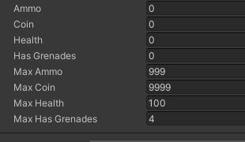
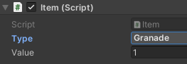
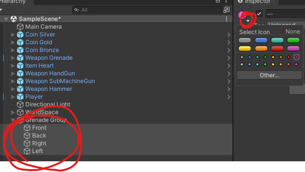

# 유니티 3D게임 쿼드뷰 04

> **Summary**
> 아이템 입수, 잔상효과 파티클 생성, 수류탄 회전 기능 구현에 대한 내용. 플레이어의 아이템 저장 변수 생성 및 아이템 수치 변경 함수 제작, 수류탄 태그 수정, 잔상효과를 위한 파티클 위치 변화 설정, Orbit.cs를 통한 수류탄 공전 구현 등이 포함되어 있습니다.

---

🎥 [동영상 보기](https://www.youtube.com/watch?v=esGkgvm9eSg&list=PLO-mt5Iu5TeYkrBzWKuTCl6IUm_bA6BKy&index=5)

> 🔥 **플레이어 아이템 저장할 변수 생성**
> ```c#
> 		//플레이어에게 탄약 동전 체력 수류탄 변수를 생성
>     public int ammo;
>     public int coin;
>     public int health;
>     public int hasGrenades;
>     //아이템의 최대 보유수를 한정시킬 변수 생성
>     public int maxAmmo;
>     public int maxCoin;
>     public int maxHealth;
>     public int maxHasGrenades;
> ```
>
> 
>
>

> 🔥 **아이템을 먹었을때 수치가 변경되도록 함수제작**
> ```c#
> void OnTriggerEnter(Collider other)
>     {
>         if(other.tag == "Item")
>         {
>             //Item 태그에 있는 다른 컴포넌트를 받아온다
>             Item item = other.GetComponent<Item>();
>             switch(item.type)
>             {
>                 case Item.Type.Ammo:
>                     ammo += item.value; //아이템의 밸류값을 ammo에 넣는다
>                     if (ammo > maxAmmo) //만약 최대치를 넘는다면 최대치로 고정
>                         ammo = maxAmmo;
>                     break;
>                 case Item.Type.Coin:
>                     coin += item.value;
>                     if (coin > maxCoin)
>                         coin = maxCoin;
>                     break;
>                 case Item.Type.Heart:
>                     health += item.value;
>                     if (health > maxHealth)
>                         health = maxHealth;
>                     break;
>                 case Item.Type.Granade:
>                     break;
>             }
>         }
>     }
> ```
>
> > 🔥 **수류탄을 먹어도 아이템이 먹어지지않고 아이템도 사라지지않는 현상은 내가 수류탄의 태그를 웨폰으로해뒀기 떄문에 `other,tag == “Item”` 코드가 작동하지 않았던것 또, 타입도 Granade로 변경해줘야한다**
> > 
> >
> > 
> >
> >
>
>

> 🔥 **Null Empty 에서 아이콘을 추가해줄수있다**
> 
>
>
>

> 🔥 **Rate of Distance : 파티클 위치변화에 따라 입자 생성 (잔상효과)

그리고 Simulation Space에서 World로 설정해서 잔상효과처럼 만듭니다**
> 
>
> 
>
>

> 🔥 **수류탄 회전을 위한 Orbit.cs 를 생성하고 수류탄 오브젝트단위의 최상위 어미에 스크립트 할당 ( Front / Back / Right / Left )**
>
> Orbit.cs 에서 타겟을 퍼블릭으로 설정해서 파일을 넣을수 있게만든 다음에 유니티 내부에서 플레이어 프리팹을 target 안에 넣는다 
>
> ```c#
> public class Orbit : MonoBehaviour
> {
>     public Transform target; //수류탄이 공전할 중심 설정
>     public float orbitSpeed; //수류탄 공전 속도
>     Vector3 offset; //플레이어와 수류탄 사이의 거리를 계산할 고정값
>
>     // Update is called once per frame
>     void Update()
>     {
>         //RotateAround 를 사용하여 특정 개체를 중심으로 물체를돌게할 수 있다
>         transform.RotateAround(target.position, //타겟의 포지션을 중심으로 
>                                 Vector3.up, //z축이 움직이고
>                                 orbitSpeed * Time.deltaTime); //회전하는 수치는 델타타임 적용
>     }
> ```
>
> 
>
> ```c#
> //Player.cs
>
> case Item.Type.Granade:
> 	  **grenades[hasGrenades].SetActive(true);**
> 	  hasGrenades += item.value;
> 	  if (hasGrenades > maxHasGrenades)
> 	      hasGrenades = maxHasGrenades;
> 	  break;
> ```
>
> 그 후에 OntriggerEnter() 내부에서 수류탄 먹었을때 수류탄이 보이도록 코드입력
>
>

