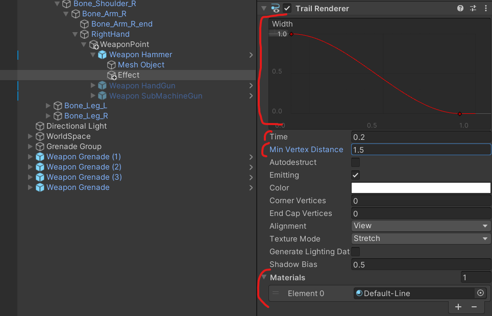
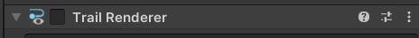
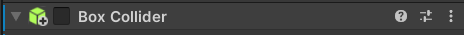
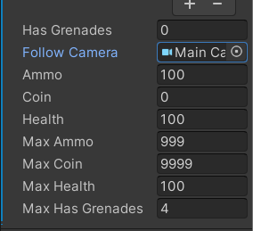

# 유니티 3D게임 쿼드뷰 05

> **Summary**
> UI 크기 조정, 무기 잔상 효과, 코루틴 함수와 IEnumerator 사용법, 마우스 방향 공격 및 Raycast 활용법에 대한 설명이 포함되어 있으며, 무기 설정, 공격 및 재장전 코드와 관련된 다양한 예시가 제공된다.

---

🎥 [동영상 보기](https://www.youtube.com/watch?v=afPF_fOOG68)

🎥 [동영상 보기](https://www.youtube.com/watch?v=Zfoyagdz1y0&list=PLO-mt5Iu5TeYkrBzWKuTCl6IUm_bA6BKy&index=6)

> 🔥 **무기기본설정 코드**
> ```c#
> //Weapon.cs
> //무기정보 변수설정
>     public enum Type { Melee, Range }; //근거리/원거리 열거형으로 무기타입
>     public Type type; //실제 무기 타입이 저장될 변수 (enum에서 설정한 타입이 type에 저장)
>     public int damage;
>     public float rate; //공속
>     public BoxCollider meleeArea; //공격범위를 콜라이더로 설정
>     public TrailRenderer trailEffect; //무기 휘두르는 효과
> ```
>
> 
>
> 
>
>

> 🔥 **근접공격 잔상효과를 만들기 위해서 웨폰포인트에 Effect Empty를 설정해두고 Trail Renderer 컴포넌트를 추가해준다**
> 
>
> 
>
> 
>
> 
>
> 그리고 Trail 렌더하고 Box 콜라이더도 Off 시켜준다
>
>

> 🔥 ****코루틴 함수 / Ienumerator 은 yield 를 포함하고있어야한다****
>
> Yield 키워드를 여러개 사용하여 시간차 로직 작성이 가능함
>
>
> > **일반함수 **: Use() 함수를 메인루트라고할때 Swing()이라는 함수를 호출하면 서브루틴이라고 한다
> ** 코루틴함수 **: Use() 메인함수와 Swing()코루틴이 동시에 실행된다
>
> ```c#
> IEnumerator Swing()
>     {
>         //yield 결과를 전달하는 함수
>         yield return null;
>     }
> ```
>
>

> 🔥 **코루틴 함수는 사용할때 `StartCoroution(”함수이름”);` 로 사용해야한다**
> ```c#
> public void Use()
>     {
>         //현재 타입의 무기타입이 근접무기라면
>         if(type == Type.Melee)
>         {
>             StopCoroutine("Swing");
>             StartCoroutine("Swing");
>         }
>     }
>
>     IEnumerator Swing()
>     {
>         //yield 결과를 전달하는 함수
>
>         //1번 구역 실행
>         yield return new WaitForSeconds(0.1f); // 0.1초 대기
>         //2번 구역 실행
>
>         //break로 코루틴 탈출 가능
>         yield break;
>     }
> ```
>
>

> 🔥 **그리고 Player.cs 에 있던 코드도 Weapon에 맞춰 변경(볼드체 해둔 코드 추가)**
> ```c#
> **Weapon **equipweapon; //장착하고있는 무기의 메쉬 //Weapon.cs의 클래스를 사용해야하기 때문
>
> void Swap()
>     {
>         if(sDown1 && (!hasWeapons[0] || equipweaponIndex == 0)) return;
>         if(sDown2 && (!hasWeapons[1] || equipweaponIndex == 1)) return;
>         if(sDown3 && (!hasWeapons[2] || equipweaponIndex == 2)) return;
>         //스왑버튼이 눌려있고 무기를 가지고있지 않거나 현재 무기 인덱스가 해당무기를 가지고 있을때 리턴시켜서 함수를 종료시킨다
>
>         int weaponsIndex = -1; //weaponsIndex 기본값은 -1 즉 없는값 입니다
>         if (sDown1) weaponsIndex = 0;
>         if (sDown2) weaponsIndex = 1;
>         if (sDown3) weaponsIndex = 2;
>
>         if((sDown1 || sDown2 || sDown3) && !isJump && !isDodge) //1 2 3 키 중 하나만 눌린 상태이고 점프와 회피상태가 아닐떄 실행됩니다
>         {
>             //처음시작하면 손에 아무것도 없는 Null상태기 때문에 false를 하면 에러가뜬다
>             //고로 비어있는상태가 아닐때만 현재 쥐고있는 무기를 off하는 코드작성
>             if(equipweapon != null) equipweapon**.gameObject**.SetActive(false);
>
>             equipweaponIndex = weaponsIndex;
>             equipweapon = Weapons[weaponsIndex]**.GetComponent<Weapon>();**
>             //게임오브젝트[] Weapons 값은 위에서 if로 weaponsIndex을 받아오고 해당 오브젝트를 활성화시켜 보이게합니다
>             equipweapon**.gameObject**.SetActive(true);
>             isSwap = true;
>
>             anim.SetTrigger("doSwap");
>             Invoke("SwapOut",0.4f); //0.4초뒤에 isSwap을 다시 false로 되돌린다
>         }
>     }
>
> void Move()
>     {
>         moveVec = new Vector3(hAxis,0,vAxis).normalized;
>
>         //혹시 지금 닷지중입니까?
>         //닷지를 했을때 dodgeVec에 moveVec이 담겨서 방향값이 고정된다
>         if(isDodge)
>             moveVec = dodgeVec;
>
>         if(isSwap** || !isFireReady**) //공격할땐 못움직이게
>             moveVec = Vector3.zero;
>
>         //걸을땐 느리게
>         transform.position += moveVec * speed * (wDown ? 0.3f : 1f) * Time.deltaTime;
>         anim.SetBool("IsRun", moveVec != Vector3.zero); // 0,0,0만 아니면 isRun을 받는다
>         anim.SetBool("IsWalk", wDown);
>     }
> ```
>
> ```c#
> void Attack()
>     {
>         //공격하기위해선 일단 손에 무기가 있는지부터 확인 무기 없으면(null) 나가~
>         if(equipweapon == null)
>             return;
>
>         fireDelay += Time.deltaTime; //공격 딜레이에 시간을 더해주고 공격가능 여부 확인
>         isFireReady = equipweapon.rate < fireDelay; //공격속도보다 파이어딜레이가 크면 true가 저장된다
>
>         if(fDown && isFireReady && !isDodge && !isSwap)
>         {
>             equipweapon.Use(); //Weapon.cs 내부에 Use() 함수 실행
>             anim.SetTrigger("doSwing");
>             fireDelay = 0;
>         }
>     }
> ```
>
>

🎥 [동영상 보기](https://www.youtube.com/watch?v=07q9RUTRq4M)

> 🔥 **총알이 바닥에 닿았을 때 물리충돌설정 (Rigidbody / Collider 는 기본으로 설정해두고)**
> ```c#
> //Bullet.cs
>
> public class Bullet : MonoBehaviour
> {
>     public int damage;
>
>     void OnCollisionEnter(Collision collision)
>     {
>         if(collision.gameObject.tag == "Floor")
>         {
>             Destroy(gameObject, 3);
>         }
>         else(collision.gameObject.tag == "Wall")
>         {
>             Destroy(gameObject);
>         }
>     }
> }
> ```
>
>

> 🔥 **재장전 코드**
> ```c#
> void Reroad()
>     {
>         if (equipweapon == null)
>             return;
>         if (equipweapon.type == Weapon.Type.Melee)
>             return;
>         if (ammo == 0)
>             return;
>
>         if(rDown && !isJump && !isDodge && !isSwap &&!isFireReady && moveVec != Vector3.zero)
>         {
>             anim.SetTrigger("doReload");
>             isReroad = true;
>             Invoke("ReloadOut",0.5f);
>         }
>     }
>
>     void ReloadOut()
>     {
>         //보유총알이 총의 최대탄창보다 적으면 장전해도 그대로 보유총알 아니라면 보유총알의 최대탄차안큼 저장된다
>         int reAmmo = ammo < equipweapon.maxAmmo ? ammo : equipweapon.maxAmmo;
>         equipweapon.curAmmo = reAmmo;
>         ammo -= reAmmo; //보유총알에서 장전하는 값을 계속해서 뺀다
>         isReroad = false;
>     }
> ```
>
> > 보유총알이 총의 최대탄창보다 적으면 장전해도 그대로 보유총알 아니라면 보유총알의 최대탄차안큼 저장된다 
>
> ```c#
> void Move()
>     {
>         moveVec = new Vector3(hAxis,0,vAxis).normalized;
>
>         //혹시 지금 닷지중입니까?
>         //닷지를 했을때 dodgeVec에 moveVec이 담겨서 방향값이 고정된다
>         if(isDodge)
>             moveVec = dodgeVec;
>
>         if(isSwap || !isFireReady || **!isReroad**)
>             moveVec = Vector3.zero;
>
>         //걸을땐 느리게
>         transform.position += moveVec * speed * (wDown ? 0.3f : 1f) * Time.deltaTime;
>         anim.SetBool("IsRun", moveVec != Vector3.zero); // 0,0,0만 아니면 isRun을 받는다
>         anim.SetBool("IsWalk", wDown);
>     }
> ```
>
>

> 🔥 **마우스 방향으로 공격**
> ```c#
> //player.cs
>
> public Camera followCamera;
> ```
>
> 
>
> > 🔥 **What is Raycast?**
> > > 레이캐스트는 광선을 쏘는 것을 의미합니다. 여기서는
> >
> > 
> >
> > ```c#
> > //player.cs
> >
> > void Turn()
> >     {
> >         //#1 키보드에 의해 결정되는 시점
> >         transform.LookAt(transform.position + moveVec);
> >         //#2 마우스에 의해 결정되는 시점
> >         **Ray ray = followCamera.ScreenPointToRay(Input.mousePosition); //스크린에서 월드로 Ray를 쏘는 함수
> >         RaycastHit rayHit;
> >         if(Physics.Raycast(ray, out rayHit, 100))**
> >         {
> >
> >         }
> >     }
> > ```
> >
> >
>
>

🎥 [동영상 보기](https://www.youtube.com/watch?v=dynN70kyD9A&list=PLO-mt5Iu5TeYkrBzWKuTCl6IUm_bA6BKy&index=8)

> 🔥 **리지드바디끼리 부딪혀서 플레이어가 자동으로 회전하는 현상 픽스**
> Transform이동이기때문에 Rigidbody를 제어할 수 없어서 따로 제작해줘야한다
>
> `Player.cs `에서 수정하도록 한다
>
> ```c#
> void FreezeRotation()
> {
>     //angularVelocity = 물리 회전 속도
>     //Update() 안에 넣어 매프레임 FreezeRotations()을 호출하여 물리회전속도를 0으로 초기화시켜 회전을 막는다
>     rigid.angularVelocity = Vector3.zero;
> }
>
> void FixedUpdate() 
> {
>     FreezeRotation();
> }
> ```
>
>
> 또한, 충돌 레이어 또한 설정해줘야한다 다른 리지드바디와 충돌했기 때문이기에 레이어를 다르게한다
>
> 
>
> 
>
>
> Edit - ProjectSettings - Physics - Layer Collision Matrix
>
> 
>
>

> 🔥 **벽관통 해결 또한 Ray를 활용한다**
> ```javascript
> void StopToWal()
>     {
> 				//DrawRay는 씬 내에서 Ray를 시각적으로 보여주는 함수이다
>         **Debug.DrawRay(transform.position, transform.forward * 5/*Ray의 길이*/,Color.green);
>     }**
>
>     void FixedUpdate() 
>     {
>         FreezeRotation();
>         **StopToWal();**
>     }
> ```
>
> 
>
> ```c#
> bool isBorder; //벽과 닿았나 안닿았나?
>
>
> ```
>
>

