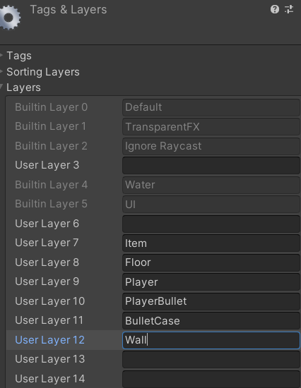
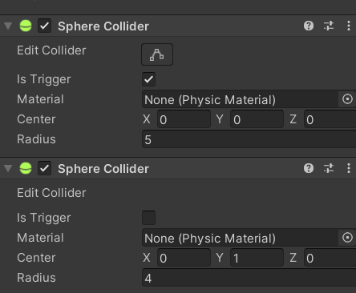
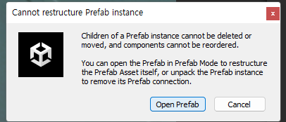

# 유니티 3D게임 쿼드뷰 06

> **Summary**
> 자동회전 오류를 수정하고 레이캐스트를 시각적으로 표시하며 아이템과 플레이어 간의 충돌을 방지하는 방법을 설명합니다. Rigidbody를 제어하기 위해 FreezeRotation 함수를 사용하고, Ray를 활용하여 벽 관통 문제를 해결합니다. 아이템의 물리적 상호작용을 조정하기 위해 콜라이더의 순서를 변경하는 방법도 포함되어 있습니다.

---

🎥 [동영상 보기](https://www.youtube.com/watch?v=dynN70kyD9A&list=PLO-mt5Iu5TeYkrBzWKuTCl6IUm_bA6BKy&index=8)

> 🔥 **리지드바디끼리 부딪혀서 플레이어가 자동으로 회전하는 현상 픽스**
> Transform이동이기때문에 Rigidbody를 제어할 수 없어서 따로 제작해줘야한다
>
> `Player.cs `에서 수정하도록 한다
>
> ```c#
> void FreezeRotation()
> {
>     //angularVelocity = 물리 회전 속도
>     //Update() 안에 넣어 매프레임 FreezeRotations()을 호출하여 물리회전속도를 0으로 초기화시켜 회전을 막는다
>     rigid.angularVelocity = Vector3.zero;
> }
>
> void FixedUpdate() 
> {
>     FreezeRotation();
> }
> ```
>
>
> 또한, 충돌 레이어 또한 설정해줘야한다 다른 리지드바디와 충돌했기 때문이기에 레이어를 다르게한다
>
> 
>
> 
>
>
> Edit - ProjectSettings - Physics - Layer Collision Matrix
>
> 
>
>

> 🔥 **벽관통 해결 또한 Ray를 활용한다**
> ```javascript
> void StopToWal()
>     {
> 				//DrawRay는 씬 내에서 Ray를 시각적으로 보여주는 함수이다
>         **Debug.DrawRay(transform.position, transform.forward * 5/*Ray의 길이*/,Color.green);
>     }**
>
>     void FixedUpdate() 
>     {
>         FreezeRotation();
>         **StopToWal();**
>     }
> ```
>
> 
>
> ```c#
> bool isBorder; //벽과 닿았나 안닿았나?
>
>
> ```
>
>

> 🔥 **아… Layer 가 아니라 Tag 설정을 해서 코드가 실행이 안된거구나**
> 
>
>

> 🔥 **무기랑 플레이어랑 안부딪히게 - 리지드바디를 땅에 닿았을때 작용하지 않도록 만든다**
> ```c#
> //Item.cs
>
> Rigidbody rigid;
> SphereCollider sphereCollider;
>
> void Awake()
>     {
>         rigid = GetComponent<Rigidbody>();
>         sphereCollider = GetComponent<SphereCollider>();
>     }
>
> void OnCollisionEnter(Collision collision)
>     {
>         if(collision.gameObject.tag == "Floor")
>         {
>             rigid.isKinematic = true; //외부 물리효과에 의해서 움직일 수 없게 변경
>             sphereCollider.enabled = false;
>         }
>     }
> ```
>
> # “근데 아이템에 스피어 콜라이더는 두갠데예?”
>
> > 🔥 **GetCompnent() 쓰면 첫번째 컴포넌트만 가져온다 고로 첫번째에있는(위에있는) 콜라이더 정보를 가져온다 그래서 <u>**물리를 담당하는 콜라이더가 상위에 있어야하고**</u>, 아이템 충돌을 감지하는 콜라이더가 아래있어야한다**
> > 
> >
> >
>
> # “Is Trigger가 상위에 있는데, 이거 어케내림?”
>
> > 🔥 **우클릭 눌러서 Move Up 시켜주면 Open Prefab 뜨는데 거기서 Move Up 시켜주면 된다**
> > 
> >
> > 
> >
> > 오픈 프리팹 들어가서 다시 Move up
> >
> >
>
>

