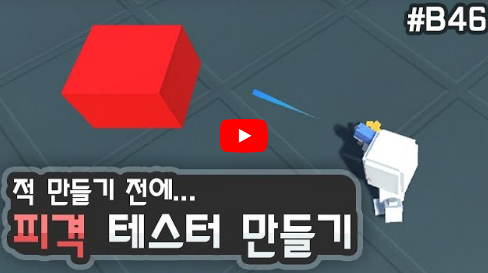

# 유니티 3D게임 쿼드뷰 07

> **Summary**
> 피격받을 몬스터를 생성하고, 몬스터 사망 후 피격 판정을 받지 않게 설정하는 방법에 대한 설명. 스크립트에서 머터리얼을 불러오는 방법과 피격 처리 로직을 포함한 코드 예시 제공.

---



🎥 [동영상 보기](https://www.youtube.com/watch?v=IoaPxcSHwEM&list=PLO-mt5Iu5TeYkrBzWKuTCl6IUm_bA6BKy&index=9)

> 🔥 **스크립트에서 머터리얼 불러올땐 그냥 GetComponent만 하면 안된다 MeshRenderer를 불러와서 material을 따로 불러와야함**
> ```c#
> //Enemy.cs
>
> Material mat;
>
> mat = GetComponent<MeshRenderer>().material;
> ```
>
>

> 🔥 **죽고나서 피격판정 안받게 설정**
> ```c#
> //내방법
> //Enemy.cs
>
> IEnumerator OnDamage()
>     {
>         mat.color = Color.red;
>         yield return new WaitForSeconds(0.1f);
>
>         if(curHealth > 0)
>         {
>             mat.color = Color.white;
>         }
>         else
>         {
>             mat.color = Color.gray;
>             **yield return new WaitForSeconds(1.5f);
>             rigid.isKinematic = true; //외부 물리효과에 의해서 움직일 수 없게 변경
>             boxCollider.enabled = false;**
>             Destroy(gameObject, 1);
>         }
>     }
> ```
>
> ```c#
> //강의에서 방법
> //Enemy.cs
>
> IEnumerator OnDamage()
>     {
>         mat.color = Color.red;
>         yield return new WaitForSeconds(0.1f);
>
>         if(curHealth > 0)
>         {
>             mat.color = Color.white;
>         }
>         else
>         {
>             mat.color = Color.gray;
>             **gameObject.layer = 14;**
>             Destroy(gameObject, 1);
>         }
>     }
> ```
>
> ```c#
> //합친방법
> //Enemy.cs
>
> IEnumerator OnDamage()
>     {
>         mat.color = Color.red;
>         yield return new WaitForSeconds(0.1f);
>
>         if(curHealth > 0)
>         {
>             mat.color = Color.white;
>         }
>         else
>         {
>             mat.color = Color.gray;
>             **gameObject.layer = 14;
>             yield return new WaitForSeconds(1.0f);
>             boxCollider.enabled = false;**
>             Destroy(gameObject, 1);
>         }
>     }
> ```
>
>


