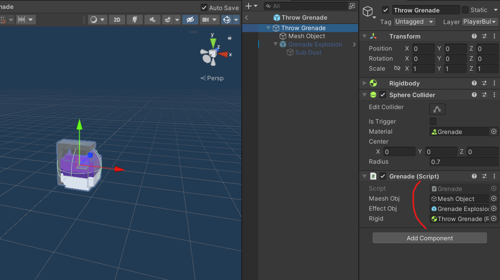
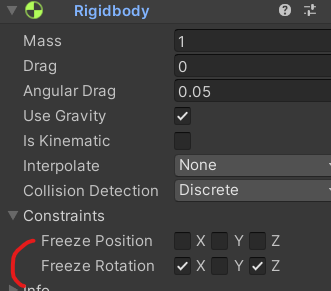

# 유니티 3D게임 쿼드뷰 08

> **Summary**
> 수류탄 구현 및 폭발 기능을 위한 C# 코드 예시를 제공하며, 수류탄의 투척, 폭발 후 효과, 적에게 데미지를 주는 방법을 설명한다. 또한, 적의 반응을 다르게 설정하고 Rigidbody의 회전 고정을 조정하는 방법도 포함되어 있다.

---

🎥 [동영상 보기](https://www.youtube.com/watch?v=FyJYWRIq0Ss&list=PLO-mt5Iu5TeYkrBzWKuTCl6IUm_bA6BKy&index=10)

> 🔥 **수류탄 구현**
> ```c#
> //player.cs
>
> public GameObject grenadeObjects; //던져질 수류탄 오브젝트
>
> void Grenade()
>     {
>         if(hasGrenades == 0)
>             return;
>         if(gDown && !isReroad && !isSwap)
>         {
> /*수류탄 투척 위치 코드*/
>             Ray ray = followCamera.ScreenPointToRay(Input.mousePosition); //스크린에서 월드로 Ray를 쏘는 함수
>             RaycastHit rayHit;
>
>             //레이케스트 함수에서 ray가 어딘가에 닿았다면 rayHit에 저장해준다. 이때 저장할때 쓰는 함수가 바로 out
>             if(Physics.Raycast(ray, out rayHit, 100)) //out : return 처럼 반환값을 주어진 변수에 저장하는 키워드
>             {
>                 //RaytHit의 마우스 클릭 위치를 활용하여 회전을 구현
>                 //히트의 포인트가 있는데 ray가 닿았던 지점이다. 그곳에서 플레이어의 위치를 빼면 상대 위치가 나온다
>                 Vector3 nextVec = rayHit.point - transform.position;
>                 nextVec.y = 10; //던지는 효과가 나도록 높이값인 y를 높게 고정한다
>                 //그 위치로 플레이어가 돌아보면 된다
>
> /*수류탄 날라댕기는 부분 코드*/
>                 GameObject instantGrenade = Instantiate(grenadeObjects, transform.position, transform.rotation);
>                 Rigidbody rigidGrenade = instantGrenade.GetComponent<Rigidbody>();
>                 rigidGrenade.AddForce(nextVec, ForceMode.Impulse);
>                 rigidGrenade.AddTorque(Vector3.back * 10, ForceMode.Impulse);
>
> /*수류탄 사용 완료 코드*/
>                 hasGrenades--; //보유 수류탄 -1
>                 grenades[hasGrenades].SetActive(false); //공전 수류탄 수도 hasGrenades값 참조하여 비활성화
>             }
>         }
>     }
> ```
>
>

> 🔥 **수류탄 폭발 구현**
> 
>
> ```c#
> //Grenade.cs
>
> using System.Collections;
> using System.Collections.Generic;
> using UnityEngine;
>
> public class Grenade : MonoBehaviour
> {
>     public GameObject maeshObj;
>     public GameObject effectObj;
>     public Rigidbody rigid;
>
>     // Start is called before the first frame update
>     void Start()
>     {
>         StartCoroutine(Explosion());
>     }
>
>     IEnumerator Explosion()
>     {
>         //3초 뒤 코드 실행
>         yield return new WaitForSeconds(3f);
>
>         //기존에 가지고있던 postions값과 rotation값을 초기화시켜준다
>         rigid.velocity = Vector3.zero;
>         rigid.angularVelocity = Vector3.zero;
>
>         //메쉬오브젝트는 안보이게설정하고 이펙트오브젝트는 보이게 설정한다
>         maeshObj.SetActive(false);
>         effectObj.SetActive(true);
>     }
> }
> ```
>
>

> 🔥 **Enemy에게 데미지를 주기위해 HitByGrenade라는 함수를 새로 호출하고 Enemy.cs에서 함수를 public으로 생성해준다**
> ```c#
> //Grenade.cs
>
> //rayHits[] 배열 안에있는 Enemy태그가 붙어있는 넘들
> //foreach 문으로 수류탄 범위 적들의 피격함수 호출
> foreach (RaycastHit hitObj in rayHits)
> {
>     hitObj.transform.GetComponent<Enemy>().**HitByGrenade**(transform.position);
> }
> ```
>
> ```c#
> //Enemy.cs
>
> public void HitByGrenade(Vector3 explosionPos)
> {
>     curHealth -= 100;
>     Vector3 reactVec = transform.position - explosionPos; //현재값에서 폭발범위 위치값을 뺴줌
>     StartCoroutine(OnDamage(reactVec, true));
> }
> ```
>
>

> 🔥 **총알맞았을때랑 폭탄맞았을때 넉백판정을 다르게 설정한다
또 OnDamge()에 인자도 추가하여 기존 코드에 인자로 true 혹은 false를 넣어둬서 수류탄공격인지 아닌지 설정한다**
> ```c#
> //Enemy.cs
>
> public void HitByGrenade(Vector3 explosionPos)
> {
>     curHealth -= 100;
>     Vector3 reactVec = transform.position - explosionPos; //현재값에서 폭발범위 위치값을 뺴줌
>     StartCoroutine(OnDamage(reactVec, **true**));
> }
>
> IEnumerator OnDamage(Vector3 reactVec, **bool isGrenade**)
> {
>     mat.color = Color.red;
>     reactVec = reactVec.normalized;
>     reactVec += Vector3.up;
>     rigid.AddForce(reactVec * 3, ForceMode.Impulse);
>     yield return new WaitForSeconds(0.1f);
>
>     if(curHealth > 0)
>     {
>         mat.color = Color.white;
>     }
>     else
>     {
>         mat.color = Color.gray;
>         gameObject.layer = 14;
>
>         **//수류탄에 피격되었을때
>         if (isGrenade)
>         {
>             reactVec = reactVec.normalized;
>             reactVec += Vector3.up * 3;
>
>             rigid.freezeRotation = false; //충돌해서 회전하는거 막았던거 해제
>             rigid.AddForce(reactVec * 5, ForceMode.Impulse); //위치값 이동
>             rigid.AddTorque(reactVec * 15, ForceMode.Impulse); //회전값
>         }**
>         //총알에 피격되었을때
>         else
>         {
>             reactVec = reactVec.normalized;
>             reactVec += Vector3.up;
>             rigid.AddForce(reactVec * 5, ForceMode.Impulse);
>         }
>
>         yield return new WaitForSeconds(1.0f);
>         boxCollider.enabled = false;
>         Destroy(gameObject, 1);
>     }
> }
> ```
>
> > 🔥 **rigidbody.**freezeRotation** = false / true ;**
> > 플레이어랑 충돌해서 혼자 돌지말라고 고정옵션 켜뒀던거 끄는함수
> >
> > 
> >
> >
>
>

> 🔥 **그리고 마지막으로 Grenade.cs의 Explosion() 에서 Destroy로 프리팹 삭제**
> ```c#
> IEnumerator Explosion()
> {
>     //3초 뒤 코드 실행
>     yield return new WaitForSeconds(3f);
>
>     //기존에 가지고있던 postions값과 rotation값을 초기화시켜준다
>     rigid.velocity = Vector3.zero;
>     rigid.angularVelocity = Vector3.zero;
>
>     //메쉬오브젝트는 안보이게설정하고 이펙트오브젝트는 보이게 설정한다
>     maeshObj.SetActive(false);
>     effectObj.SetActive(true);
>
>     //부피가 있는 레이케스트를 활용하여 피격범위 설정
>     //범위내에있는놈들 싹다 죽여야하기때문에 배열로 생성
>     //SphereCastAll(시작위치,반지름,레이케스트발사방향,레이케스트길이,레이어마스크) 구체모양의 레이캐스팅
>     RaycastHit[] rayHits = Physics.SphereCastAll(transform.position, 15,Vector3.up,0,LayerMask.GetMask("Enemy"));
>
>     //rayHits[] 배열 안에있는 Enemy태그가 붙어있는 넘들
>     //foreach 문으로 수류탄 범위 적들의 피격함수 호출
>     foreach (RaycastHit hitObj in rayHits)
>     {
>         hitObj.transform.GetComponent<Enemy>().HitByGrenade(transform.position);
>     }
>     **Destroy(gameObject,5);**
> }
> ```
>
>

