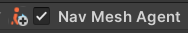
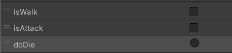

# 유니티 3D게임 쿼드뷰 09

> **Summary**
> 유니티 3D 게임 개발에 있어 적 AI 구현을 위해 GetComponentInChildren<>();와 NavMeshAgent를 사용하며, NavMesh 베이킹을 통해 적이 플레이어를 잘 따라오도록 설정합니다. 애니메이터 컨트롤러를 통해 적의 애니메이션을 관리하고, 공격 범위를 설정하기 위해 SphereCastAll을 활용하여 플레이어를 타겟팅하는 코드를 작성합니다.

---

🎥 [동영상 보기](https://www.youtube.com/watch?v=FBY_cmtCNHw&list=PLO-mt5Iu5TeYkrBzWKuTCl6IUm_bA6BKy&index=11)

> 🔥 **Enemy A에 Enemy.cs 를 넣으면 다음과같은 에러가뜨는데,  자식들의 컴포넌트값까지 받아온다는 의미로 InChildren을 추가하면 정상적으로 meshRender를 불러옵니다**
> 
>
> ```c#
> private void Awake()
>     {
>         rigid = GetComponent<Rigidbody>();
>         boxCollider = GetComponent<BoxCollider>();
>         mat = GetComponent**InChildren**<MeshRenderer>().material;
>     }
> ```
>
>

> 🔥 **Nav Mesh Agent = 네비게이션을 사용하는 인공지능 컴포넌트**
> 
>
> ```c#
> //Enermy.cs
> using UnityEngine.AI; //AI 모듈을 쓰기 위해선 해당 라이브러리 추가
>
> public Transform target; //목표물을 받아내기위한 변수
>
> NavMeshAgent nav; //AI모듈이 추가되면 해당 네비게이션 변수를 만들어낼 수 있음
> ```
>
> ```c#
> private void Awake()
>     {
>         nav = GetComponent<**NavMeshAgent**>();
>     }
>
> void Update()
>     {
>         //도착할 목표 위치를 지정하는 함수
>         nav.**SetDestination**(target.position);
>     }
> ```
>
> 
>
>

> 🔥 **NavMesh = NavAgent가 경로를 그리기 위한 바탕**
>
> ## `Window - AI - navigation`
>
>
> 클릭하면 창이 뜨는데
>
> 
>
> 
>
> > 🔥 **NavMesh는 Static 오브젝트에서만 Bake가 가능함**
> > 
> >
> >
>
> 
>
>

> 🔥 **적 애니메이션 제작**
> 
>
> 
>
> 
>
> 애니메이터 컨트롤러 제작하여 메쉬오브젝트 내부에 넣기
>
> ```c#
> //Enemy.cs
>
> Animator anim;
>
> void Awake()
>     {
>         rigid = GetComponent<Rigidbody>();
>         boxCollider = GetComponent<BoxCollider>();
>         mat = GetComponentInChildren<MeshRenderer>().material;
>         nav = GetComponent<NavMeshAgent>();
>         anim = GetComponentInChildren<Animator>();
>     }
> ```
>
>

> 🔥 **버그발생.. 코드 다 똑같은데 왜 몬스터 상태 이따구냐**
> 
>
> 
>
> ## 해결 : MeshObject에만 애니메이터가 있어야했는데 내가 둘 다 넣어서 충돌문제다
>
>

🎥 [동영상 보기](https://www.youtube.com/watch?v=LUnZHdcOe_M)

> 🔥 **`**MeshRenderer[]**` meshes;
팔,다리 몸통별로 따로따로 메쉬렌더러를 가지고 있기 때문에 배열로 선언**
> ```c#
> //Plater.cs
>
> MeshRenderer[] meshes; //팔,다리 몸통별로 따로따로 메쉬렌더러를 가지고 있기 때문에 배열로 선언
>
> void Awake()
>     {
>         meshes = GetComponentsInChildren<MeshRenderer>();
> 				//Components 복수형이다 참고하시길
>     }
> ```
>
>

> 🔥 **몬스터 공격 코드**
> ```c#
> void Targeting()
>     {
>         float targetRadius = 1.5f;
>         float targerRange = 3f;
>
>         //부피가 있는 레이케스트를 활용하여 피격범위 설정
>         //범위내에있는놈들 싹다 죽여야하기때문에 배열로 생성
>         //SphereCastAll(시작위치,반지름,레이케스트발사방향,레이케스트길이,레이어마스크) 구체모양의 레이캐스팅
>         RaycastHit[] rayHits = Physics.SphereCastAll(transform.position, 
>                                                     targetRadius,transform.forward,targerRange,
>                                                     LayerMask.GetMask("Player"));
>         Debug.DrawRay(transform.position, transform.forward * targerRange,Color.green);
>         //rayHits변수에 데이터가 들어오면 공격 코루틴 실행
>         //만약 공격 범위 안에 플레이어가 들어왔다면?
>         if(rayHits.Length > 0 && !isAttack)
>         {
>             StartCoroutine(Attack());
>         }
>     }
>
>     IEnumerator Attack()
>     {
>         isChase = false; //쫓아가지 않는 상태 활성화
>         isAttack = true; //공격상태 활성화
>         anim.SetBool("isAttack",true); //공격 애니메이션 활성화
>         yield return new WaitForSeconds(0.2f);
>         meleeArea.enabled = true; //공격범위 활성화
>         yield return new WaitForSeconds(1f);
>         meleeArea.enabled = false; //공격범위 비활성화
>
>         isChase = true;
>         isAttack = false;
>         anim.SetBool("isAttack",false);
>     }
> ```
>
> 
>
>

