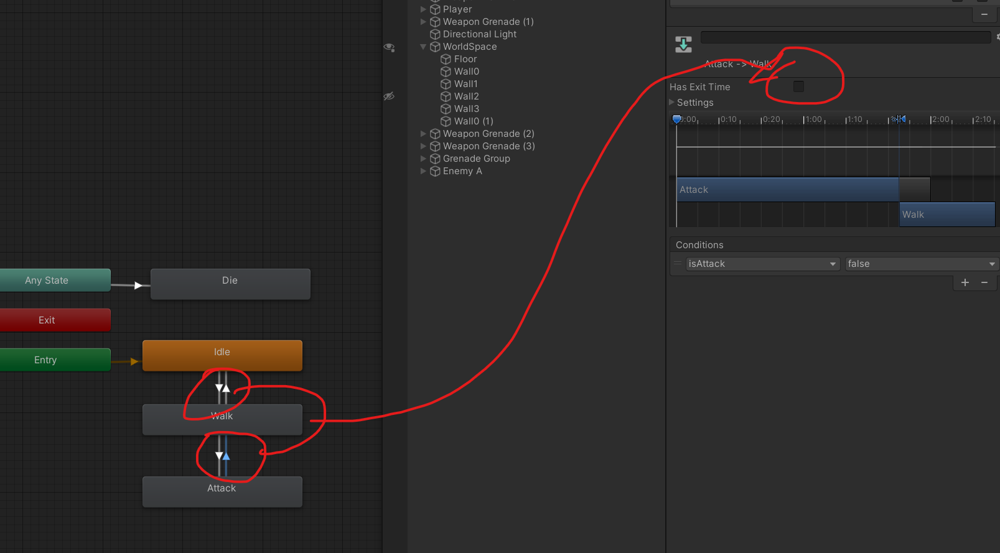
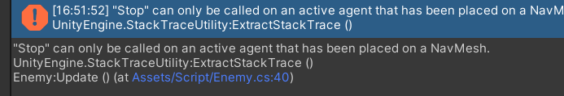
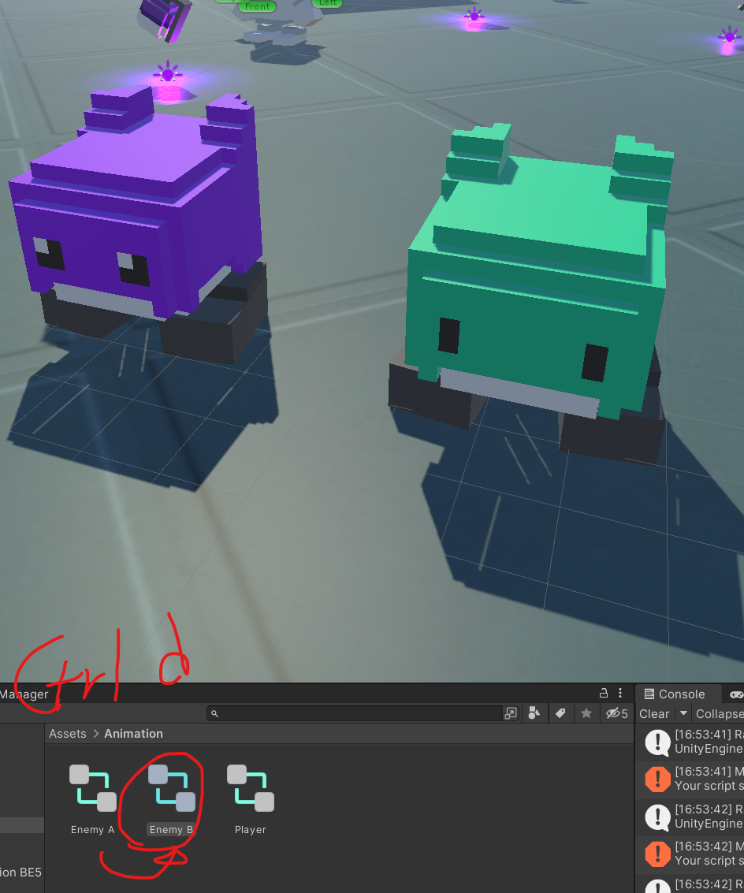
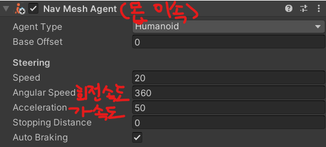
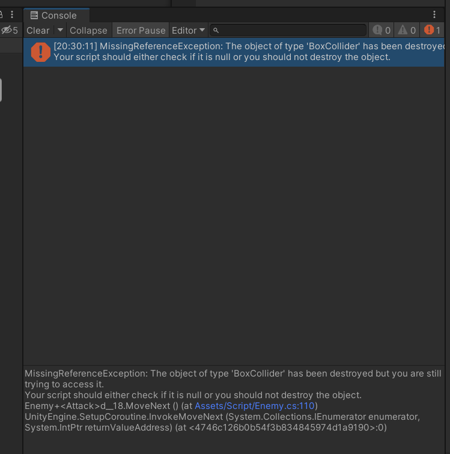
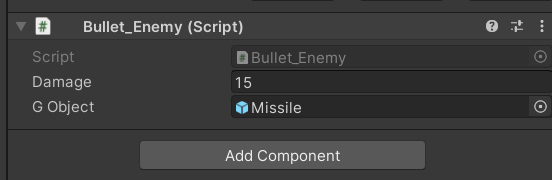

# 유니티 3D게임 쿼드뷰 10

> **Summary**
> 애니메이션 문제 해결, Nav Mesh Agent 설정, BoxCollider와 충돌 오류 수정, 몬스터 타입별 기능 구현, 프리팹 생성 코드 포함. 공격 애니메이션이 정상 작동하도록 Has Exit Time 비활성화, 충돌 오류를 해결하기 위해 Bullet_Enemy 클래스를 새로 만들어 사용.

---

🎥 [동영상 보기](https://www.youtube.com/watch?v=LUnZHdcOe_M)

> 🔥 **왜 공격 애니메이션이 한번만 작동할까…**
> ## 단순했다.. Entry에 있는 모든 애니메이션에 Has Exit Time을 비활성화시키니까 애니메이션이 정상작동한다
>
> 
>
>

> 🔥 **에러발생**
> 
>
> ```c#
>
> void Update()
>     {
>         if(nav.enabled)
>             nav.SetDestination(target.position);
>             nav.isStopped = !isChase;
>     }
>
>
> ```
>
> ```c#
>
> void Update()
>     {
>         if(nav.enabled)
> 				{
>             nav.SetDestination(target.position);
>             nav.isStopped = !isChase;
> 				}
>     }
>
>
> ```
>
>

> 🔥 **애니메이터를 그대로 복사해서 해당 애니메이터는 Enemy B의 Mesh Object 내부에 넣어준다**
> 
>
>

> 🔥 **Nav Mesh Agent 설정**
> 
>
>

> 🔥 **enum 과 Type으로 몬스터 타입을 정하고 Switch문을 이용하여 타입마다 다른 기능을 가지도록함 **
> ```c#
> //Enemy.cs
>
> public enum Type {A,B,C}; //몬스터 타입을 결정하기 위한 타입설정
> public Type enemyType;
>
> //스피어 레이케스팅 활용해서 넓은 데미지 범위를 만들것입니다
>     void Targeting()
>     {
>         float targetRadius = 0;
>         float targerRange = 0;
>
>         switch (enemyType) {
>             case Type.A:
>                 targetRadius = 1.5f;
>                 targerRange = 3f;
>                 break;
>             case Type.B:
>                 targetRadius = 1f;
>                 targerRange = 6f;
>                 break;
>             case Type.C:
>                 break;
>         }
> ```
>
>

> 🔥 **BoxCollider 와 Destroy 충돌 오류**
> 
>
> ```c#
> void OnTriggerEnter(Collider other) 
>     {
>
>         if(other.gameObject.tag == "Floor")
>         {
>             Destroy(gameObject, 2);
>         }
>         else if(other.gameObject.tag == "Wall" || other.gameObject.tag == "Enemy")
>         {
>             Destroy(gameObject, 2);
>         }
>     }
> ```
>
> 그래서 Switch문이나 enum if문 등 다양한방법으로 디버깅해보았지만 실패…
>
>
> 그래서 고안한 방법은 그냥 Bullet.cs에 분기점을 만드는게 아니라 새롭게 Bulllet_Enemy.cs 를만들어서 Enemy에게 할당해주자..
>
> ```c#
> using System.Collections;
> using System.Collections.Generic;
> using UnityEngine;
>
> public class Bullet_Enemy : MonoBehaviour
> {
>     public int damage;
>     **public GameObject gObject; //근접무기는 비워두세요**
>
>     void OnCollisionEnter(Collision collision)
>     {
>         //몬스터 A,B 전용
>         if(gObject == null)
>         {
>             if(collision.gameObject.tag == "Floor")
>             {
>                 Debug.Log("몬스터 Floor와 충돌");
>             }
>             else if(collision.gameObject.tag == "Wall")
>             {
>                 Debug.Log("몬스터 Wall와 충돌");
>             }
>         }
>         //몬스터 C 전용 (미사일에 Destroy를 사용하기 위함)
>         else
>         {
>             if(collision.gameObject.tag == "Floor")
>             {
>                 Destroy(gameObject, 2);
>             }
>             else if(collision.gameObject.tag == "Wall")
>             {
>                 Destroy(gameObject, 2);
>             }
>         }
>
>     }
>
>     void OnTriggerEnter(Collider other) 
>     {
>         //몬스터 A,B 전용
>         if(gObject == null)
>         {    
>             if(other.gameObject.tag == "Floor")
>             {
>                 Debug.Log("몬스터 Floor와 충돌");
>             }
>             else if(other.gameObject.tag == "Wall")
>             {
>                 Debug.Log("몬스터 Wall와 충돌");
>             }
>             else if(other.gameObject.tag == "Player")
>             {
>                 Debug.Log("몬스터 플레이어와 충돌");
>             }
>         }
>         //몬스터 C 전용 (미사일에 Destroy를 사용하기 위함)
>         else
>         {
>             if(other.gameObject.tag == "Floor")
>             {
>                 Destroy(gameObject, 2);
>             }
>             else if(other.gameObject.tag == "Wall")
>             {
>                 Destroy(gameObject, 2);
>             }
>             else if(other.gameObject.tag == "Player")
>             {
>                 Debug.Log("몬스터 미사일 플레이어와 충돌");
>                 Destroy(gameObject);
>             }
>         }
>
>     }
>
> }
> ```
>
> ```c#
> //Enemy.cs
>
> void OnTriggerEnter(Collider other)
>     {
>         else if(other.tag == "EnemyBullet")
>         {   if(!isDamage)
>             {
>                 **Bullet_Enemy **enemyBullet = other.GetComponent<**Bullet_Enemy**>();
>                 health -= enemyBullet.damage;
>                 StartCoroutine(OnDamage());
>             }
>         }
>     }
> ```
>
> 
>
> # 선생님의 디버깅 방법(그냥 bool값 추가)
>
> ```c#
> using System.Collections;
> using System.Collections.Generic;
> using UnityEngine;
>
> public class Bullet_Enemy : MonoBehaviour
> {
>     public int damage;
>     public bool isMelee; //근접무기는 비워두세요
>
>     void OnCollisionEnter(Collision collision)
>     {
>         //몬스터 A,B 전용
>         if(isMelee == true)
>         {
>             if(collision.gameObject.tag == "Floor")
>             {
>                 Debug.Log("몬스터 Floor와 충돌");
>             }
>             else if(collision.gameObject.tag == "Wall")
>             {
>                 Debug.Log("몬스터 Wall와 충돌");
>             }
>         }
>         //몬스터 C 전용 (미사일에 Destroy를 사용하기 위함)
>         else
>         {
>             if(collision.gameObject.tag == "Floor")
>             {
>                 Destroy(gameObject, 2);
>             }
>             else if(collision.gameObject.tag == "Wall")
>             {
>                 Destroy(gameObject, 2);
>             }
>         }
>
>     }
>
>     void OnTriggerEnter(Collider other) 
>     {
>         //몬스터 A,B 전용
>         if(isMelee == true)
>         {    
>             if(other.gameObject.tag == "Floor")
>             {
>                 Debug.Log("몬스터 Floor와 충돌");
>             }
>             else if(other.gameObject.tag == "Wall")
>             {
>                 Debug.Log("몬스터 Wall와 충돌");
>             }
>             else if(other.gameObject.tag == "Player")
>             {
>                 Debug.Log("몬스터 플레이어와 충돌");
>             }
>         }
>         //몬스터 C 전용 (미사일에 Destroy를 사용하기 위함)
>         else
>         {
>             if(other.gameObject.tag == "Floor")
>             {
>                 Destroy(gameObject, 2);
>             }
>             else if(other.gameObject.tag == "Wall")
>             {
>                 Destroy(gameObject, 2);
>             }
>             else if(other.gameObject.tag == "Player")
>             {
>                 Debug.Log("몬스터 미사일 플레이어와 충돌");
>                 Destroy(gameObject);
>             }
>         }
>
>     }
>
> }
> ```
>
>
>

> 🔥 **프리팹 생성 코드**
> ```javascript
> //총알 게임오브젝트 인스턴트 생성 (프리팹 , 생성위치, 생성각도) Enemy기준으로 생성됨
> GameObject instantBullet = Instantiate(bullet, transform.position, transform.rotation);
> ```
>
>

