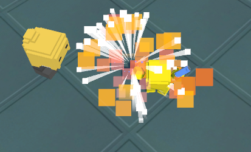

# 유니티 3D게임 쿼드뷰 11

> **Summary**
> 카메라 쉐이크 기능을 구현하고, 탄피와 몬스터 충돌 시 발생하던 에러를 해결했으며, 미사일 피격 시 폭발 효과를 구현했습니다. 카메라 흔들림은 플레이어가 데미지를 입었을 때 발생하고, 특정 조건에서 객체를 삭제하는 코드의 중복 문제를 수정했습니다.

---

> 🔥 **카메라 쉐이크 구현완료! Upadate함수가 매프레임 변화하는것을 활용하여 데미지를 입은 상태일 경우, isDamage를 true상태로 스위칭하여 카메라가 흔들리게했고, true 내부에 isDamageOff 함수를 추가하여 n초뒤에 카메라흔들림이 종료되도록 설정했다**
> ```c#
> //Follow.cs
>
> using System.Collections;
> using System.Collections.Generic;
> using UnityEngine;
>
> public class Follow : MonoBehaviour
> {
>     public Transform target;
>     public Vector3 offset;
>     public Player player;
>     public int compareHealth;
>     public int shakeIntencity = 3;
>     public bool isDamage;
>
>     void Start()
>     {
>         compareHealth = player.health;
>     }
>     void Update()
>     {
>         decreaseHealth();
>         **switch (isDamage)
>         {
>             case false:
>                 transform.position = target.position + offset;
>                 break;
>             case true:
>                 CameraShake();
>                 Invoke("isDamageOff",0.3f);
>                 break;
>         }**
>     }
>     void decreaseHealth()
>     {
>         if (compareHealth > player.health)
>         {
>             compareHealth = player.health;
>             isDamage = true;
>         }
>     }
>
>     void isDamageOff()
>     {
>         isDamage = false;
>     }
>    ** void CameraShake()
>     {
>     transform.position = new Vector3((target.position.x + Random.Range(-shakeIntencity, shakeIntencity))
>                                             , (target.position.y + Random.Range(-shakeIntencity, shakeIntencity))
>                                             , (target.position.z + Random.Range(-shakeIntencity, shakeIntencity))) + offset;
>     }**
> }
> ```
>
>

> 🔥 **끈질겼던 탄피와 몬스터가 충돌했을 때 프로그램이 종료되던 에러 해결**
> `MissingReferenceException: The object of type 'GameObject' has been destroyed but you are still trying to access it.`
>
>
> 이미 사라진 객체에 접근할 수 없다는건데..
>
> ```c#
> //Bullet.cs
>
> void OnTriggerEnter(Collider other) 
>     {
>
>         if(other.gameObject.tag == "Floor")
>         {
>             Destroy(gameObject, 2);
>         }
>         else if(other.gameObject.tag == "Wall" ||** other.gameObject.tag == "Enemy"**)
>         {
>             Destroy(gameObject, 2);
>         }
>     }
> ```
>
> 기존에 굵게표시한 저부분 때문에 에러가발생..! 그냥 저부분 날려주니 에러가 발생하지 않는다
>
> ```c#
> //Enemy.cs
>
> private void OnTriggerEnter(Collider other) 
>     {
>         else if(other.tag == "Bullet")
>         {
>             Bullet bullet = other.GetComponent<Bullet>();
>             curHealth -= bullet.damage;
>             Vector3 reactVec = transform.position - other.transform.position;
>             **Destroy(other.gameObject); //총알이 닿으면 총알삭제**
>
>             StartCoroutine(OnDamage(reactVec, false)); //OnDamage 메소드 실행
>             Debug.Log("Range: " + curHealth);
>         }
>     }
> ```
>
> 다른코드에 Destroy하는 코드가 중복으로 있어서 충돌한거였다
>
>

> 🔥 **미사일 피격시 폭발구현**
> 
>
> Grenade에서 사용했던 파티클을 그대로 사용했고 Simulation Space를  Local에서 Word로 바꿨고 Emission의 Rate Over Distance를 조절해서 폭발을 구현했다
>
>

