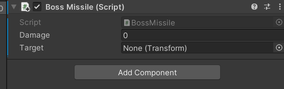
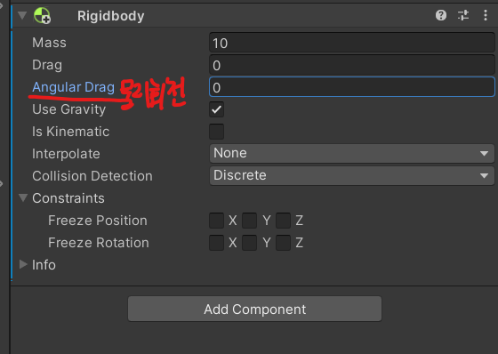

# 유니티 3D게임 쿼드뷰 12

> **Summary**
> 클래스 상속, 보스 구현, 코루틴 사용법, localScale 조정, 모든 메쉬 색상 변경 방법, 플레이어 방향 예측 및 보스 패턴 개발에 관한 내용을 다루고 있습니다. 각 주제에 대한 코드 예시와 설명이 포함되어 있습니다.

---

🎥 [동영상 보기](https://www.youtube.com/watch?v=7JlujO3JYas&list=PLO-mt5Iu5TeYkrBzWKuTCl6IUm_bA6BKy&index=15)

> 🔥 **11분부터 파티클설정에대한 내용을 복습합니다**

> 🔥 **클래스 상속하는 방법**
> ## **public class (스크립트이름) : (상속받을 스크립트)**
>
> ```c#
> using System.Collections;
> using System.Collections.Generic;
> using UnityEngine;
>
> **public class BossMissile : Bullet**
> {
>     void Awake()
>     {
>
>     }
>
>     void Update() 
>     {
>
>     }
>
> }
> ```
>
> 
>
>

> 🔥 **보스 바위공격 구현**
> 
>
>

> 🔥 **enum 추가하여 몬스터의 분기점 추가**
> ```c#
> //Bullet_Enermy.cs
>
> using System.Collections;
> using System.Collections.Generic;
> using UnityEngine;
>
> public class Bullet_Enemy : MonoBehaviour
> {
>     public int damage;
>     public GameObject effectObj; //폭발이펙트
>     public GameObject maeshObj; //미사일오브젝트 등록
>     **public enum Type {Melee, Range, Boss};**
>     public Type type;
>     void OnCollisionEnter(Collision collision)
>     {
>         //몬스터 A,B 전용
>         **if(type == Type.Melee)**
>         {
>             if(collision.gameObject.tag == "Floor")
>             {
>                 Debug.Log("몬스터 Floor와 충돌");
>             }
>             else if(collision.gameObject.tag == "Wall")
>             {
>                 Debug.Log("몬스터 Wall와 충돌");
>             }
>         }
>         //몬스터 C 전용 (미사일에 Destroy를 사용하기 위함)
>         **else if (type == Type.Range || type == Type.Boss )**
>         {
>             if(collision.gameObject.tag == "Floor")
>             {
>                 Destroy(gameObject, 2);
>             }
>             else if(collision.gameObject.tag == "Wall")
>             {
>                 Destroy(gameObject, 2);
>             }
>         }
>
>     }
>
>     void OnTriggerEnter(Collider other) 
>     {
>         //몬스터 A,B 전용
>         **if(type == Type.Melee)**
>         {    
>             if(other.gameObject.tag == "Floor")
>             {
>                 Debug.Log("몬스터 Floor와 충돌");
>             }
>             else if(other.gameObject.tag == "Wall")
>             {
>                 Debug.Log("몬스터 Wall와 충돌");
>             }
>             else if(other.gameObject.tag == "Player")
>             {
>                 Debug.Log("몬스터 플레이어와 충돌");
>             }
>         }
>         //몬스터 C 전용 (미사일에 Destroy를 사용하기 위함)
>        ** else if (type == Type.Range || type == Type.Boss )**
>         {
>             if(other.gameObject.tag == "Floor")
>             {
>                 Destroy(gameObject);
>             }
>             else if(other.gameObject.tag == "Wall")
>             {
>                 Destroy(gameObject);
>             }
>             else if(other.gameObject.tag == "Player")
>             {
>                 Debug.Log("몬스터 미사일 플레이어와 충돌");
>                 maeshObj.SetActive(false);
>                 effectObj.SetActive(true);
>                 Destroy(gameObject,2f);
>             }
>         }
>
>     }
>
> }
> ```
>
>

> 🔥 ****코루틴의 while 문 안에는 yield return 딜레이를 주지 않으면 오류가 발생한다****
> ## 코루틴 While문에는 꼭 yield return null; 포함
>
> ```c#
> //GainPower에서 계속 기를 모으고있음
>     IEnumerator GainPower()
>     {
>         //isShoot이 트루가 아닐때까지 반복
>         //while 문 안에는 yield return null; 딜레이를 주지 않으면 오류가 발생한다
>         while(!isShoot)
>         {
> 						yield return null;
>         }
>     }
> ```
>
>

> 🔥 **transform.localScale = Vector3.one * scaleValue;**
> ## `transform.localScale = Vector3.one * scaleValue;`
>
>
> > 🔥 ****locaslScale?****
> > `Transform.localScale`은 게임오브젝트의 **상대적인 크기**를 나타냅니다.게임오브젝트의 부모가 있을 경우 부모를 기준으로 상대적인 크기를 나타냅니다. 부모의 크기가 변경되면 자식의 크기도 변경됩니다. `Transform.localScale`에 `Vector3`를 대입하면 크기가 변경됩니다.
> >
> > 부모가 없을 경우에는 `Transform.lossyScale`과 동일합니다. 만약 부모의 `localScale`이 `(2, 2, 2)` 이고 자식의 `localScale`이 `(1, 1, 1)` 이라면 자식의 절대적인 크기는 `(2, 2, 2)`가 됩니다.
> >
> >
>
> > 🔥 ****Vector3.one?****
> >
>
>

> 🔥 **몬스터도 피격당했을때 모든 메쉬 머터리얼 변경되도록 하는 방법은 Material을 사용하는것이 아니라 플레이어처럼 `MeshRenderer[]`로 material을 설정해준다**
> ```c#
> //Enemy.cs
>
> MeshRenderer[] meshs;
> meshs = GetComponent**s**InChildren<MeshRenderer>();
>
> //복수형 유의...
>
> IEnumerator OnDamage(Vector3 reactVec, bool isGrenade)
>     {
>         **foreach (MeshRenderer mesh in meshs)
>             mesh.material.color = Color.red;**
>         reactVec = reactVec.normalized;
>         reactVec += Vector3.up;
>         rigid.AddForce(reactVec * 3, ForceMode.Impulse);
>         yield return new WaitForSeconds(0.1f);
>
>         if(curHealth > 0)
>         {
>             **foreach (MeshRenderer mesh in meshs)
>                 mesh.material.color = Color.white;**
>         }
>         else
>         {
>             **foreach (MeshRenderer mesh in meshs)
>                 mesh.material.color = Color.gray;**
>             gameObject.layer = 14;
>             isChase = false; //추격함수를 종료
>             nav.enabled = false; //네비게이션 컴포넌트도 비활성화
>             anim.SetTrigger("doDie"); //사망 애니메이션 포함
>             //수류탄에 피격되었을때
>             if (isGrenade)
>             {
>                 reactVec = reactVec.normalized;
>                 reactVec += Vector3.up * 3;
>
>                 rigid.freezeRotation = false; //충돌해서 회전하는거 막았던거 해제
>                 rigid.AddForce(reactVec * 5, ForceMode.Impulse); //위치값 이동
>                 rigid.AddTorque(reactVec * 15, ForceMode.Impulse); //회전값
>             }
>             //총알에 피격되었을때
>             else
>             {
>                 reactVec = reactVec.normalized;
>                 reactVec += Vector3.up;
>                 rigid.AddForce(reactVec * 5, ForceMode.Impulse);
>             }
>
>             yield return new WaitForSeconds(1.0f);
>             boxCollider.enabled = false;
>
>             if(enemyType == Type.D)
>                 Destroy(gameObject, 2);
>         }
>     }
>
> //foreach로 묶어버리고 mesh.material.color 로 코드 전부 변경
> ```
>
>

> 🔥 **Boss 플레이어 방향 예측하기**
> **1. Input.GetAxis(string name)**
>
> - 1.0f 부터 1.0f 까지의 범위의 값을 반환한다. 즉, 부드러운 이동이 필요한 경우에 사용된다.
> **2. Input.GetAxisRaw(string name)**
>
> - 1, 0, 1 세 가지 값 중 하나가 반환된다. 키보드 값을 눌렀을 때 즉시 반응해야한다면 GetAxisRaw를 사용하면 된다.
> ```c#
> //Boss.cs
>
> using System.Collections;
> using System.Collections.Generic;
> using UnityEngine;
>
> public class Boss : Enemy
> {
>     public GameObject missile;
>     public Transform missilePortA;
>     public Transform missilePortB;
>
>     //플레이어의 이동방향을 예측하는 변수
>     Vector3 lookVec;
>     Vector3 tauntVec;
>     bool isLook;
>
>     void Start()
>     {
>         isLook = true;
>     }
>
>     void Update()
>     {
>         if(isLook)
>         {
>             float h = Input.GetAxisRaw("Horizontal");
>             float v = Input.GetAxisRaw("Vertical");
>             //얼마나 예측할것인가? (5) 만큼 예측하겠다
>             lookVec = new Vector3(h,0,v) * 5f;
>             transform.LookAt(target.position + lookVec);
>         }
>     }
> }
> ```
>
>

> 🔥 **보스 패턴 개발은 Random과 Switch문을 활용합니다**
> ```c#
> //Boss.cs
>
> IEnumerator Think()
>     {
>         yield return new WaitForSeconds(0.1f); //생각하는 시간 길수록 보스가 쉬워진다
>
>         //랜덤으로 0~4값이 랜덤액션값에 들어간다
>         //보스가 랜덤값에 따라 다른 패턴을 가지기 위함이다
>         **int ranAction = Random.Range(0,5);
>         switch (ranAction)
>         {
>             case 0:
>                 break;**
>             case 1:
>                 break;
>             case 2:
>                 break;
>             case 3:
>                 break;
>             case 4:
>                 break;
>         }
> ```
>
>

