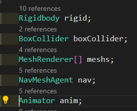
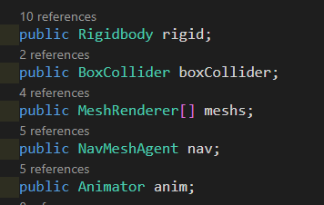
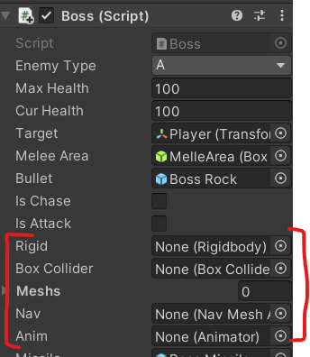
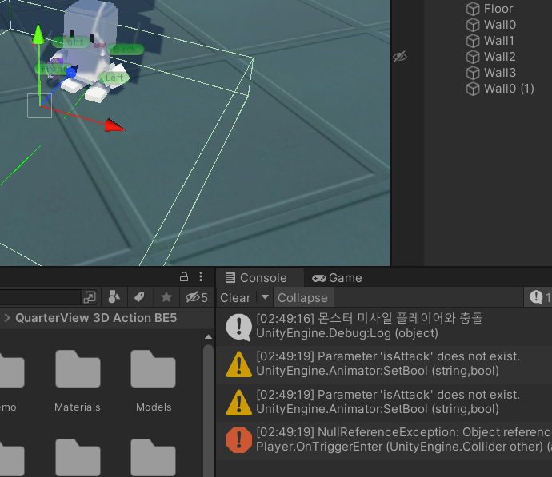
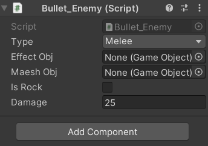

# 유니티 3D게임 쿼드뷰 13

> **Summary**
> 유니티 3D 게임 개발에 대한 내용으로, gameObject.layer를 변경하여 충돌 설정, 보스 패턴 구현, 확률 설정 및 버그 해결 방법을 다룹니다. 또한, 부모 클래스의 Awake() 메서드 문제와 해결책, 보스의 다양한 공격 메커니즘 구현에 대한 코드 예시가 포함되어 있습니다.

---

🎥 [동영상 보기](https://www.youtube.com/watch?v=7JlujO3JYas&list=PLO-mt5Iu5TeYkrBzWKuTCl6IUm_bA6BKy&index=15)

> 🔥 **gameObject.layer = 14; 이런느낌으로  레이어를 변경해서 특정 레이어와 충돌하게하거나 하지않게 만들어서 관리할 수 있다**

> 🔥 **상속을 받더라도 부모의 스크립트의 변수가 public 이여야만 자식 스크립트에서 사용이 가능합니다**
> 
>
> 
>
>

> 🔥 **보스패턴 구현**
> Think() 에서 랜덤한 분기점에 따라서 코루틴을 불러오고 불러온 코루틴이 끝나면 코루틴 내부에서 다시 Think()를 불러와 다시금 프로그램이 실행될 수 있도록 코드를 구현
>
>
> ### Case를 n개 이상 겹치게하여 확률을 높임
> 총 5개중 40퍼확률로 미사일발사 , 돌굴러가는패턴, 20퍼확률로 점프공격
>
> ```c#
> //Boss.cs
>
> IEnumerator Think()
>     {
>         yield return new WaitForSeconds(0.1f); //생각하는 시간 길수록 보스가 쉬워진다
>
>         //랜덤으로 0~4값이 랜덤액션값에 들어간다
>         //보스가 랜덤값에 따라 다른 패턴을 가지기 위함이다
>         **int ranAction = Random.Range(0,5);
>         switch (ranAction)**
>         {
>
>             case 0:
>             case 1:
>                 //미사일 발사 패턴
>                 StartCoroutine(MissileShot());
>                 break;
>             case 2:
>             case 3:
>                 //돌 굴러가는 패턴
>                 StartCoroutine(RockShot());
>                 break;
>             case 4:
>                 //점프 공격 패턴
>                 StartCoroutine(Taunt());
>                 break;
>         }
>     }
>
>     IEnumerator MissileShot()
>     {
>         anim.SetTrigger("doShot");
>         yield return new WaitForSeconds(2.5f);
>
>         **StartCoroutine(Think());**
>     }
>
>     IEnumerator RockShot()
>     {
>         anim.SetTrigger("doBigShot");
>         yield return new WaitForSeconds(3f);
>
>         StartCoroutine(Think());
>     }
>
>     IEnumerator Taunt()
>     {
>         anim.SetTrigger("doTaunt");
>         yield return new WaitForSeconds(3f);
>
>         StartCoroutine(Think());
>     }
> ```
>
>

> 🔥 **근데 이렇게 짜면 어미클래스인 Enemy에서 초기화 한 컴포넌트정보가 제대로 들어가있지 않는다 왜그럴까?**
> ### 이유는 자식함수의 Awake()는 자식 클래스’만’ 단독실행 하기 때문에 어미클래스의 Awake()는 제대로 실행되지 않습니다
>
> 
>
> ```c#
> //Enemy.cs
> void Awake()
>     {
>         rigid = GetComponent<Rigidbody>();
>         boxCollider = GetComponent<BoxCollider>();
>         meshs = GetComponentsInChildren<MeshRenderer>();
>         nav = GetComponent<NavMeshAgent>();
>         anim = GetComponentInChildren<Animator>();
>         if(enemyType != Type.D)
>             Invoke("ChaseStart",2); //추격하는 함수를 2초뒤에 실행한다
>     }
> ```
>
> # 해결방법(택1)
>
> - 어미클래스의 Awake() 를 Start() 로 바꿔준다
>   - 이 방법은 기존에 Awake()로 작업했던 코드들과 충돌을해 문제가 있을수도 있으니 조심 
> - **어미클래스의 내용을 자식클래스에도 그대로 붙여넣는다**
>   - 이 방법이 제일 안전
>

> 🔥 **보스 스킬들 구현**
> > 🔥 **보스 미사일발사공격 매커니즘 구현**
> > ```c#
> > //Boss.cs
> >
> > IEnumerator MissileShot()
> >     {
> >         //애니메이션 실행
> >         anim.SetTrigger("doShot");
> >
> >         //첫번째 미사일 발사 코드
> >         yield return new WaitForSeconds(0.2f);
> >         **//Instantiate(인스턴트할 오브젝트, 인스턴트 생성 위치, 인스턴트 생성 각도)**
> >         GameObject instantMissileA = **Instantiate**(missile, missilePortA.position, missilePortA.rotation);
> >         BossMissile bossMissileA = instantMissileA.GetComponent<BossMissile>();
> >         bossMissileA.target = target; //미사일의 타겟에 현재클래스의 타겟을 담는다
> >
> >         //두번째 미사일 발사 코드
> >         yield return new WaitForSeconds(0.3f);
> >         //Instantiate(인스턴트할 오브젝트, 인스턴트 생성 위치, 인스턴트 생성 각도)
> >         GameObject instantMissileB = Instantiate(missile, missilePortB.position, missilePortB.rotation);
> >         BossMissile bossMissileB = instantMissileB.GetComponent<BossMissile>();
> >         bossMissileB.target = target; //미사일의 타겟에 현재클래스의 타겟을 담는다
> >
> >         yield return new WaitForSeconds(2f);
> >
> >         StartCoroutine(Think());
> >     }
> > ```
> >
> >
>
> > 🔥 **보스 돌 발사 구현**
> > ```c#
> > //Boss.cs
> >
> > IEnumerator RockShot()
> >     {
> >         //기를 모을땐 플레이어를 바라보는것을 중지시킨다
> >         isLook = false;
> >         anim.SetTrigger("doBigShot");
> >         //인스턴트를 생서할 오브젝트를 bullet에 저장하였고, 그 bullet의 pos값과 rotate 값을 그대로 받아오겠다는 뜻
> >         Instantiate(bullet, transform.position, transform.rotation);
> >         yield return new WaitForSeconds(3f);
> >
> > 				isLook = true;
> >         StartCoroutine(Think());
> >     }
> > ```
> >
> >
>
> > 🔥 **보스 점프공격 구현**
> > ```c#
> > IEnumerator Taunt()
> >     {
> >         //내려찍을 위치를 받기 위해 점프공격 위치를 변수에 저장
> >         //점프상태일때 타겟을 바라보면 어색하니 잠시 isLook을 끔
> >         //타겟의 위치와 바라보는 위치값을 더함
> >         tauntVec = target.position + lookVec;
> >
> >         isLook = false;
> >         nav.isStopped = false; //네비게이션이 다시 작동합니다
> >         boxCollider.enabled = false; //공중에 있을때 콜라이더가 충돌하여 데미지를 입지 않게
> >         anim.SetTrigger("doTaunt");
> >
> >         //1.5초 지나면 공격범위 활성화
> >         yield return new WaitForSeconds(1.5f);
> >         meleeArea.enabled = true;
> >
> >         yield return new WaitForSeconds(0.5f);
> >         meleeArea.enabled = false;
> >
> >         //공격이 끝났으니 다시 원래대로
> >         yield return new WaitForSeconds(1f);
> >         isLook = true;
> >         nav.isStopped = true; //네비게이션이 종료됩니다
> >         boxCollider.enabled = true; //공중에 있을때 콜라이더가 충돌하여 데미지를 입지 않게
> >         StartCoroutine(Think());
> >     }
> > ```
> >
> >
>
>

> 🔥 **StopAllCoroutines() = 모든 코루틴이 break되며 코드가 끝난다**
> ```c#
> //Boss.cs
>
> void Update()
>     {
>         if (isDead)
>         {
>             StopAllCoroutines();
> 						return;
>         }
> 		}
> ```
>
>

> 🔥 **MeleeArea와 충돌했을때 버그나는 이유는 MeleeArea에 Bullet을 넣지 않았기 때문…**
> 
>
> 
>
>

> 🔥 **보스에게 공격당했을 때 Player 넉백구현**
> [other.name](http://other.name/) 으로 네임태그로 오브젝트를 불러올 수 있구나
>
> ```c#
> //player.cs
>
> void OnTriggerEnter(Collider other)
>     {
>         else if(other.tag == "EnemyBullet")
>         {   if(!isDamage)
>             {
>                 Bullet_Enemy enemyBullet = other.GetComponent<Bullet_Enemy>();
>                 health -= enemyBullet.damage;
>
>                 bool isBossAtk = **other.name** == "Boss Melee Area";
>                 StartCoroutine(OnDamage(isBossAtk));
>             }
>         }
>     }
>     IEnumerator OnDamage(bool isBossAtk) //플레이어가 적의 총알의 데미지를 입었을 때
>     {
>         //보스공격을 맞았을땐 그냥 뒤로 넉백을 줘버리자
>         if(isBossAtk)
>             rigid.AddForce(transform.forward * -25, ForceMode.Impulse);
>
>     }
> ```
>
>

