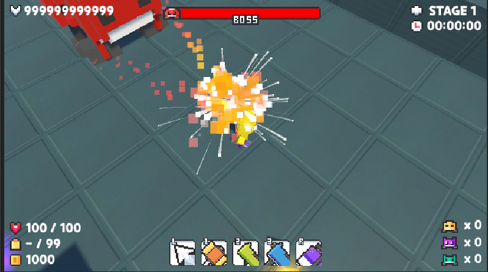
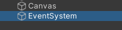
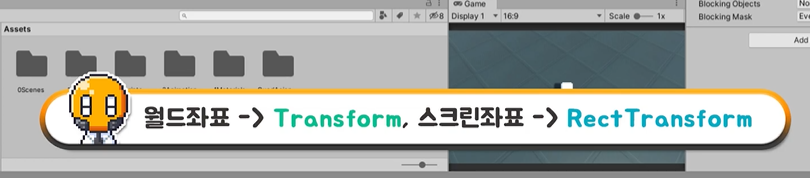
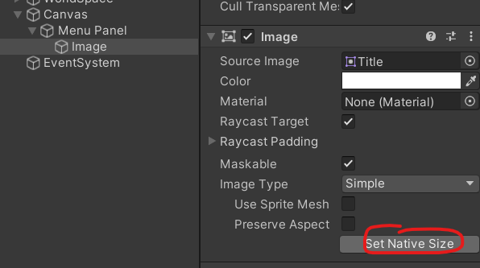
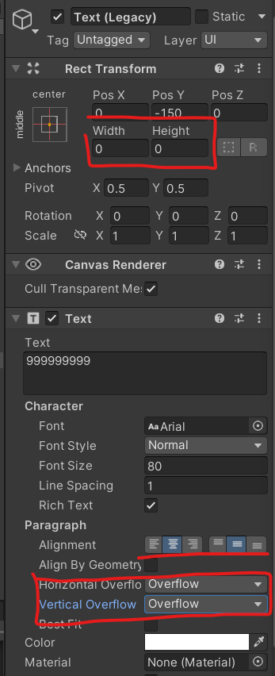
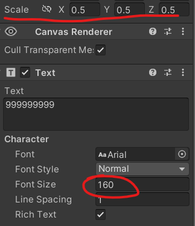
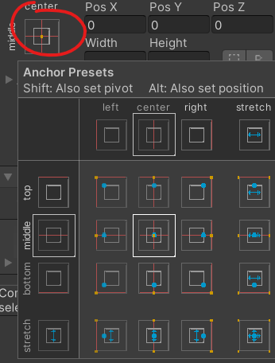
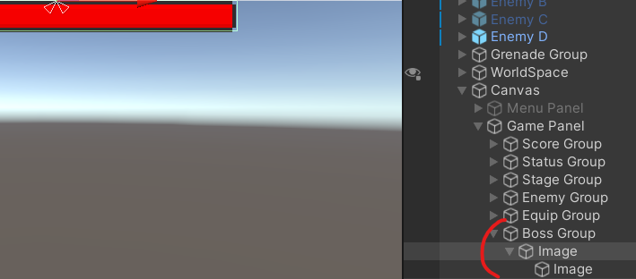

# 유니티 3D게임 쿼드뷰 14

> **Summary**
> UI 구성 및 EventSystem 사용법, RectTransform의 스크린 좌표 이해, 글자 크기 문제 해결 방법, 선명한 글자 얻는 방법, HP 구현 방법에 대한 설명이 포함되어 있습니다. 게임 UI는 여러 판넬을 만들고 필요할 때 불러오는 방식으로 작업합니다.

---

🎥 [동영상 보기](https://www.youtube.com/watch?v=N4PLRkupABM&list=PLO-mt5Iu5TeYkrBzWKuTCl6IUm_bA6BKy&index=14)

> 🔥 **게임 UI는 판넬을 용도에 맞춰 여러개 만들고 판넬 속에 필요한 UI를 구현한 후에 필요할때마다 판넬 전체를 불러오는방식으로 작업합니다

EX)인게임 플란넬, 게임오버 플란넬, 게임스타트 플란넬**

> 🔥 **우클릭 - UI - canvas 클릭하면 등장하는 EventSystem은 입력키를받는 컴포넌트라 생각하면 된다**
> 
>
>

> 🔥 **RectTransform → 스크린좌표임 월드좌표와 다릅니다**
> 
>
>

> 🔥 **Set Native Size 이미지를 원래 크기로 맞추는 기능**
> 
>
>

> 🔥 **UI Text 글자크기가 박스보다 클경우 사라지는 현상을 해결하는방법은 다음과같다**
> 
>
>

> 🔥 **선명한 글자를 얻는 방법은 다음과같다
스케일을 줄인다 → 줄인 비율만큼 폰트사이즈를 늘린다**
> 
>
>

> 🔥 **UI 중심과 위치의 방향 기준**
> 
>
>

> 🔥 **HP구현방법**
> 
>
> ### 패널안에 Empty Group만들고 배경Image 자식으로 설정 후에 이미타입 simple로 변경하고 Set Native Size 누른 후에 다시 Slice 해둔다음에 배경 Image 속에 자식으로 피통이 될 내부 Image를 생성해 배경 Image와 동일한작업을하고 앵커피벗은 우측으로 고정 (피깎이는걸 구현하기 위해) 
>
>

