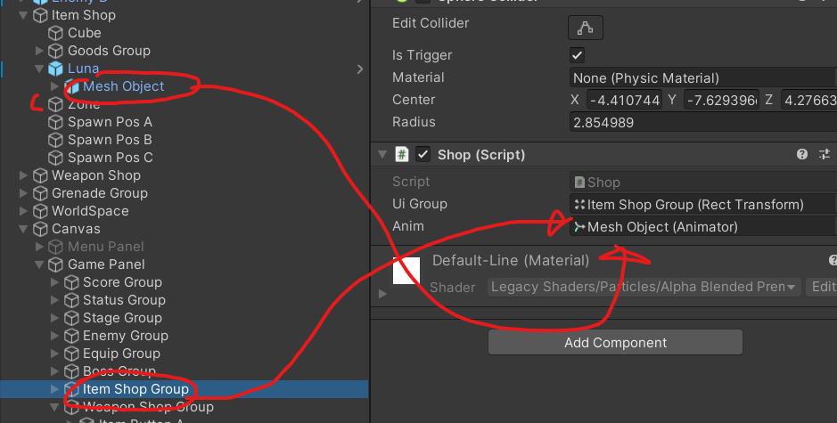

# 유니티 3D게임 쿼드뷰 15

> **Summary**
> 고리모양 파티클 시스템 생성, UI에서 이미지 컴포넌트 추가 및 버튼 클릭 시 함수 실행 방법, NPC 대화 구현을 포함한 유니티 3D 쿼터뷰 게임 클론 개발에 대한 내용입니다. 파티클 시스템의 속성 조정, UI 코드 생성, 외부 코드 호출 방법, 구매 및 대화 생성 스크립트 작성 방법이 설명됩니다.

---

🎥 [동영상 보기](https://www.youtube.com/watch?v=r27DFyivQCY&list=PLO-mt5Iu5TeYkrBzWKuTCl6IUm_bA6BKy&index=15)


> 🔥 **도넛모양으로 회전하는 파티클시스템**
> 1. 파티클시스템생성
> 1. shape에서 Donut으로 변경
> 1. Start Speed 0 으로 고정하여 흩뿌리지 않게
> 1. Shpae에서 Radius와 Donut Radius 조절
> 1. Shape - Mode - Loop 로 변경하여 빙글빙글 돌게
> 1. 그 다음에 시간에따른 크기변화와 색상변화를 주다보면 예쁜 파티클시스템이 완성된다UI
> 
>
>

> 🔥 **UI에서 Create Empty를 만들고Image 컴포넌트를 추가해서 버튼이나 특정이미지를 삽입할수도 있다 굳이 Image를 생성하지 않아도…**
> 
>
>

> 🔥 **UI를 뜨게하기위한 코드 생성**
> ```c#
> //Shop.cs
>
> using System.Collections;
> using System.Collections.Generic;
> using UnityEngine;
>
> public class Shop : MonoBehaviour
> {
>     public RectTransform uiGroup; //UI를 담을 변수
>     public Animator anim;
>     Player enterPlayer; //플레이어 정보를 상점이 받는 변수
>
>     //UI 들어가고
>     void Enter()
>     {
>
>     }
>
>
>     //UI 나가고
>     void Exit()
>     {
>
>     }
> }
> ```
>
> 
>
>

> 🔥 **함수에서 외부코드 불러와서 사용하는 방법**
> ```javascript
> //UI 들어가고
>     //enterPlayer를 불러올때 어디서불러오지?
>     //불러오기 위해 매개변수를 함수에 넣어준다
>     //또 public으로 선언하여 외부 함수를 불러올 수 있게 설정
>     public void Enter(Player player)
>     {
>         enterPlayer = player;
>         uiGroup.anchoredPosition = Vector3.zero; //앵커포인트를 0로 고정하여 화면 중앙에
>     }
> ```
>
>

> 🔥 **Player 부분도 코드 수정**
> ```c#
> //Player.cs
>
> void OnTriggerStay(Collider other) 
>     {
>         if(other.tag == "Weapon" || **other.tag == "Shop")
>             nearObject = other.gameObject;
>         //콜라디어 내에 있는 값들 출력
>         //Debug.Log(nearObject.name);**
>     }
>
>
> void Interaction()
>     {
>     if(iDown && nearObject != null && !isJump && !isDodge) //만약 아이템이 눌린상태라면 (e가눌린상태라면)
>         {
>             if(nearObject.tag == "Weapon")
>             {
>                 Item item = nearObject.GetComponent<Item>();
>                 int weaponsIndex = item.value;
>                 hasWeapons[weaponsIndex] = true;
>
>                 Destroy(nearObject);
>             }
>             **else if(nearObject.tag == "Shop")
>             {
>                 Shop shop = nearObject.GetComponent<Shop>();
>                 shop.Enter(this); //자기 자신(현재는 Player.cs)을 넣어준다
>             }**
>         }
>     }
> ```
>
>

> 🔥 **버튼에 특정 스크립트에 특정 함수 실행시키는 방법**
> ## 해당 버튼에 들어가서 On Click 버튼에 + 버튼 눌러주고 스크립트가 담겨있는 오브젝트를 박스안에 넣어주고 public으로 설정된실행될 함수를 넣어준다
>
> 
>
>

> 🔥 **구매 스크립트 작성 UI를 따로 불러와줘야 인게임에서 UI글씨가 보입니다**
> ```c#
> //Shop.cs
>
> using UnityEngine.UI;
>
> public RectTransform uiGroup; //UI를 담을 변수
> public Animator anim;
> public GameObject[] itemObj; //아이템 정보를 불러오기위해 배열로 선언
> public int[] itemPrice;
> public Transform[] itemPos; //아이템이 생성될 위치
> public Text talkPlayer;
>
>
> //어떤물건인지 알기 위해서 index를 추가해준다
>     public void Buy(int index)
>     {
>
>     }
> ```
>
> 
>
>

> 🔥 **대화생성 스크립트 작성**
> ```c#
> //Shop.cs
>
> using UnityEngine.UI; //UI를 불러와야 UI의 텍스트가 보인다
>
> public string[] talkData; //NPC대사를 바꾸기 위한 String 배열
> public Text talkText;
>
> public void Buy(int index)
>     {
>         //우리가 선택한 아이템의 가격은 아이템가격의 인덱스를 참조한다
>         int price = itemPrice[index];
>         //만약 부족하다면
>         if(price > enterPlayer.coin)
>         {
>             StopCoroutine(Talk()); //만약 이미 코루틴이 실행중이라면 꼬일수있기때문에 코드를 종료시켜준다
>             StartCoroutine(Talk());
>             return;
>         }
>     }
>
>     IEnumerator Talk()
>     {
>         talkText.text = talkData[1];
>         yield return new WaitForSeconds(2f);
>         talkText.text = talkData[0];
>     }
> }
> ```
>
>

