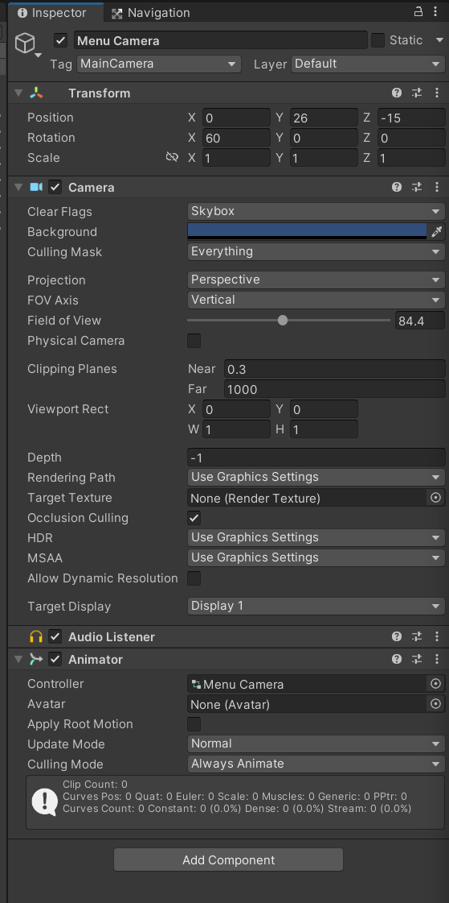
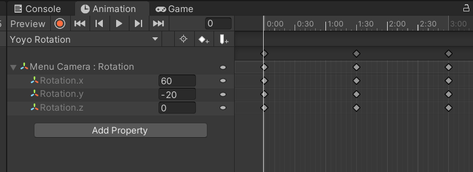
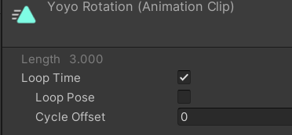
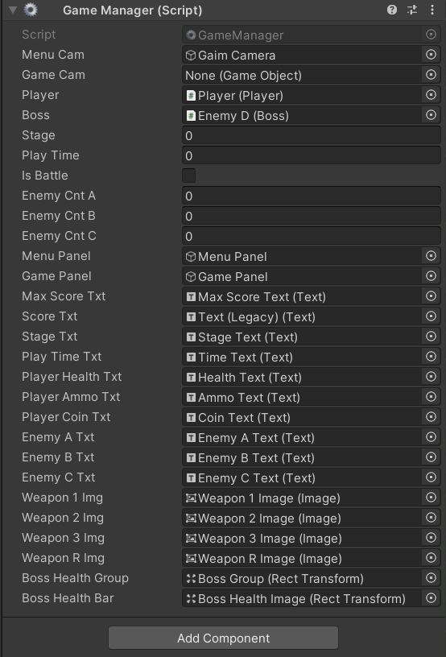
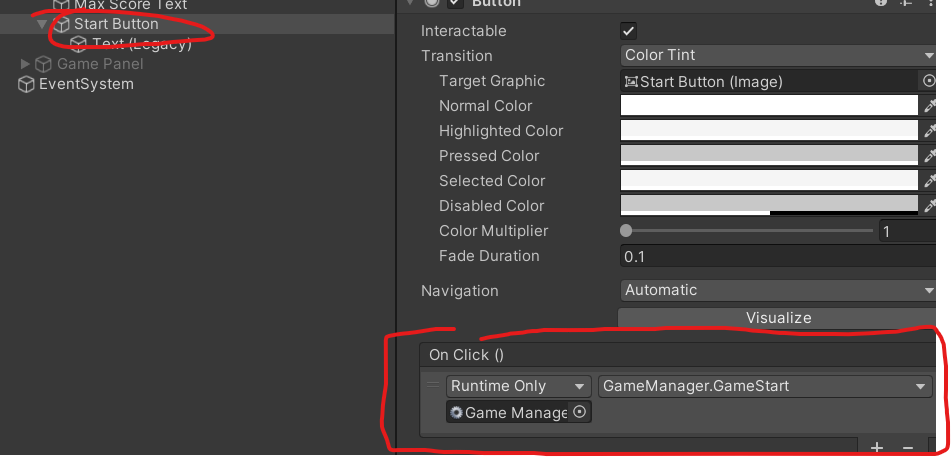

# 유니티 3D게임 쿼드뷰 16

> **Summary**
> 유니티 3D 게임 개발에 관한 내용으로, UI 로직 구성, 타이틀 카메라 제작, PlayerPrefs를 통한 저장 기능, GameManager 생성 및 변수 설정, 점수 및 플레이 시간 포맷 구현, 보스 체력 표시 방법 등을 다루고 있습니다. 또한, 애니메이션 추가 및 메뉴 관리에 대한 코드 예시도 포함되어 있습니다.

---

🎥 [동영상 보기](https://www.youtube.com/watch?v=7B9BsVnG8D8&list=PLO-mt5Iu5TeYkrBzWKuTCl6IUm_bA6BKy&index=16)

> 🔥 **메뉴용 카메라를 따로 생성하고 애니메이션을 제작하여 메뉴 카메라에 삽입**
> 
>
> 
>
> 
>
>

> 🔥 **초기화면 점수설정하기위해 Player.cs에서 PlayerPrefs 코드 추가**
> ```c#
> //Player.cs
>
> void Awake()
>     {
>         Debug.Log(PlayerPrefs.**GetInt**("MaxScore"));
>         PlayerPrefs.**SetInt**("MaxScore",112500);
>     }
> ```
>
> # 점수 설정은 Set자료형
> 점수 불러오기는 Get자료형
>
>

> 🔥 **GameManager.cs 생성하여 메뉴 관리**
> 
>
> ## 인게임에 쓰이는 요소들을 변수들로 설정
>
> ```c#
> //GameManager.cs
>
> using System.Collections;
> using System.Collections.Generic;
> using UnityEngine;
> using UnityEngine.UI; //UI를 다루기 위해선 해당 라이브러리 활성화
>
> public class GameManager : MonoBehaviour
> {
>     //게임매니저가 필요한 변수들부터 실행
>     public GameObject menuCam;
>     public GameObject gameCam;
>     public Player player;
>     public Boss boss;
>     public int stage;
>     public float playTime; //플레이시간
>     public bool isBattle; //현재 전투 스테이지인지?
>     public int enemyCntA;
>     public int enemyCntB;
>     public int enemyCntC;
>
>     //UI를 위한 변수설정
>     public GameObject menuPanel;
>     public GameObject gamePanel;
>     public Text maxScoreTxt;
>     public Text scoreTxt; //gamePanel 상단부
>     public Text stageTxt;
>     public Text playTimeTxt;
>     public Text PlayerHealthTxt; //gamePanel 하단부
>     public Text PlayerAmmoTxt;
>     public Text PlayerCoinTxt;
>     public Text enemyATxt;
>     public Text enemyBTxt;
>     public Text enemyCTxt;
>     public Image weapon1Img; //gamPanel 무기부
>     public Image weapon2Img;
>     public Image weapon3Img;
>     public Image weaponRImg;
>     public RectTransform bossHealthGroup; //보스 HP를 활성화시키는 스위치
>     public RectTransform bossHealthBar; //보스 피통
> }
> ```
>
> 
>
>

> 🔥 **메인메뉴 구현**
> > 🔥 **string.Format(); 함수로 문자열 양식 적용 {0:n0} 의미**
> > ```javascript
> > //GameManager.cs
> >
> > void Awake() 
> >     {
> >         //최고점수 불러오기
> >         //그냥 GetInt하면 기존 maxScore가 String으로 선언되어있기때문에
> >         //string.Format() 함수로 문자열 양식을 적용할것이다
> >         //string.Format("어떤양식을원하는가?",실제 값)
> >         maxScoreTxt.text = string.Format(("{0:n0}"),PlayerPrefs.GetInt("MaxScore"));
> >     }
> > ```
> >
> > ```c#
> > 괄호사이에 표기형식을 "" 를 감싸서 넣어주면 된다.
> >
> > 변수.ToString("N0"); 
> >
> > [ F : 실수 ]
> > F0 : 소수점 없이 표기  1234
> >
> > F1 : 소수점 한자리 1234.5
> >
> > F2 : 소수점 두자리 1234.56
> >
> > ...
> >
> > [ N : 자릿수를 표기하는 실수 ]
> > N0 : 소수점 없이 표시 + 천단위마다 , 표기 1,234
> >
> > N1 : 소수점 한자리 + 천단위마다 , 표기 1,234.5
> >
> > N2 : 소수점 두자리 + 천단위마다 , 표기 1,234.56
> >
> > ...
> >
> > [ P : 백분률 ]
> > P0 : %로 표기. 0.3f -> 30%
> >
> >
> >
> > [ D : 0을 붙이는 정수 ]
> > D0 : 123
> >
> > D1 : 한자리 123
> >
> > D5 : 다섯자리 00123
> > ```
> >
> >
>
> > 🔥 **게임스타트 눌렸을시 메인메뉴 비활성화하고 게임메뉴 활성화하는 코드를 작성한 후에 OnClick()에서 함수를 호출한다**
> > ```javascript
> > //GameManager.cs
> >
> >     public void GameStart()
> >     {
> >         //메뉴 관련 오브젝트 비활성화
> >         menuCam.SetActive(false);
> >         gameCam.SetActive(true);
> >
> >         menuPanel.SetActive(false);
> >         gamePanel.SetActive(true);
> >
> >         player.gameObject.SetActive(true); //비활성화해뒀던 플레이어 오브젝트 활성화
> >     }
> > ```
> >
> > 
> >
> >
>
> > 🔥 **LateUpdater 활용한 메뉴 UI 업데이트**
> > ```c#
> > //GameManager.cs
> >
> > //LateUpdate : Update()가 끝난 후 호출되는 생명주기
> >     void LateUpdate() 
> >     {
> >         //플레이어 스크립트에서 점수 체력 코인 정보 변수에 저장
> >         scoreTxt.text = string.Format(("{0:n0}"),player.score);
> >         stageTxt.text = "STAGE " + stage;
> >         playTimeTxt.text = "";
> >
> >         PlayerHealthTxt.text = player.health + " / " + player.maxHealth;
> >         PlayerCoinTxt.text = string.Format(("{0:n0}"),player.coin);
> >
> >         //만약 플레이어의 장착템이 null이거나 melee라면 표시를 '-' 로 표기
> >         if(player.equipweapon == null)
> >             PlayerAmmoTxt.text = "- / " + player.ammo;
> >         else if(player.equipweapon.type == Weapon.Type.Melee)
> >             PlayerAmmoTxt.text = "- / " + player.ammo;
> >         else
> >             PlayerAmmoTxt.text = player.equipweapon.curAmmo + " / " + player.ammo;
> >
> >         //무기가 00입니까? [n] 맞다면? 1 아니라면: 0
> >         weapon1Img.color = new Color(1,1,1, player.hasWeapons[0] ? 1 : 0); //망치
> >         weapon2Img.color = new Color(1,1,1, player.hasWeapons[1] ? 1 : 0); //권총
> >         weapon3Img.color = new Color(1,1,1, player.hasWeapons[2] ? 1 : 0); //서브머신건
> >         weaponRImg.color = new Color(1,1,1, player.hasGrenades > 0 ? 1 : 0); //수류탄이 0개보단 많다
> >
> >         //각 적들의 수
> >         //적의 수를 설정하여 문자열로 저장 후 UI에 저장
> >         enemyATxt.text = enemyCntA.ToString();
> >         enemyBTxt.text = enemyCntB.ToString();
> >         enemyCTxt.text = enemyCntC.ToString();
> >
> >
> >     }
> > ```
> >
> >
>
> > 🔥 **시 분 초 00:00:00 포맷에 맞게 구현**
> > ```javascript
> > //GameManager.cs
> >
> > void Update()
> > {
> >     //싸울때만 플레이타임을 더할것임
> >     if(isBattle)
> >         playTime  += Time.deltaTime;
> >
> > }
> >
> > void LateUpdate()
> > {
> > 		int hour = (int)(playTime / 3600);
> >     int min = (int)((playTime - hour * 3600) / 60); //이미 시간단위로 나눴기 때문에 그 나눈값을 60으로 나눔
> >     int second = (int)(playTime % 60); //분을 나눈 나머지값이 초다
> >     playTimeTxt.text = string.Format("{0:00}",hour) + ":" + string.Format("{0:00}",min) + ":" + string.Format("{0:00}",second);
> > }
> > ```
> >
> >
>
> > 🔥 **보스체력구현**
> > ```c#
> > //GameManager.cs
> >
> > void LateUpdate()
> > {
> > 		//보스의 현재체력에서 최대체력을 나눈값을 X축에 넣어서 크기를 줄여준다
> >     bossHealthBar.localScale = new Vector3((float)boss.curHealth / boss.maxHealth,1,1);
> > }
> > ```
> >
> >
>
>
>

