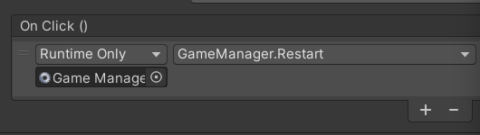
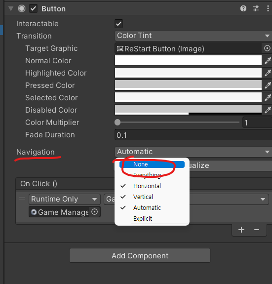

# 유니티 3D게임 쿼드뷰 17

> **Summary**
> 유니티 3D 게임 개발에 관한 내용으로, 게임 시작 및 종료 기능 구현, 몬스터 소환 로직, 네비게이션 타겟 설정 방법, 씬 관리 함수 사용법, 버튼 클릭 방지 설정 등이 포함되어 있습니다.

---

🎥 [동영상 보기](https://www.youtube.com/watch?v=9g4prUqF2oA&t=5s)

> 🔥 **게임 스타트존 제작 구현**
> 다음과같은 코드를 구현하면, 상점스테이지와 게임스테이지를 나눌 수 있음
>
> ```c#
> //GameManager.cs
>
> public GameObject itemShop;
> public GameObject weaponShop;
> public GameObject startZone;
>
> public void GameStart()
> {
>     //메뉴 관련 오브젝트 비활성화
>     menuCam.SetActive(false);
>     gameCam.SetActive(true);
>
>     menuPanel.SetActive(false);
>     gamePanel.SetActive(true);
>
>     player.gameObject.SetActive(true); //비활성화해뒀던 플레이어 오브젝트 활성화
> }
>
> //스테이지 시작, 종료 함수 생성
> public void StageStart()
> {
>     //전투가 시작되면 상점 및 게임스타트 영역을 비활성화시킵니다
>     itemShop.SetActive(false);
>     weaponShop.SetActive(false);
>     startZone.SetActive(false);
>     isBattle = true; //전투상태 ON
>     StartCoroutine(InBattle());
> }
>
> //코루틴으로 전투 상태 구현
> IEnumerator InBattle()
> {
>     yield return new WaitForSeconds(5); //n초 동안 전투상태
>     StageEnd(); //전투가 끝나면 스테이지 종료 함수 호출
> }
>
> public void StageEnd()
> {
>     //플레이어를 시작 위치로 초기화
>     player.transform.position = Vector3.up * 0.8f;
>     //전투가 종료되면 상점 및 게임스타트 영역을 활성화시킵니다
>     itemShop.SetActive(true);
>     weaponShop.SetActive(true);
>     startZone.SetActive(true);
>
>     isBattle = false;
>     stage++; //스테이지를 한단계 올림
> }
> ```
>
>

> 🔥 **몬스터 프리팹  보완**
> 랜덤값을 몬스터 소환 수와 몬스터 소환 위치에 넣는다 랜덤한위치에 랜덤한수의 몬스터가 리스폰함
>
> ```javascript
>
> //GameManager.cs
>
> //몬스터 리스폰에 필요한 변수들 선언
> public Transform[] enemyZones;
> public GameObject[] enemies;
> public List<int> enemyList; //몬스터가 얼마나 소환될것인지 리스트 작성
>
> void Awake() 
> {
>     //몬스터 생성 정보를 불러옴
>     enemyList = new List<int>();
> }
>
> //코루틴으로 전투 상태 구현
> IEnumerator InBattle()
> {
>     while(enemyList.Count < 0)
>     {
>         //소환하는곳이 4곳이니 랜덤값 0~4 설정
>         //게임오브젝트 변수를 따로 만들어서 인스턴트를 생성함
>         //인스턴트 내용 : 인스턴트한다(몬스터프리팹[몹종류들[n]],소환될장소[].위치,소환될장소[].회전값)
>         int ranZone = Random.Range(0,4);
>         GameObject instantEnemy = Instantiate(enemies[enemyList[0]]
>                                             ,enemyZones[ranZone].position
>                                             ,enemyZones[ranZone].rotation);
>     }
> }
> ```
>
>

> 🔥 **프리팹으로 저장한 오브젝트에 네비게이션 target을 저장하는 방법은 바로 public으로설정한 변수에 타겟을 넣어주는거다.**

> 🔥 **SceneManagemen 함수를 쓰려면 라이브러리를 따로 불러와야함..

그 후에 ReStart Button에서도 On Click() 활성화시켜줘야합니다**
> ```javascript
> //GameManager.cs
>
> using UnityEngine.SceneManagement; //Scene 관련 함수를 사용하려면 해당 라이브러리 활성화
>
> //게임 오버 후, 메인 타이틀로 돌아가기 위해 재시작 함수 생성
> public void Restart()
> {
>     //씬이 하나밖에 없기 때문에 그냥 0눌러주면 된다
>     SceneManager.LoadScene(0);
> }
> ```
>
> 
>
>

> 🔥 **버튼 네비게이션을 None으로 해줘야 버튼으로 클릭이 안됩니다**
> 
>
>

