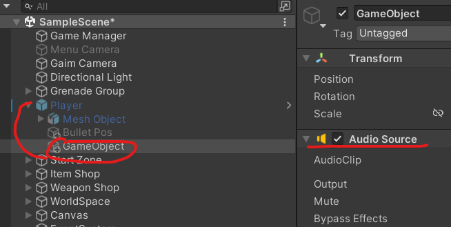

# 유니티 3D게임 쿼드뷰 18 (최종)

> **Summary**
> 사운드 구현을 위해 각 사운드별로 AudioSource가 담긴 자식 오브젝트를 추가하고, 원하는 사운드를 다운로드하여 Player.cs에 jumpSound 변수를 추가한 후 음향효과를 활성화하는 코드를 작성합니다. Play On Awake 옵션은 해제해야 합니다.

---

🎥 [동영상 보기](https://www.youtube.com/watch?v=9g4prUqF2oA&t=5s)

> 🔥 **각 사운드별로 AudioSource가 담긴 자식 오브젝트를 추가해줍니다**
> 
>
>

> 🔥 **사운드는 다음 웹사이트에서 얻을 수 있습니다**
> 🔗 [https://assetstore.unity.com/?category=audio&free=true&orderBy=1](https://assetstore.unity.com/?category=audio&free=true&orderBy=1)
>
> 🔗 [https://soundeffect-lab.info/](https://soundeffect-lab.info/)
>
>
>

> 🔥 **원하는 사운드를 다운받고 Audio Clip에 넣은 후 Player.cs에서 다음과 같은 코드를 추가해줍니다**
>
> jumpSound라는 퍼블릭 변수와
>
> Play()라는 함수를 이용하여 음향효과를 활성화 시킵니다
>
> ```c#
> //Player.cs
>
> **public AudioSource jumpSound;
> **
> void Jump()
>     {
>         if(jDown && moveVec == Vector3.zero && !isJump && !isSwap && !isDead)
>         {
>             rigid.AddForce(Vector3.up * 15, ForceMode.Impulse);
>             anim.SetBool("IsJump", true);
>             anim.SetTrigger("doJump");
>             isJump = true;
>
>             **jumpSound.Play();**
>         }
>     }
> ```
>
> 
>
>

