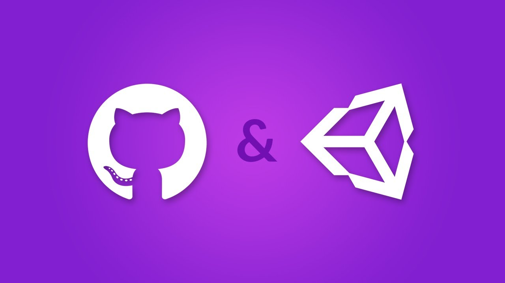

# 유니티 깃허브 연동

> **Summary**
> 유니티 프로젝트 관리를 위해 깃허브와 연동하는 방법에 대한 정보가 포함되어 있으며, 새로운 리포지토리 생성 및 프로젝트를 깃허브에 올리는 방법에 대한 링크가 제공됩니다.

---

🔗 [https://learnandcreate.tistory.com/625](https://learnandcreate.tistory.com/625)

🔗 [https://jjuke-brain.tistory.com/entry/Github%EB%A1%9C-Unity-%ED%94%84%EB%A1%9C%EC%A0%9D%ED%8A%B8-%EA%B4%80%EB%A6%AC%ED%95%98%EA%B8%B0](https://jjuke-brain.tistory.com/entry/Github%EB%A1%9C-Unity-%ED%94%84%EB%A1%9C%EC%A0%9D%ED%8A%B8-%EA%B4%80%EB%A6%AC%ED%95%98%EA%B8%B0)

🔗 [https://88-it.tistory.com/157](https://88-it.tistory.com/157)

