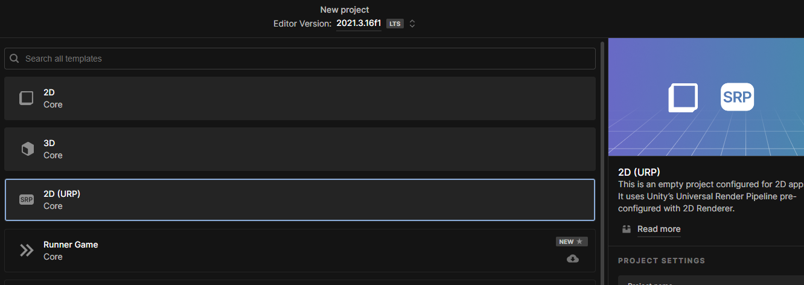
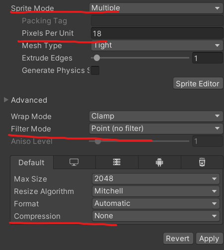
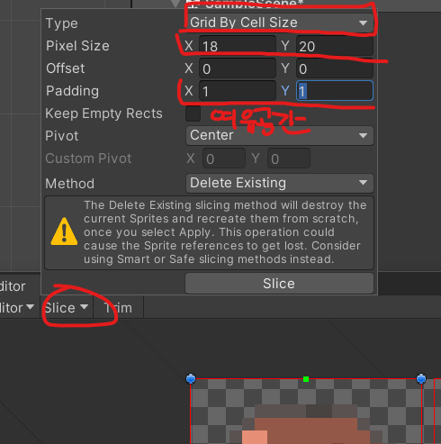
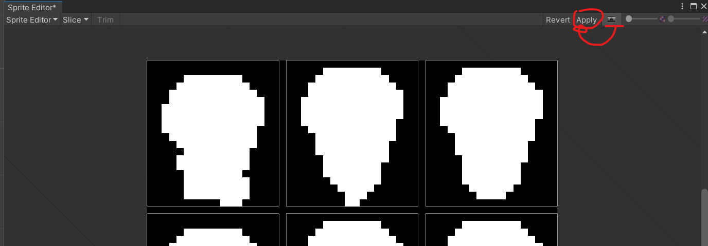
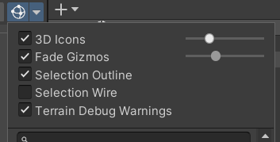
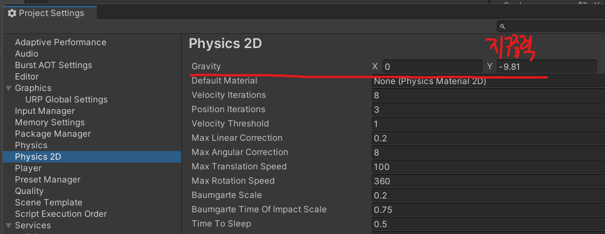
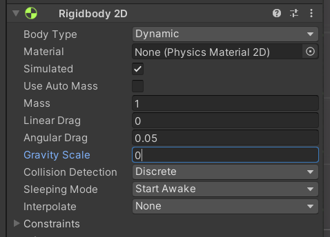
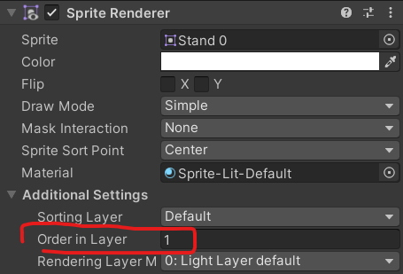

# 유니티 로그라이크 01

> **Summary**
> URP는 다양한 플랫폼에 최적화된 그래픽을 제공하며, 캐릭터 스프라이트 설정, 기즈모 크기 변경, 중력 설정 및 이미지 레이어 순서 조정 방법을 설명한다.

---

🎥 [동영상 보기](https://www.youtube.com/watch?v=qOTbP9ciJ88&list=PLO-mt5Iu5TeZF8xMHqtT_DhAPKmjF6i3x&index=2)

> 🔥 **URP로 프로젝트 생서할것임**
> ## URP는 유연하고 확장성이 좋으며 다양한 플래폼(모바일, 콘솔, PC, VR)에 최적화된 그래픽을 제공한다.
>
> 
>
>

> 🔥 **캐릭터 스프라이트 다음과 같이 설정**
> 
>
> ### Sprite에서 설정
>
> 
>
> ### Slice 하고 알파값보고 잘 잘렸는지 확인하고 Apply
>
> 
>
>

> 🔥 **유니티 씬 내부에서 기즈모 크기 변경방법**
> 
>
>

> 🔥 **유니티 중력은 리지드바디 뿐만 아니라 프로젝트설정에서도 설정이가능한데\**
>
> Edit - Projecy Settings - Physics2D 에서확인이가능하다
>
> 
>
> 
>
>

> 🔥 **이미지 레이어 순서 설정**
> 
>
>

