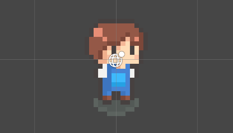

# 유니티 로그라이크 02

> **Summary**
> 플레이어 이동을 위한 Rigidbody2D 함수 설명과 FixedUpdate의 사용법을 다루며, 입력 벡터를 정규화하고 속도를 제어하는 방법을 설명합니다. GetAxis 대신 GetAxisRaw를 사용하여 반응성을 개선할 수 있습니다.

---

🎥 [동영상 보기](https://www.youtube.com/watch?v=YAu4yWU5D5U)



> 🔥 **`FixedUdate`는 물리 연산 프레임마다 호출되는 함수다**

> 🔥 **Rigidbody2D 함수 설명 + 플레이어 이동 코드**
> ```c#
> public class Player : MonoBehaviour
> {
>     public Vector2 inputVec;
>     Rigidbody2D rigid;
>
>     void Awake()
>     {
>         rigid = GetComponent<Rigidbody2D>();
>     }
>
>     void Update()
>     {
>         //input키에 Horizontal 은 [left, right] Vertical 은 [up, down] 키가 매핑되어있음
>         inputVec.x = Input.GetAxis("Horizontal");
>         inputVec.y = Input.GetAxis("Vertical");
>     }
>
>     //FixedUdate는 물리 연산 프레임마다 호출되는 함수다
> **    void FixedUpdate() 
>     {
>         //1.힘을 준다
>         rigid.AddForce(inputVec);
>
>         //2.속도제어
>         //Veclocity는 물리적인 속성을 뜻함 (속도를 인풋키로 직접 설정하겠다는 뜻)
>         rigid.velocity = inputVec;
>
>         //3.위치 이동
>         //MovePostion은 위치 이동이라 현재 위치를 더해줘야함
>         //이 코드에서 현재 위치는 rigid.postion 이다
>         //인풋값과 현재위치를 더해주면 플레이어가 나아가야 할 방향을 계산한다
>         rigid.MovePosition(rigid.position + inputVec);
>     }**
> }
> ```
>
>

> 🔥 **근데 플레이어 속도가 너무 빨라서 다음과같이 벡터를 노말라이즈 해주고 델타타임을 곱해줘서 프레임 속도를 고정시켜줍니다**
>
> > 🔥 **노말라이즈를 해주는 이유는 위 1 옆1 을 가더라도 대각선방향은 루트2 다 보니까 속도의 차가 생기니, 모든 방향의 값을 1로 고정시켜줍니다**
>
>
> ```javascript
> //Player.cs
>
> public float speed;
>
> void FixedUpdate() 
>     {
>
>         //어느 방향이든 벡터값을 1로 고정
>         **Vector2 nextVec = inputVec.normalized * speed * Time.deltaTime;**
>
>         //위치 이동
>         //MovePostion은 위치 이동이라 현재 위치를 더해줘야함
>         //이 코드에서 현재 위치는 rigid.postion 이다
>         //인풋값과 현재위치를 더해주면 플레이어가 나아가야 할 방향을 계산한다
>         rigid.MovePosition(rigid.position + nextVec);
>     }
> ```
>
>

> 🔥 **근데 GetAxis특유의 늦은 반응과 슬라이스 이동이 거슬린다**
> ## GetAxis → GetAxisRaw 로 바꾸면 벡터값이 Impulse하게 작동됨 (점차 1까지 올라가는게 아니라 바로 1값을 때려박음)
>
> ```javascript
> inputVec.x = Input.**GetAxisRaw**("Horizontal");
> inputVec.y = Input.**GetAxisRaw**("Vertical");
> ```
>
>

