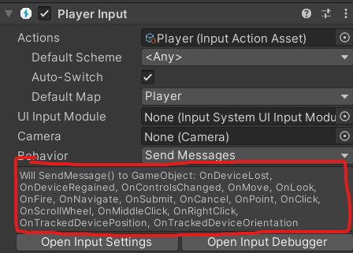

# 유니티 로그라이크 03

> **Summary**
> 유니티의 새로운 Player Input 시스템을 설치하여 플레이어의 움직임 로직을 개선하는 방법을 설명합니다. Input System 설치 후, Player Input 컴포넌트를 추가하고, 입력 값에 따라 이동 벡터를 설정하는 방법을 코드 예제와 함께 안내합니다. 기존 방법보다 더 나은 성능을 제공하며, 대각선 이동 시 상대적 길이를 자동으로 계산합니다.

---

🎥 [동영상 보기](https://www.youtube.com/watch?v=tKMnVBTes0M&list=PLO-mt5Iu5TeZF8xMHqtT_DhAPKmjF6i3x&index=4)

> 🔥 ****기존에 유니티에서 제공하던 Input System 은 구식 방법으로. 새롭게 유니티에서 배포하는 Input 패키지를 설치하여 더 나은 방법으로 플레이어의 움직임 로직을 구현합니다****

> 🔥 **Window - Package Manager 에서 Unity Registriy 이동하여 Input System 설치**
> 
>
> 
>
>

> 🔥 **설치 후에 컴포넌트 Player Input을 검색하면 새롭게 컴포넌트가 추가된것을 확인할 수 있습니다 **
>
> 
>
>
> Create Actions 를 해주면
>
> 
>
>

> 🔥 **Interactions에서 Input이 어떻게 눌렸을때 Move값이 변할지 설정할 수 있습니다. 기본적으로 Press 즉 버튼이 눌리자마자 값이 변하는 형태입니다**
> 
>
>

> 🔥 **아 그리고 저장도 잊지 마세요 전 오토세이브를 켜뒀습니다**
> 
>
>

> 🔥 **그리고 Player Input에서 제공하는 함수를 참고해봅시다. Vs Code에서 자동완성 기능을 지원하지 않아서 참고해야해요**
> 
>
>

```c#
//Player.cs

using System.Collections;
using System.Collections.Generic;
using UnityEngine;
**using UnityEngine.InputSystem;** //새롭게 설치한 Player Input System 을 사용하기 위해 임포트

public class Player : MonoBehaviour
{
    public Vector2 inputVec;
    public float speed;
    Rigidbody2D rigid;

    void Awake()
    {
        rigid = GetComponent<Rigidbody2D>();
    }


    //FixedUdate는 물리 연산 프레임마다 호출되는 함수다
    void FixedUpdate() 
    {

        //어느 방향이든 벡터값을 1로 고정
        Vector2 nextVec = inputVec * speed * Time.deltaTime;

        //위치 이동
        //MovePostion은 위치 이동이라 현재 위치를 더해줘야함
        //이 코드에서 현재 위치는 rigid.postion 이다
        //인풋값과 현재위치를 더해주면 플레이어가 나아가야 할 방향을 계산한다
        rigid.MovePosition(rigid.position + nextVec);
    }

    **void OnMove(InputValue value)
    {
        //아까 Player의 Input Action 속성의Move - Control Type으로 설정했던 Vector2 를 가져옴
        //해당 라이브러리를 통해서 벡터의 노멀라이즈는 이미 설정되어있기 때문에 기존 nextVec에서 normalized는 빼도 된다
        inputVec = value.Get<Vector2>();
    }
}**
```

> 🔥 **해당 라이브러리의 함수를 이용하면 기존 방법에서 사용하던  노말라이즈를 자동으로 적용해줍니다 아래 사진을 보면 대각선 이동중인데 가로1 세로1의 상대적 길이를 계산하여 (2루트) 대각선 길이를 상대적으로 계산해줬습니다**
> 
>
>


