# 유니티 로그라이크 04

> **Summary**
> 유니티 로그라이크 게임 개발에 관한 내용으로, 플레이어의 이동 방향에 따라 시선을 바꾸는 코드 구현, 애니메이션 제작 방법, 애니메이터 오버라이드 활용법 등을 다루고 있다. 애니메이션의 속도를 조절하기 위해 magnitude를 사용하고, 애니메이션 트리거와 파라미터 설정에 대한 설명도 포함되어 있다.

---

🎥 [동영상 보기](https://www.youtube.com/watch?v=vizfd1TeRMI&list=PLO-mt5Iu5TeZF8xMHqtT_DhAPKmjF6i3x&index=5)


> 🔥 **플레이어가 이동방향에맞게 시선을 바꾸는 코드를 구현해보자**
> 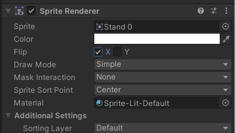
>
> ```c#
> //Player.cs
>
> SpriteRenderer spriter;
>
> void LateUpdate()
>     {
>         if (inputVec.x != 0)
>         {
>             //좌측으로 이동하면 x는 - 값이 되니까 spriter.flipX는 true값이 된다
>             //우측으로 이동하면 좌표상 x는 +가 되니까 true값을 가지며 기존대로 우측을 바라본다
>             **spriter.flipX = inputVec.x < 0;**
>         }
>     }
> ```
>
> > 🔥 **LateUpdater? : 프레임이 종료 되기 전 실행되는 매프레임 함수(생명주기)**
>
>

> 🔥 **플레이어의 애니메이션을 직접 만들어보자**
> 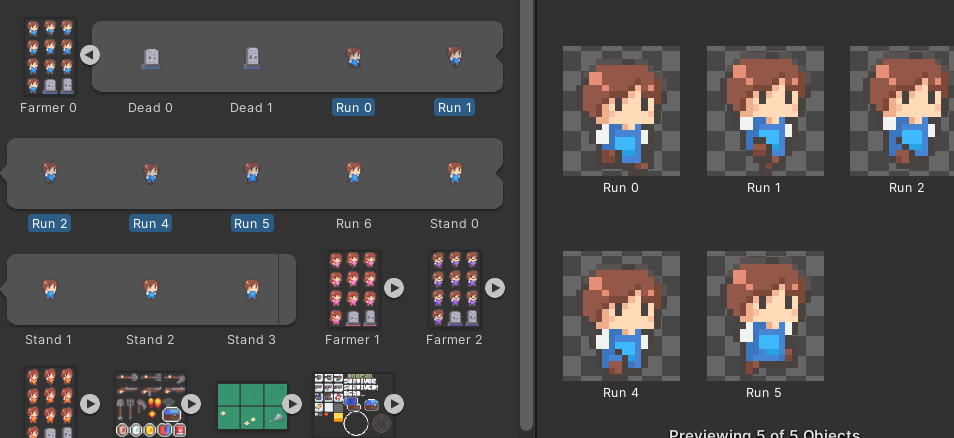
>
> > 🔥 **Unity 파일 이름의 "Ac" 접두어는 "Asset Collection"을 의미합니다. Unity는 이 접두사를 사용하여 파일이 프로젝트에서 함께 사용되는 자산 집합인 자산 컬렉션의 일부임을 나타냅니다. Unity는 일관된 명명 규칙을 사용하여 개발자가 프로젝트 파일을 보다 쉽게 구성하고 관리할 수 있도록 합니다. 또한 "Ac" 접두사는 Unity가 에셋 컬렉션 파일을 프로젝트에서 사용되는 다른 유형의 파일과 구별하는 데 도움이 됩니다.**
> > 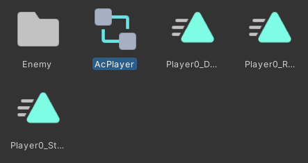
> >
> >
>
> 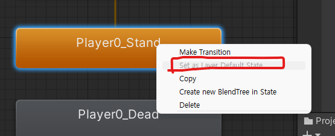
>
> 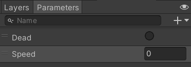
>
> 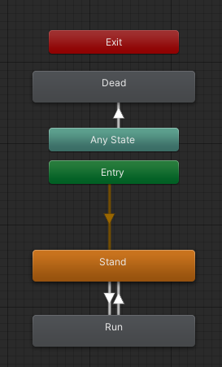
>
> 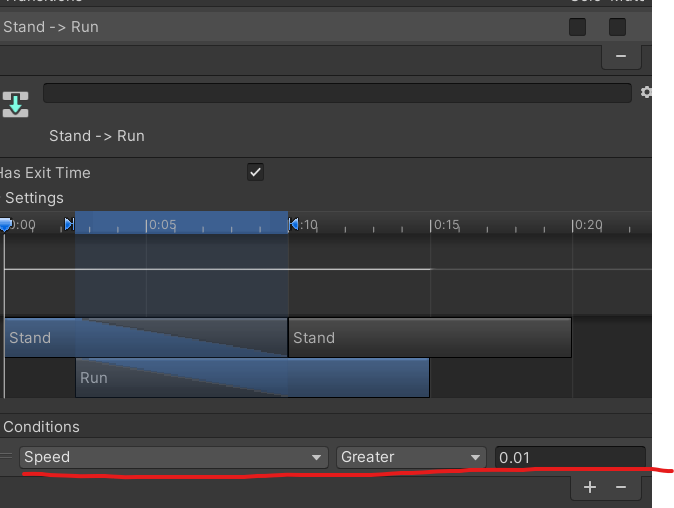
>
> > 🔥 **What is Has Exit TIme?**
> > 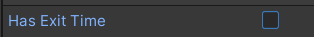
> >
> >
>
> ```c#
> using System.Collections;
> using System.Collections.Generic;
> using UnityEngine;
> using UnityEngine.InputSystem; //새롭게 설치한 Player Input System 을 사용하기 위해 임포트
>
> public class Player : MonoBehaviour
> {
>     public Vector2 inputVec;
>     public float speed;
>     Rigidbody2D rigid;
>     SpriteRenderer spriter;
>     **Animator anim;**
>
>     void Awake()
>     {
>         rigid = GetComponent<Rigidbody2D>();
>         spriter = GetComponent<SpriteRenderer>();
>         **anim = GetComponent<Animator>();**
>     }
>
> ...
> ...
> ...
>
>     void LateUpdate()
>     {
>         **//magnitude : 순수하게 크기만 가지고있는 속성
>         //움직이기만 하면 애니메이션이 작동되는거니까 Speed에 단순한 움직임값만 넣어주는것
>         anim.SetFloat("Speed", inputVec.magnitude);**
>
> ...
> ```
>
> > 🔥 ****magnitude **을 사용함으로서 움직일때 얻는 값을 얻을 수 있음
> Animator에서 Speed는 값이 0.01보다 크면 실행되게했으니 굳이 inputVec.x or y 가져와서 하나하나 할 필요 없이 magnitude를 사용한다**
>
>

> 🔥 ****애니메이션 재활용하는 애니메이터 오버라이드를 알아보자****
> 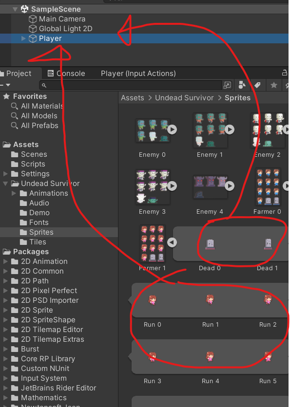
>
> 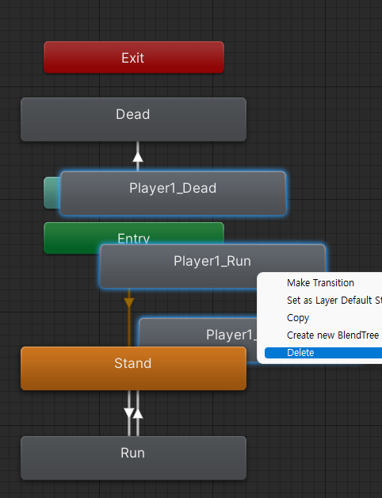
>
> > 🔥 **애니메이션 폴더에서 Animator Override를 생성해준다**
> > 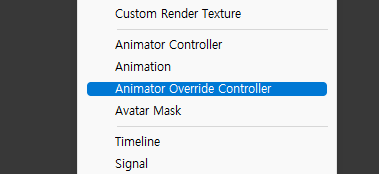
> >
> >
>
> 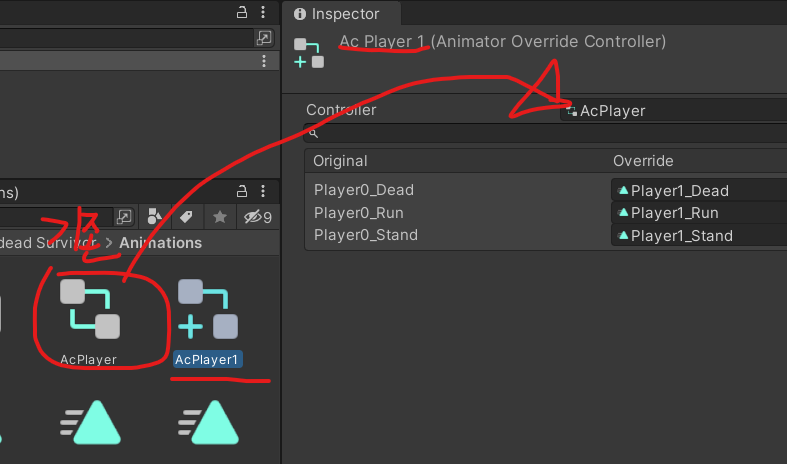
>
> 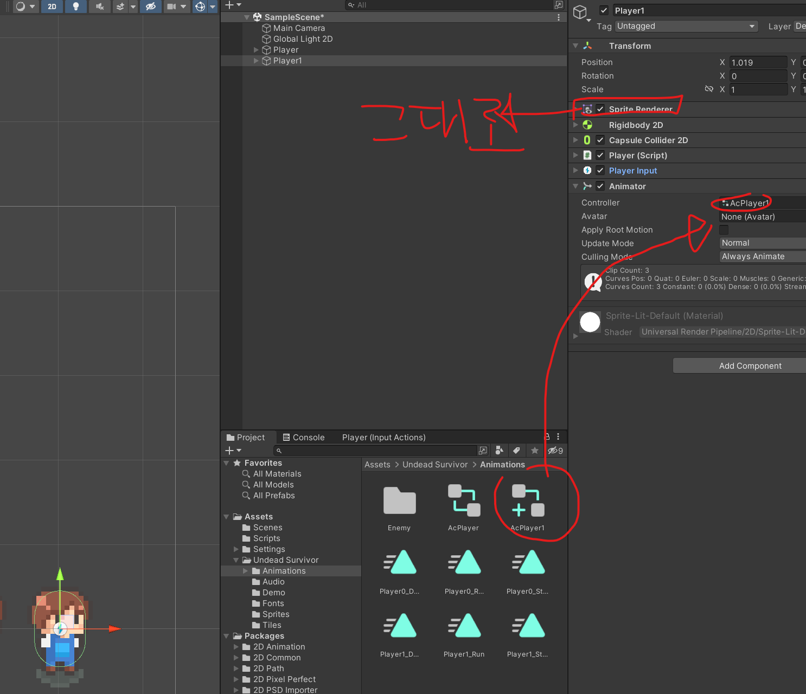
>
> 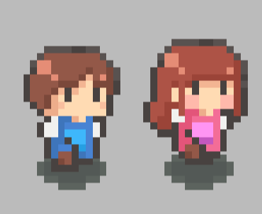
>
>

