# 유니티 로그라이크 05

> **Summary**
> 무한 맵 구현, 플레이어를 따라다니는 카메라 설정, 게임 매니저를 활용한 코드 관리, 랜덤 타일 생성 및 타일맵 콜라이더 설정에 대한 내용을 다루고 있으며, Unity에서 로그라이크 클론 게임 개발을 위한 다양한 기술적 요소를 설명하고 있습니다.

---

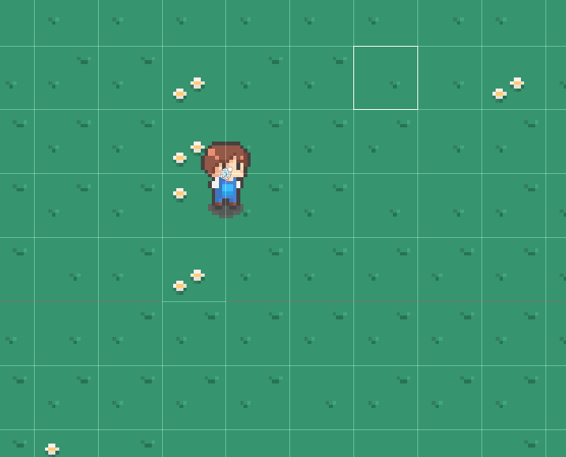

🎥 [동영상 보기](https://www.youtube.com/watch?v=SNjgew0VhHY&list=PLO-mt5Iu5TeZF8xMHqtT_DhAPKmjF6i3x&index=6)

> 🔥 **랜덤한 타일이 배치된 타일맵을 그려보자**
> 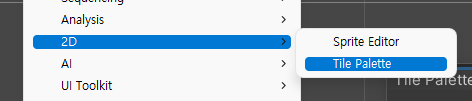
>
> 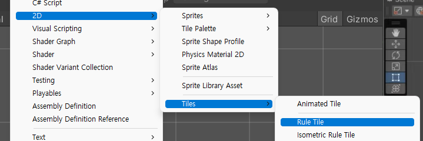
>
> 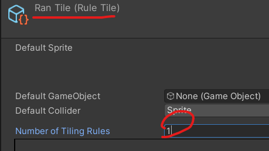
>
> > 🔥 **Runt Tile이란 인접한 타일에 따라 이미지가 정해지는 타일 (랜덤생성 타일)**
>
> 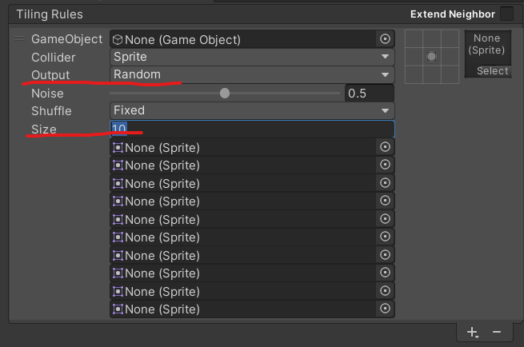
>
> 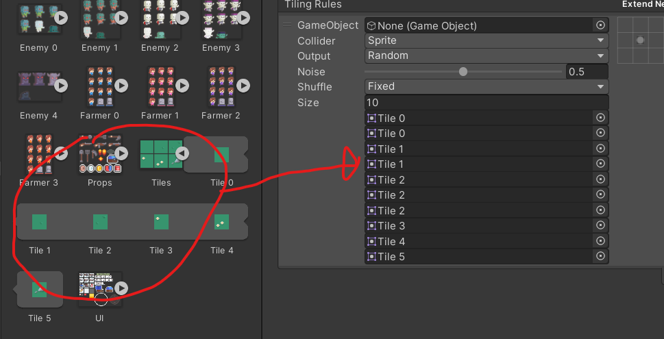
>
> ## Tile Palette에 RanTile 적용시켜서 랜덤타일 생성될 틀을 만들어준다
>
> 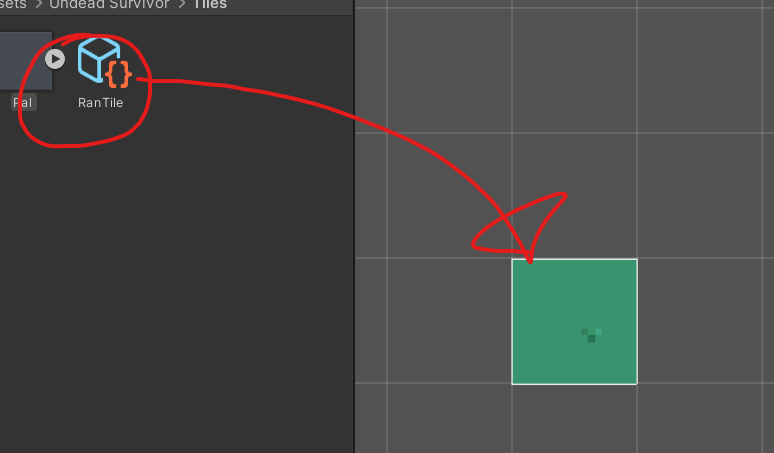
>
> 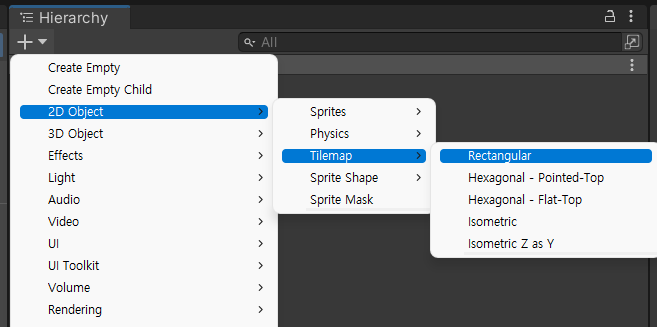
>
> 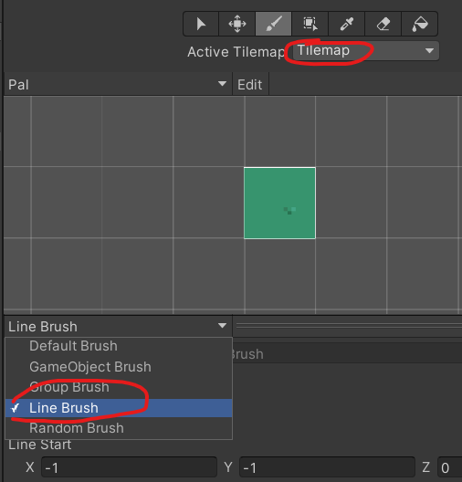
>
>

> 🔥 ****랜덤타일맵 생성 - 1****
> 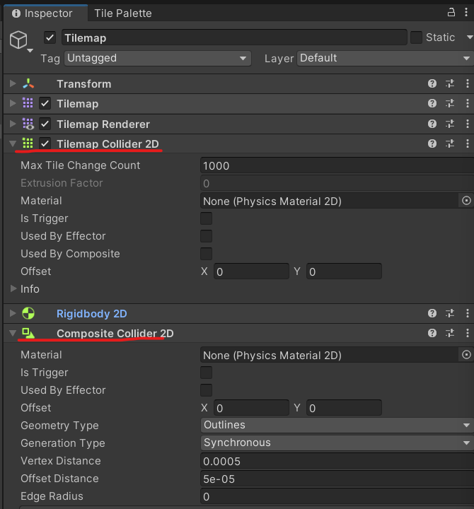
>
> 하이어라키에 Tilemap에 `Tilemap Collider 2D` 와 `Compsite Collider 2D` 를 추가해준다
>
> > 🔥 **`Compsite Collider 2D` : 잘게 나눠진 그리드 속에 나뉜 타일을 하나로 합쳐주는 컴포넌트**
>
> 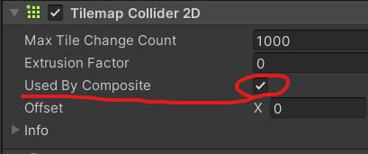
>
> 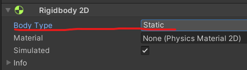
>
> 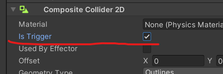
>
> ## 그리고 Tilemap의 Tag설정을 ‘Ground’ 로 설정해준다
>
>
> 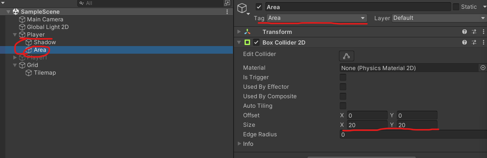
>
>

> 🔥 ****랜덤타일맵 생성 - 2 (재배치 스크립트 준비)****
>
> ## 게임메모리를 생성하는 이유는 게임메모리 자체를 메모리에 얹어버릴것임
>
> 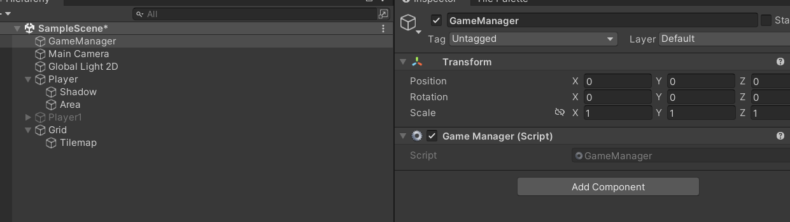
>
> 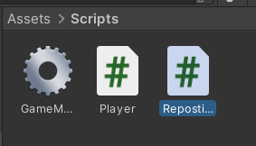
>
>
> 파이썬의 Main 함수를 따로 만들어서 미리 만들어둔 함수를 미리 불러와서 사용하는거랑 비슷한 논리..
>
> ```c#
> //Gamemanager.cs
>
> using System.Collections;
> using System.Collections.Generic;
> using UnityEngine;
>
> public class GameManager : MonoBehaviour
> {
>     //정적변수 static을 미리 설정해두면 즉시 클래스에서 부를 수 있다는 편리함이 있다
>     public static GameManager instance;
>     public Player player;
>
>     void Awake() 
>     {
>         instance = this;
>     }
> }
> ```
>
> 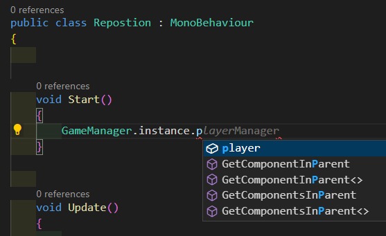
>
> # 코드작성
>
> ```c#
> //Reposition.cs
>
> using System.Collections;
> using System.Collections.Generic;
> using UnityEngine;
>
> public class Repostion : MonoBehaviour
> {
>     //트리거가 체크된 콜라이더를 벗어났을때
>     //이를 위해 플레이어에 Area를 만들었다 (충돌여부를 확인하기 위해)
>     void OnTriggerExit2D(Collider2D collision)
>     {
>         //이 콜라이더의 주인
>         //Area 태그가 '아닐때' 코드가 실행되도록함
>         //만약 Area태그가 아닌다면 코드를 실행하지 않겠다 라는 뜻
>         if(!collision.CompareTag("Area"))
>             return; //코드 상단에 if return 필터를 넣음으로서 이 태그가 아닐경우 빨랑 코드가 나갈수있도록함
>
>         //거리를 구하기 위해 플레이어 위치와 타일맵 위치를 미리 저장
>
>         //플레이어 위치
>         //플레이어 포지션을 가져오기위해 게임매니저에 저장해둔 플레이어에서 위치값을 가져오는 과정
>         Vector3 playerPos = GameManager.instance.player.transform.position;
>
>         //타일맵 위치
>         //현재 이 스크립트가 들어있는 타일맵의 위치값
>         Vector3 myPos = transform.position; 
>
>         //x축과 y축 각각의 거리를 구하는 코드
>         //Mathf 는 수학 라이브러리.. 절대값을 구하기 위해 Abs를 불러옴
>         float diffX = Mathf.Abs(playerPos.x - myPos.x);
>         float diffY = Mathf.Abs(playerPos.y - myPos.y);
>
>
>         //플레이어의 이동 방향을 저장하기 위한 변수
>         //플레이어에서 미리 만들어뒀던 inputVec을 불러온다
>         Vector3 playerDir = GameManager.instance.player.inputVec;
>         //Player에서 노멀라이즈를 했기때문에 1값이 안나오니 0보다 클때(좌우 이동할때) 값을 받아온다 
>         float dirX = playerDir.x < 0 ? -1 : 1;
>         float dirY = playerDir.y < 0 ? -1 : 1;
>
>         //나중에 적이 추가되었을때 적들도 재배치를 요구하기때문에 여기서 필터를 만들어준다
>         **switch (transform.tag)
>         {
>             case "Ground":
>                 if (diffX > diffY)
>                 {
>                     //Translate : 지정된 값 만큼 현재 위치에서 이동한다
>                     //Translate(이동방향,플레이어방향,Area의크기,)
> 										//40을 곱해준 이유는 Tilemap을 4개 복사해서 쓸거기 때문에 타일맵의 총 합을 구하면 40이된다
>                     transform.Translate(Vector3.right * dirX * 40);
>                 }
>                 else if (diffX < diffY)
>                 {
>                     transform.Translate(Vector3.up * dirY * 40);
>                 }
>                 break;
>             case "Enemy":
>                 break;**
>         }
>     }
> }
> ```
>
> 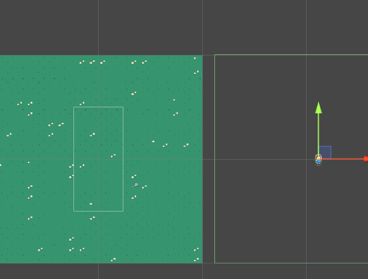
>
> 만약 이런식으로 X축으로 화면을 벗어났을경우, 
>
> ```c#
> if (diffX > diffY)
> ```
>
> 해당코드와 같은 수평적으로 벗어난 상태이니 그에 해당되는 코드가 시작된다는 뜻
>
> 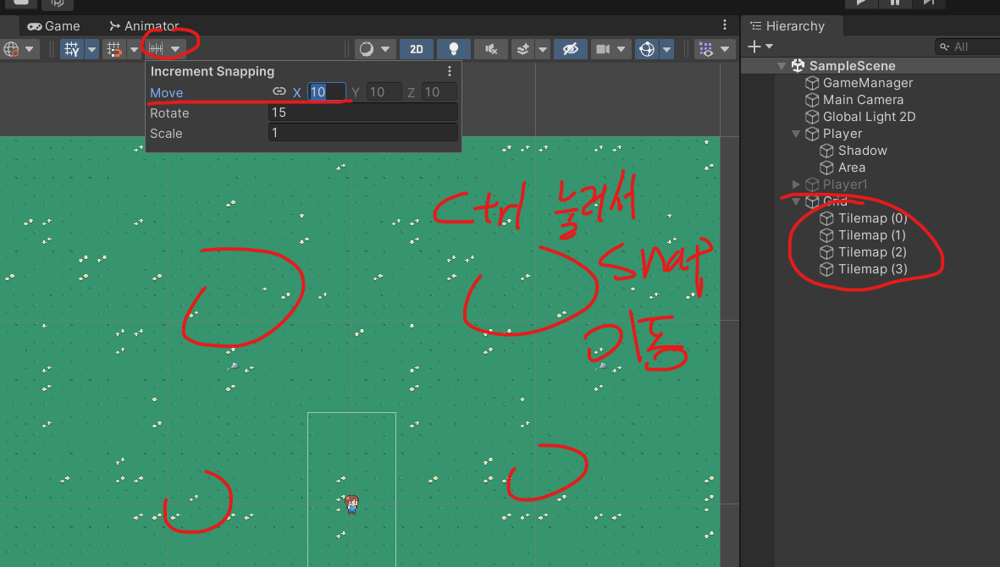
>
>
> 이 4개의 타일이 계속해서 재활용되며 이동되는 로직인데, 그림으로 설명하면 다음과 같다
>
> 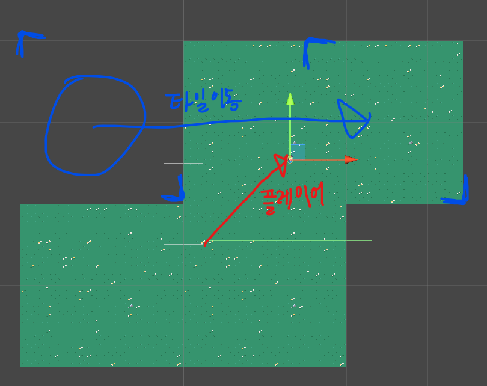
>
> > 🔥 **시잇팔 버그발생! **
> > ```c#
> > Instructions: Using the provided web search results, write a comprehensive reply to the given query. Make sure to cite results using [[number](URL)] notation after the reference. If the provided search results refer to multiple subjects with the same name, write separate answers for each subject.
> > Query: NullReferenceException: Object reference not set to an instance of an object
> > Repostion.OnTriggerExit2D (UnityEngine.Collider2D collision) (at Assets/Scripts/Repositon.cs:21)
> > ```
> >
> > 이 버그가 발생되길래 21번째줄 가서 확인해보니 다음코드였다
> >
> > ```c#
> > Vector3 playerPos = GameManager.instance.player.transform.position;
> > ```
> >
> > 아니 public으로 설정도해뒀고 문제없는데 왜 자꾸 버그가 날까… 보아하니
> >
> >
> > 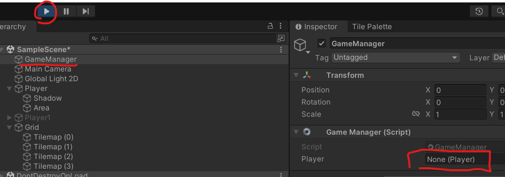
> >
> > 게임스타트를 투르면 GameManager에 설정해뒀던 Player가 날아가버린다.. 뭐야 이 버그
> >
> >
> > ## 답은 GameManager.cs에 있었다…
> >
> >
> > 코드가 Awake될때 인스턴트값에 자기 자신을 넣었어야 Player가 날아가지 않았다…
> >
> >
> > 기존에는 GetComponet를 사용해서 public함수에 직접 접근했었는데 뭐가 문제일까?
> >
> > ```c#
> > using System.Collections;
> > using System.Collections.Generic;
> > using UnityEngine;
> >
> > public class GameManager : MonoBehaviour
> > {
> >     //정적변수 static을 미리 설정해두면 즉시 클래스에서 부를 수 있다는 편리함이 있다
> >     public static GameManager instance;
> >     public Player player;
> >
> >     void Awake() 
> >     {
> >         **instance = this;**
> >         /*
> >         instance = GetComponent<GameManager>();
> >         player = GetComponent<Player>();
> >         */
> >     }
> > }
> > ```
> >
> >
>
>

> 🔥 **카메라를 설정해주자**
> 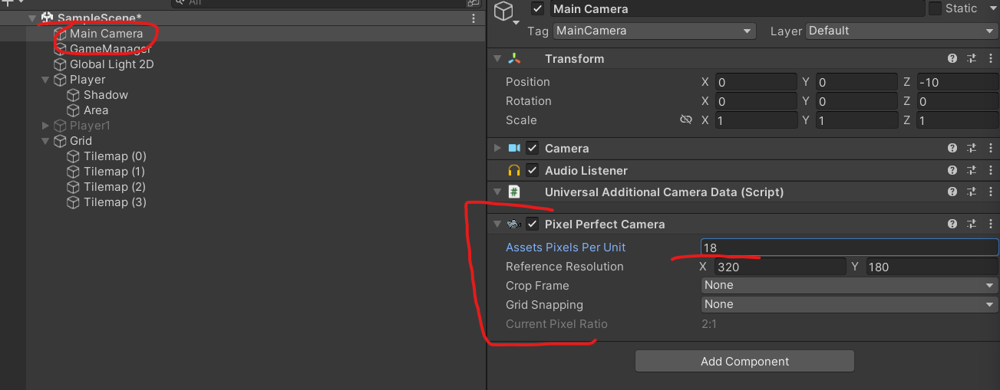
>
>
> 해상도가 짝수여야 다음 에러를 해결할 수 있다
>
> 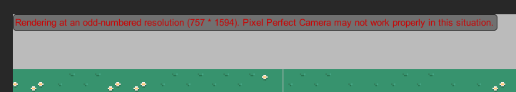
>
> 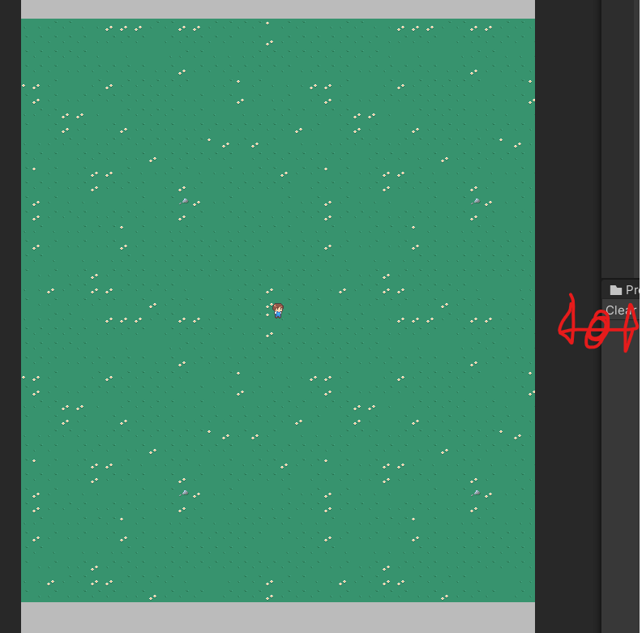
>
>
> ## 플레이어를 따라다니는 카메라를 구현해보자
>
> 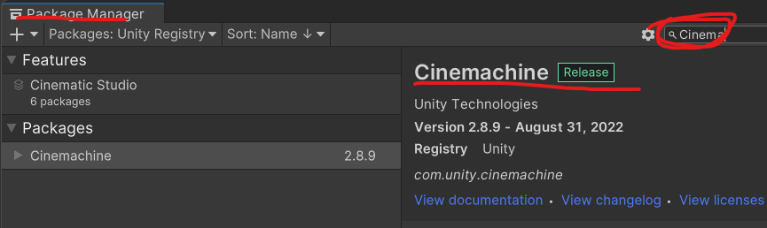
>
> 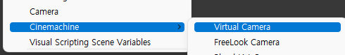
>
> > 🔥 **Virtual Camera는 Main Camera의 감독역할을 하게된다**
>
> 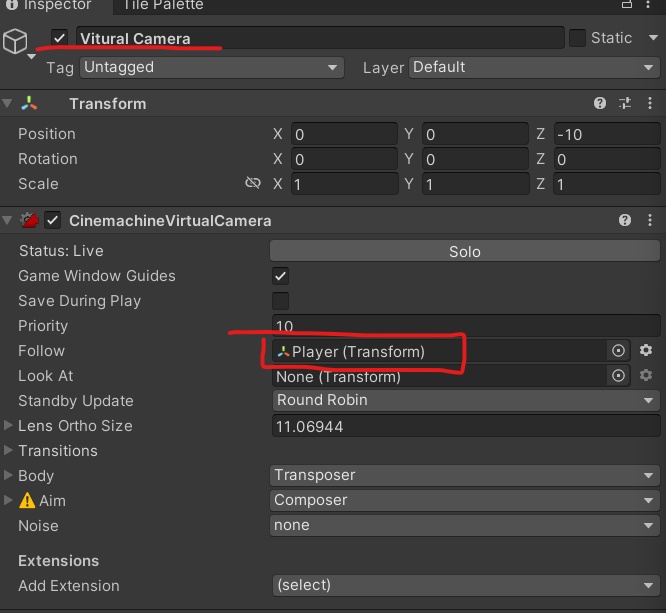
>
> ### Virtual Camera : 야 MainCamera! Player를 따라다녀!
>
> 라는 의미…
>
>
> 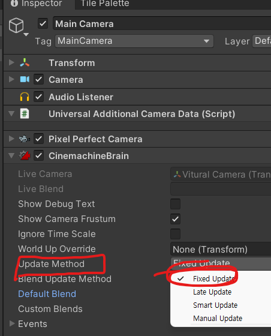
>
>

