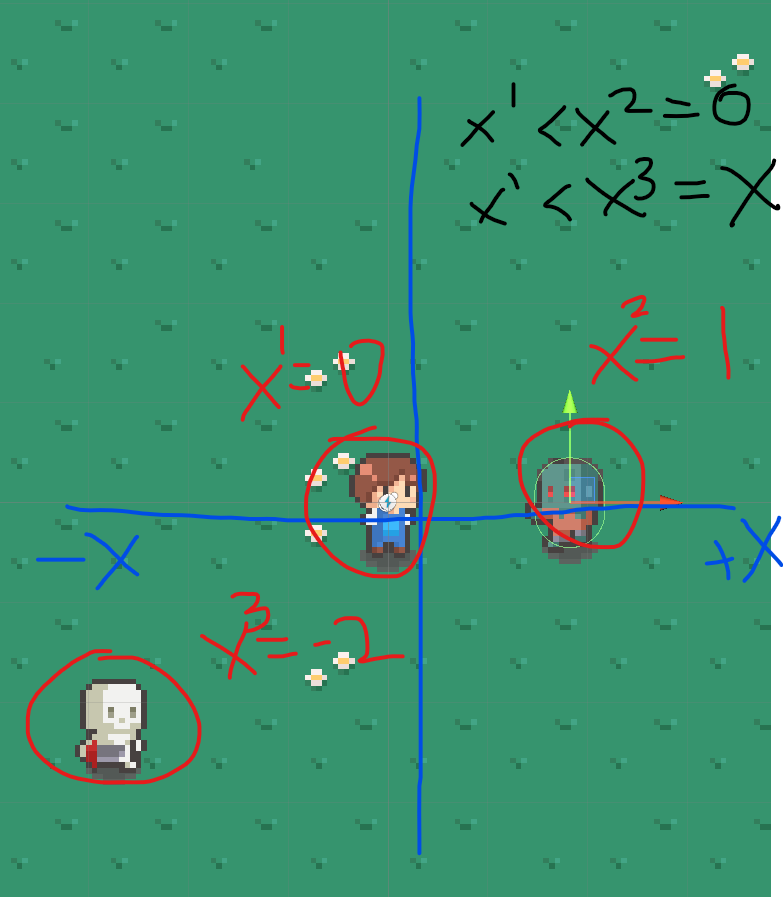
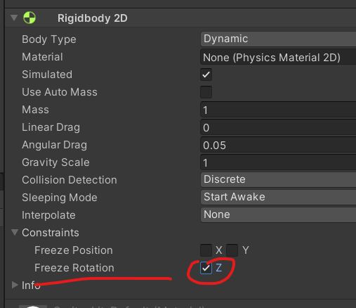
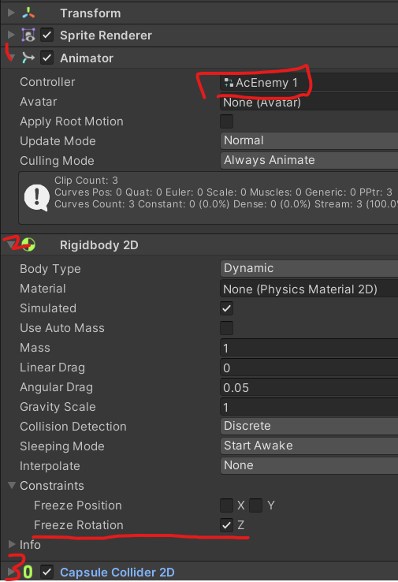
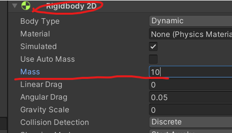

# 유니티 로그라이크 06

> **Summary**
> 몬스터를 따라오게 만들기 위한 C# 코드와 관련된 설명이 포함되어 있으며, 적 스프라이트의 회전 방지, 몬스터가 플레이어를 바라보게 하는 방법, 화면을 벗어난 몬스터를 텔레포트시키는 기능을 구현하는 방법이 제시되어 있습니다.

---



🎥 [동영상 보기](https://www.youtube.com/watch?v=0aUCu1BcZxs&list=PLO-mt5Iu5TeZF8xMHqtT_DhAPKmjF6i3x&index=7)

> 🔥 **적 스프라이트를 가져오고 리지드바디를 추가한 후에 회전하지 않도록 Freeze Rotation값을 잠가준다**
> 
>
> 
>
>

> 🔥 **몬스터가 날 따라오게 만들어보자!**
> ```c#
> //Enemy.cs
>
> public class Enemy : MonoBehaviour
> {
>     public float speed; //몬스터 이속
>     public Rigidbody2D target; //물리적으로 따라갈거기때문에 리지드바디를 타입으로 둠
>     bool isLive; //살았는지 죽었는지 확인함
>     Rigidbody2D rigid; //내위치(몬스터위치)
>     SpriteRenderer spriter;
>
>     void Awake()
>     {
>         rigid = GetComponent<Rigidbody2D>();
>         spriter = GetComponent<SpriteRenderer>();
>     }
>
>     **//물리적인 추적을 할거기 때문에 일반 Update() 함수를 쓰지않고 FixedUpdate를 사용할것임
>     void FixedUpdate()
>     {
>         //타겟의 위치에서 나의 위치를 뺸 값
>         Vector2 dirVec = target.position - rigid.position;
>         //픽스드업데이트 내부에서 쓰는거니 델타타임도 fixed 붙여줌
>         Vector2 nextVec = dirVec.normalized * speed * Time.fixedDeltaTime;
>         //현재위치(rigid.postion)에 다음에 나아갈 방향(nextVec)을 더해준다
>         rigid.MovePosition(rigid.position + nextVec);
>         //리지드바디끼리 충돌했을때 누구 하나가 밀려나지 않도록 Velocity를 고정
>         rigid.velocity = Vector2.zero;
>     }**
> }
> ```
>
>

> 🔥 **몬스터가 날 바라보게 만들어보자**
> ```c#
> //Enemy.cs
>
> void LateUpdate() 
>     {
>         **spriter.flipX = target.position.x < rigid.position.x;**
>     }
> ```
>
> 
>
>

> 🔥 **몬스터가 화면을 벗어났을때  텔레포트 시키게 만들어보자**
> ## 타일을 재배치하던 Reposition 코드를 재활용함
>
> ```c#
> //Reposition.cs
>
> public class Repostion : MonoBehaviour
> {
>    ** //Collider2D는 모든유형의 콜라이더를 포함한다
>     //Enemy가 죽어도 콜라이더가 다른 오브젝트에 영향을 주지 않기 위함임
>     Collider2D coll;**
>
>     **//초기화부분
>     void Awake() 
>     {
>         coll = GetComponent<Collider2D>();
>     }**
>
> ...
> ...(생략)...
> ...
>
>             **case "Enemy":
>                 if(coll.enabled) //만약 Enemy태그의 콜라이더가 살아있어? 
>                 {
>   //플레이어의 이동방향의 맞은편에서 텔레포트시키도록함
>   //플레이어의 이동방향 * (타일크기(텔포범위) + 소환위치를 약간 변형)
>                     transform.Translate(playerDir * 20 + new Vector3(Random.Range(-3f,3f),Random.Range(-3f,3f),0));
>                 }
>                 break;**
>         }
>     }
> }
> ```
>
> 
>
>

