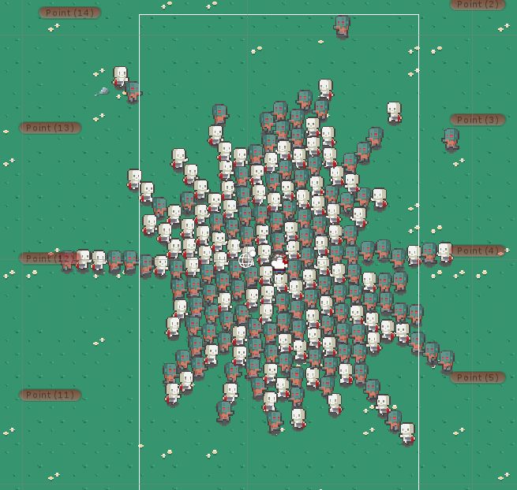
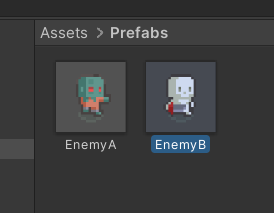
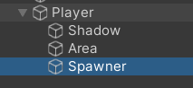
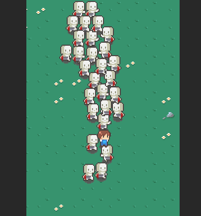
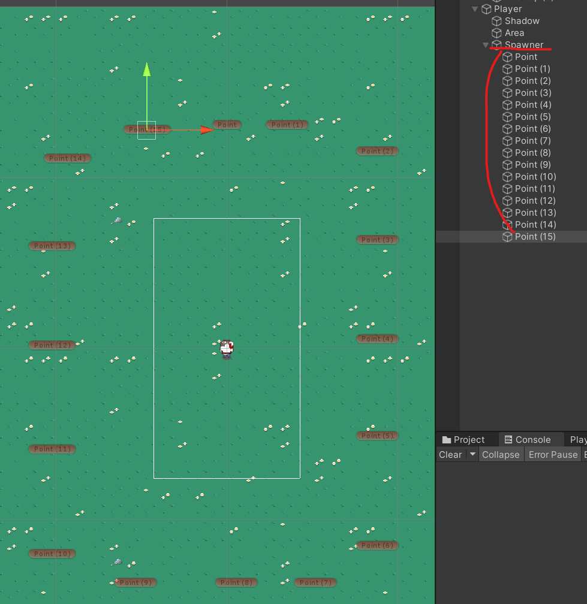

# 유니티 로그라이크 07

> **Summary**
> 무한으로 생성되는 몬스터를 제작하기 위해 PoolManager를 사용하여 프리팹을 관리하고, Spawner를 통해 몬스터를 소환하는 방법을 설명합니다. OnEnable 이벤트를 사용하여 인스턴스된 적이 플레이어를 타겟으로 설정하는 과정도 포함되어 있습니다. 타이머를 이용해 주기적으로 몬스터를 생성하는 코드도 제공됩니다.

---



🎥 [동영상 보기](https://www.youtube.com/watch?v=A7mfPH8jyBE&list=PLO-mt5Iu5TeZF8xMHqtT_DhAPKmjF6i3x&index=8)

> 🔥 ****일단 만들어진 적 오브젝트를 프리팹으로 만들어준다 (위치 초기화도 잊지마요)****
> 
>
>

> 🔥 ****프리팹 관리할 목적으로 PoolManager를 CreateEmpty로 생성해준다****
>
> 그리고 프리팹을 담을 pool을 만들어준다
>
> ```c#
> //PoolManager.cs
>
> using System.Collections;
> using System.Collections.Generic;
> using UnityEngine;
>
> public class PoolManager : MonoBehaviour
> {
>     // 프리팹을 포관할 변수와 풀 리스트가 필요하다 (무언가를 담을것이기 때문에 수영장'풀' 이라고 함...)
>     // 프리팹이 2개면 리스트도 2개여야함
>
>     **// ... 프리팹 보관할 변수
>     public GameObject[] prefabs;**
>
>     **// ... 풀 담당을 하는 리스트들
>     //리스트는 꺽세를 만들고 그 안에 타입을 넣어준다
>     //리스트도 프리팹의 개수만큼 생성되어야하니 배열로 선언해준다
>     List<GameObject>[] pools;**
> }
> ```
>
> 리스트와 그 속에 담긴 오브젝트들도 초기화해준다
>
> ```c#
> //PoolManager.cs
>
> void Awake() 
>     {
>         **//리스트기때문에 new를 만들어줘야함
>         //List 배열의 크기는 prefabs배열과 동일하기때문에 배열에 Prefabs의 길이를 넣어준다
>         pools = new List<GameObject>[prefabs.Length];
>
>         //for문으로 배열 내부 오브젝트들을 모두 초기화해준다
>         for (int index = 0; index < pools.Length; index++)
>         {
>             //풀을 담는 배열도 초기화해주고 각각의 리스트들도 전부 초기화해줌
>             pools[index] = new List<GameObject>();
>         }**
>     }
> ```
>
> ### 생성된 배열만큼 반복문을 돌려서 활성화되지 않은 오브젝트를 활성화시켜주고 모든 오브젝트가 활성화되어있으면 새로운 오브젝트를 생성하여 기존 배열에 추가시켜주는 과정
>
> ```c#
> //PoolManager.cs
>
> //생성된 오브젝트를 반환해줄거임
>     //어떤 Pools[]에 담겨있는 오브젝트를 가져올것이기때문에 매개변수도 넣어준다
>     **public GameObject Get(int index)**
>     {
>         **GameObject select = null;** //null 로 초기화 (foreach문에서 오브젝트를 넣어줄거임)
>
>         **foreach (GameObject item in pools[index])**
>         {
>
>             //item변수가 활성화되어있는지 스스로 확인하는 변수
>             **if(!item.activeSelf)**
>             {
>                 // ... 선택한 Pool[]의 놀고 있는 게임오브젝트에 접근
>                     // ... 노는 오브젝트를 발견했을경우 select 변수에 할당
>                 **select = item;
>                 select.SetActive(true);
>                 break;**
>             }
>         }
>
>         // ... 못 찾았으면?(모든 오브젝트가 작동중이라면)
>         if (!select) //값이 없으면 false가 반환되기 때문에
>         {
>             // ... 새롭게 생성하여 Select 변수에 할당
>             //Instantiate(복사될게임오브젝트,위치값)
>             **select = Instantiate(prefabs[index], transform)**; //오브젝트 생성하고
>             **pools[index].Add(select);** //복사된 오브젝트를 pools에 등록해준다
>         }
>
>         **return select;**
>     }
> ```
>
> > 🔥 **foreach 는 배열, 리스트의 데이터를 순차적으로 접근하는 반복문이다**
>
> > 🔥 **Instantiate 는 원본 오브젝트를 복사해주는 함수다**
>
>

> 🔥 ****몬스터 스포너를 만들어보자****
> 
>
>
> 외부에서 PoolManager의 변수와 함수를 이용하기 위해 게임매니저 스크립트에 PoolManager를 생성하여 초기화해준다
>
> ```c#
> //GameManager.cs
>
> public class GameManager : MonoBehaviour
> {
>     //정적변수 static을 미리 설정해두면 즉시 클래스에서 부를 수 있다는 편리함이 있다
>     public static GameManager instance;
>     **public PoolManager pool;**
>     public Player player;
>
> }
> ```
>
> ```c#
> //Spawner.cs
>
> public class Spawner : MonoBehaviour
> {
>
>     // Update is called once per frame
>     void Update()
>     {
> /*Project Settings > Player > Other Settings > Active Input Handling 을 
> Both 로 설정하세요.
> 선강좌 중에 새로운 입력 시스템(Input System Package (New)을 사용하면서 발생한 거에요.
> Both로 하면 이전 방식의 입력 시스템 코드도 같이 사용할 수 있습니다.*/
>         **if (Input.GetButtonDown("Jump"))
>         {
> 						//몬스터 불러옴
>             GameManager.instance.pool.Get(1); //n번은 Enemyn
>         }**
>     }
> }
> ```
>
> > 🔥 **Jump 추가하고 에러나면**
> >
> > **Project Settings > Player > Other Settings > Active Input Handling 을 Both 로 설정하세요.**
> >
> > 선강좌 중에 새로운 입력 시스템(Input System Package (New)을 사용하면서 발생한 거에요.
> > Both로 하면 이전 방식의 입력 시스템 코드도 같이 사용할 수 있습니다.
> >
> >
>
> > 🔥 ****인스턴트된 프리팹이 타겟을 잃었다!!! ****
> > ### Enemy.cs에서 타겟을 다시 가져올거임
> >
> >
> > 유니티 스크립트에서 On을 쳐보면 수없이 많은 이벤트 함수들이 있는데, 우리는 `OnEnable` 을 사용할것이다
> >
> > ```c#
> > //Enemy.cs
> >
> > void OnEnable()
> >     {
> >         //게임매니저에 이미 플레이어가 저장되어있기떄문에 타겟을 저장할 수 있음
> >         //target의 Type은 Rigidbody2D라 플레이어 내부에 Rigidbody2D를 불러와야한다
> > **        target = GameManager.instance.player.GetComponent<Rigidbody2D>();
> > **    }
> > ```
> >
> >
>
> 
>
>
> ## 이제 주변에 자동으로 몬스터가 스폰되는 코드를 생성시켜볼까요
>
> 
>
> ```c#
> //Spawner.cs
>
> using System.Collections;
> using System.Collections.Generic;
> using UnityEngine;
>
> public class Spawner : MonoBehaviour
> {
>     public Transform[] spawnPoint;
>     float timer;
>     void Awake() 
>     {
>         //하이어라키 Spawner내부에 생성한 포인트들의 위치값을 받아온다
>         **spawnPoint = GetComponentsInChildren<Transform>();**
>     }
>
>     // Update is called once per frame
>     void Update()
>     {
>         timer += Time.deltaTime;
>
>         //타이머가 0.2f 초마다 몬스터 소환
>         if(timer > 0.2f)
>         {
>             timer = 0;
>             Spawn();
>         }
>     }
>
>     void Spawn()
>     {
>         //n번은 Enemy(n)
>         //Random 0,2 를 해줘야 0~1 둘 중 하나를 선택함
>         //Instantiate 반환 값을 enemy변수에 넣어둡니다 재활용 할것이기 때문입니다
>         //아래 코드에서 Random.Range가 1부터 시작하는 이유는12번줄에 겟컴포넌트를 할때 스스로도 포함하기때문에 0이 아니라 2로 시작해야한다
>        ** GameObject enemy =  GameManager.instance.pool.Get(Random.Range(0,2));
>         enemy.transform.position = spawnPoint[Random.Range(1,spawnPoint.Length)].position;
>     }**
> }
> ```
>
>


