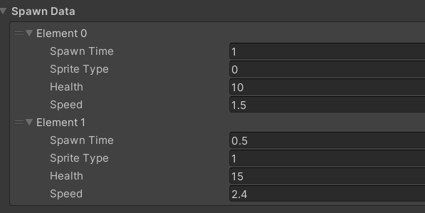
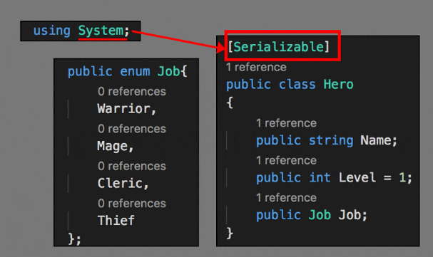
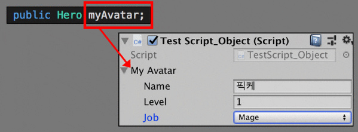
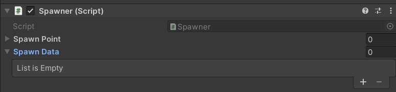
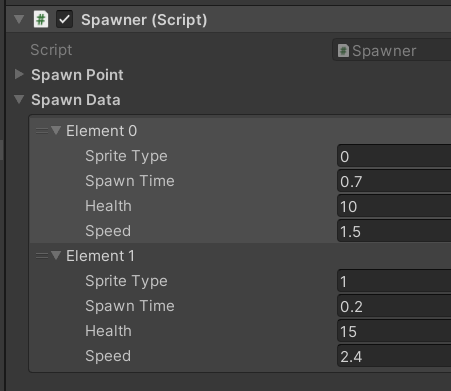
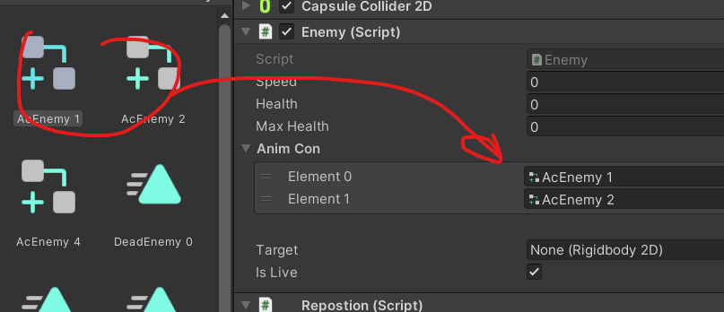

# 유니티 로그라이크 08

> **Summary**
> 게임의 난이도를 시간에 따라 조절하는 코드 구현, C#에서 실수형과 정수형 변환, 직렬화 기법을 사용하여 사용자 정의 클래스를 인스펙터에 노출시키는 방법, 몬스터 스폰 데이터 관리 및 초기화 방법에 대해 설명합니다.

---



🎥 [동영상 보기](https://www.youtube.com/watch?v=SSg_9q-8h-A&list=PLO-mt5Iu5TeZF8xMHqtT_DhAPKmjF6i3x&index=9)

> 🔥 **시간에따라 게임의 난이도가 변경되는 코드를 만들어볼까요**
> > 🔥 **GameManager.cs 에서 플레이시간을 담을 변수와 코드를 추가해줍시다**
> > ```c#
> > //GameManager.cs
> >
> > public class GameManager : MonoBehaviour
> > {
> >     ...(생략)...
> >
> >     //게임시간과 최대게임시간을 담당할 변수
> >     public float gameTime; //실제 게임타임
> >     public float maxGameTime = 2 * 10f; //최대 게임타임 (숫자는 '초')
> >
> >
> >    ...(생략)...
> >
> >     void Update()
> >     {
> >         **gameTime += Time.deltaTime;**
> >
> >         //현재 플레이타임이 최대 플레이타임을 초과한다면
> >             //현재 게임시간을 최대 게임시간으로 고정시킵니다
> >         if(gameTime > maxGameTime)
> >         {
> >             gameTime = maxGameTime;
> >         }
> >     }
> > }
> > ```
> >
> >
>
>

> 🔥 **소환데이터를 담당하는 클래스를 만들어볼까요**
>
> 스크립트 내부에서 메인클래스 밖에 새로운 클래스를 생성해봅시다
>
>
> ```c#
> //Spawner.cs
>
> public class Spawner : MonoBehaviour
> {
> 		**public SpawnData[] spawnData;**
>    ...(생략)...
> }
>
> **public class SpawnData
> {
>     public int spriteType; //스프라이트타입이 0일땐 해골 1일땐 좀비 이렇게 바뀌게 할것임
>     public float spawnTime; //스폰타임
>     public int health; //몬스터 피통
>     public float speed; //몬스터 이속
> }**
> ```
>
> > 🔥 **근데 이렇게 스크립트 내부에 두개의 클래스가 존재한다면 인스펙터창에선 
> **
> > SpawnData가 보이지 않습니다 이때 필요한 기술이 바로 `직렬화` 입니다
> >
> >
> > - > 유니티 에디터의 Inspector에는 사용자가 정의한 클래스(Class) 또는 구조체(Stucture)의 정보가 Inspector에 노출되지 않는다. System에서 제공하는*** "[Serializable]" 키워드를 지정하여 Inspector에 노출시킬 수 있다.***
> > 
> >
> > 위와 같이 사용자 정의 클래스의 윗줄에 "[Serializable]" 키워드를 붙이고, Monobehaviour를 상속받고 있는 C# 스크립트의메인 클래스에서 해당 클래스의 객체를 생성하면, 아래와 같이 Inspector에 노출되어 값을 지정 할 수 있게 된다.
> >
> > 
> >
> > ---
> >
> > ***직렬화는 데이터 구조나 오브젝트 상태를 Unity 에디터가 저장하고 나중에 재구성할 수 있는 포맷으로 자동으로 변환하는 프로세스를 말한다.***
> >
> > ***Unity 에디터에서는 저장 및 로딩, 인스펙터 창, 인스턴스화, 프리팹과 같은 일부 내장 기능에 직렬화가 사용된다.***
> >
> >
>
>
> 저는 속성창 내부에서 바로 System을 불러와 사용했습니다
>
> ```c#
> //Spawner.cs
>
> public class Spawner : MonoBehaviour
> {
> 		public SpawnData[] spawnData;
>    ...(생략)...
> }
>
> **[System.Serializable]**
> public class SpawnData
> {
>     public int spriteType; //스프라이트타입이 0일땐 해골 1일땐 좀비 이렇게 바뀌게 할것임
>     public float spawnTime; //스폰타임
>     public int health; //몬스터 피통
>     public float speed; //몬스터 이속
> }
> ```
>
> 
>
> 
>
>

> 🔥 **스폰데이터를 활용해 몬스터의 타입과 스탯을 정하고 스폰해볼까요**
> ```c#
> //Enemy.cs
>
> public float health; //몬스터의 현체력
> public float maxHealth;
> public RuntimeAnimatorController[] animCon; //애니메이션 컨트롤러를 각 몬스터 타입에 맞게 넣기위해 배열로 선언
> ```
>
> 
>
> ```c#
> **//Enemy.cs**
>
> 		//스폰데이터를 그대로 때려박음
>     //변수 data에 SpawnData 스크립트를 넣음으로서 SpawnData에 접근할 수 있음
> **    public void Init(SpawnData data)
> **    {
>         // ... 스프라이트 & 애니메이션 변경부분
>         //스프라이트의 타입은 인덱스로만 쓴다 (어처피 배열이 애니메이터랑 동일하니까)
>         //애니메이터의 컨트롤을 뭐로바꿀래? animCon[스프라이트배열] 로 바꿀게여!
>         **anim.runtimeAnimatorController = animCon[data.spriteType];
> **
>         // ... 스피드부분
>         speed = data.speed;
>
>         // ... 피통부분
>         **maxHealth = data.health;
>         health = data.health;** //최대피통이 올라갔기때문에 현피통도 초기화해준다
>     }
> ```
>
>


