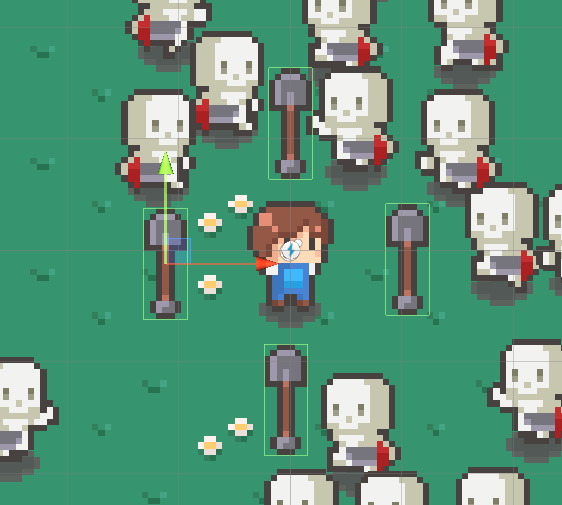

# 유니티 로그라이크 09

> **Summary**
> 회전 근접무기를 구현하기 위해 Bullet.cs와 Enemy.cs를 수정하는 방법에 대해 설명합니다. Bullet 클래스는 피해량을 초기화하는 Init 함수를 포함하고, Enemy 클래스는 OnTriggerEnter2D 메서드를 통해 플레이어의 무기와 충돌 시 피해를 처리합니다.

---



🎥 [동영상 보기](https://www.youtube.com/watch?v=HPJVVcRKwn0&list=PLO-mt5Iu5TeZF8xMHqtT_DhAPKmjF6i3x&index=10)

> 🔥 **회전하는 근접무기의 Tag는  Bullet으로 설정해두고 Bullet.cs를 수정해볼까요**
> ```c#
> **//Bullet.cs**
>
> using System.Collections;
> using System.Collections.Generic;
> using UnityEngine;
>
> public class Bullet : MonoBehaviour
> {
>     public float damage;
>     public int per;
>
>     //Initialize(초기화) 함수
>     public void Init(float damage, int per)
>     {
>         **//this는 곧 Bullet.cs
>         //매개변수의 damage와 this.damage 는 엄연히 다른 변수
>         this.damage = damage;**
>     }
> }
> ```
>
>

> 🔥 **Enemy.cs 도 함께 수정해야해요**
> ```c#
> **//Enemy.cs**
>
> void **OnTriggerEnter2D**(Collider2D collision) 
>     {
>         //플레이어의 무기에 충돌했을때만 코드가 실행
>         //Bullet 태그와 충돌하지 않았으면 코드가 if문을 만나기때문에 코드가 종료됨
>         if(!collision.CompareTag("Bullet"))
>             return;
>
>         //자신과 닿은 콜라이더안에 컴포넌트 Bullet을 불러와 그 속에있는 damage변수의 크기만큼 자신의 피를 깎는다
>         health -= collision.GetComponent<Bullet>().damage;
>
>         if (health > 0)
>         {
>             // ... 살아있음
>         }
>         else
>         {
>             // ... 죽음
>             Dead();
>         }
>     }
>
>     void Dead()
>     {
>         **//죽은상태는 곧 몬스터 프리팹의 비활성화
>         //파괴를하면 안된다 프리팹은 계속 재활용할것이기 때문에
>         gameObject.SetActive(false);**
>     }
> ```
>
>

