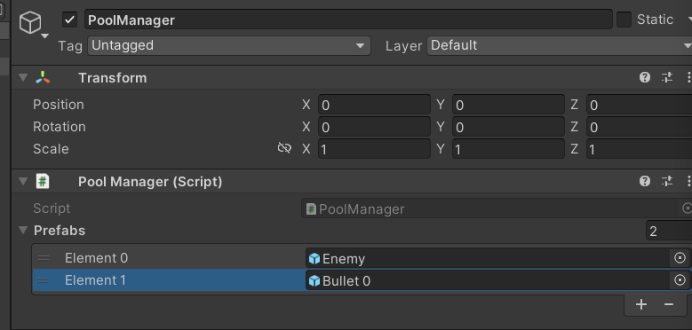

# 유니티 로그라이크 10

> **Summary**
> 유니티 로그라이크 게임 개발에 대한 내용으로, Init 함수와 parent 속성을 통해 부모를 변경하는 방법, 무기와 총알의 초기화 및 배치 방법을 설명합니다. 또한, 공전하는 무기를 생성하고 레벨업에 따라 무기의 개수를 늘리는 기능을 구현하는 코드 예시를 제공합니다.

---


🎥 [동영상 보기](https://www.youtube.com/watch?v=HPJVVcRKwn0&list=PLO-mt5Iu5TeZF8xMHqtT_DhAPKmjF6i3x&index=10)

> 🔥 **풀 매니저에 근접무기를 등록하여 무기를 배치해볼까요**
> 
>
>

> 🔥 **Init 을 쓰는 이유는 생성한 변수를 초기화할떄 이용합니다**
> ```c#
> //Bullet.cs
>
> using System.Collections;
> using System.Collections.Generic;
> using UnityEngine;
>
> public class Bullet : MonoBehaviour
> {
>     public float damage;
>     public int per;
>
>     //Initialize(초기화) 함수
>     public void Init(float damage, int per)
>     {
>         //this는 곧 Bullet.cs
>         //매개변수의 damage와 this.damage 는 엄연히 다른 변수
>         this.damage = damage;
>         this.per = per;
>     }
> }
> ```
>
>

> 🔥 **그리고 Weapon에서 Bullet을 불러와 관통횟수를 무제한으로 만들어볼까요**
>
> 부모를 직접 변경하는 **parent **함수도 공부해봐요
>
> ```c#
> //Weapon.cs
>
> using System.Collections;
> using System.Collections.Generic;
> using UnityEngine;
>
> //poolmanager에서 받아온 bullet을 플레이어 주변을 공전하는 형태로 만들어주는 스크립트
> public class Weapon : MonoBehaviour
> {
>     public int id; //이 무기는 몇번째 ID입니까?
>     public int prefabId; //PoolManger의 몇번째 프리팹ID입니까?
>     public float damage;
>     public int count; //공전하는 근접무기를 몇개나 배치할겁니까?
>     public float speed;
>
>     void Start() 
>     {
>         Init();
>     }
>
>     void Update()
>     {
>
>     }
>
>     //초기화방식이 ID에 따라 다르다
>     public void Init()
>     {
>         switch (id)
>         {
>             case 0:
>             speed = -150;
>             Batch();
>
>                 break;
>             default:
>                 break;
>         }
>     }
>
>     **//공전하는 삽을 플레이어 주변을 공전하는 함수
>     void Batch()
>     {
>         for (int index = 0; index <count; index++)
>         {
>             //게임매니저에 등록해둔 prefab을 가져오는과정
>             //Get(1) 을 등록해도 무기를 가져오겠지만 그러면 하드코딩이라 변수를 따로 설정한거임
>             Transform bullet = GameManager.instance.pool.Get(prefabId).transform;
>             //parent 속성을 통해 부모를 변경 가능하다
>             bullet.parent = transform;
>             //Bullet.cs.의 데미지, 관통횟수인데 -1로두면 무한으로 관통시키겠다
>             bullet.GetComponent<Bullet>().Init(damage, -1);
>         }
>     }**
> }
> ```
>
> 
>
> 
>
>

> 🔥 **하지만 이렇게 하드코딩처럼 프리팹을 하나하나 설정하기엔 프로그래머가 아니죠, 코드로 구현해봅시다**
> 360도에서 count를 나눠서 오브젝트를 이동시킵니다
>
> ```c#
> //Weapon.cs
>
> //공전하는 삽을 플레이어 주변을 공전하는 함수
>     void Batch()
>     {
>         for (int index = 0; index <count; index++)
>         {
>             //게임매니저에 등록해둔 prefab을 가져오는과정
>             //Get(1) 을 등록해도 무기를 가져오겠지만 그러면 하드코딩이라 변수를 따로 설정한거임
>             Transform bullet = GameManager.instance.pool.Get(prefabId).transform;
>             //parent 속성을 통해 부모를 변경 가능하다
>             bullet.parent = transform;
>             **//만약 count가 10개라면 360도를 10으로 나눈값이 되겠지
>             Vector3 rotVec = Vector3.forward * 360 * index / count;**
>             bullet.Rotate(rotVec);
>             //Translate 함수로 자신의 위쪽으로 이동합니다
>             //Bullet을 회전시킬때 Local방향을 이용한건 bullet.up때 이미 사용함
>             //그러니 bullet을 이동시킬때는 World방향 기준으로 이동시킵니다
>             bullet.Translate(bullet.up * 1.5f, Space.World);
>
>             //Bullet.cs.의 데미지, 관통횟수인데 -1로두면 무한으로 관통시키겠다
>             bullet.GetComponent<Bullet>().Init(damage, -1);
>         }
>     }
> ```
>
> 
>
>

> 🔥 **이제 스킬의 레벨에따라 공전하는 무기의 개수가 늘어나도록 함수를 제작해봅시다**
> ```c#
> //Weapon.cs
>
> using System.Collections;
> using System.Collections.Generic;
> using UnityEngine;
>
> //poolmanager에서 받아온 bullet을 플레이어 주변을 공전하는 형태로 만들어주는 스크립트
> public class Weapon : MonoBehaviour
> {
>     public int id; //이 무기는 몇번째 ID입니까?
>     public int prefabId; //PoolManger의 몇번째 프리팹ID입니까?
>     public float damage;
>     public int count; //공전하는 근접무기를 몇개나 배치할겁니까?
>     public float speed;
>
>     void Start() 
>     {
>         Init();
>     }
>
>     void Update()
>     {
>         switch (id)
>         {
>             case 0:
>                 transform.Rotate(Vector3.back * speed * Time.deltaTime);
>                 break;
>             default:
>                 break;
>         }
>
>         if (Input.GetButtonDown("Jump"))
>             levelUp(20,5);
>     }
>
>     //초기화방식이 ID에 따라 다르다
>     public void Init()
>     {
>         switch (id)
>         {
>             case 0:
>             speed = -150;
>             Batch();
>
>                 break;
>             default:
>                 break;
>         }
>     }
>     **//레벨업하면 damage와 count(개수)가 늘어나도록
>     public void levelUp(float damage, int count)
>     {
>         this.damage = damage;
>         this.count += count;
>
>         if (id == 0)
>             Batch();
>     }**
>
>     //공전하는 삽을 플레이어 주변을 공전하는 함수
>     void Batch()
>     {
>         for (int index = 0; index <count; index++)
>         {
>             Transform bullet;
>
>             **//기존 오브젝트를 먼저 활용하고 모자란것은 풀링에서 가져오는 시스템
>             if (index < transform.childCount)
>             {
>                 //현재 내가 가지고있는 인덱스를 가져와서 쓸것이다
>                 bullet = transform.GetChild(index);
>             }
>             else
>             {
>                 //게임매니저에 등록해둔 prefab을 가져오는과정
>                 //Get(1) 을 등록해도 무기를 가져오겠지만 그러면 하드코딩이라 변수를 따로 설정한거임
>                 bullet = GameManager.instance.pool.Get(prefabId).transform;
>             }**
>             //parent 속성을 통해 부모를 변경 가능하다
>             bullet.parent = transform;
>
>             bullet.localPosition = Vector3.zero;
>             bullet.localRotation = Quaternion.identity; //Quaternion의 zero값은 identity
>
>             //만약 count가 10개라면 360도를 10으로 나눈값이 되겠지
>             Vector3 rotVec = Vector3.forward * 360 * index / count;
>             bullet.Rotate(rotVec);
>             //Translate 함수로 자신의 위쪽으로 이동합니다
>             //Bullet을 회전시킬때 Local방향을 이용한건 bullet.up때 이미 사용함
>             //그러니 bullet을 이동시킬때는 World방향 기준으로 이동시킵니다
>             bullet.Translate(bullet.up * 1.5f, Space.World);
>
>             //Bullet.cs.의 데미지, 관통횟수인데 -1로두면 무한으로 관통시키겠다
>             bullet.GetComponent<Bullet>().Init(damage, -1);
>         }
>     }
> }
> ```
>
>

