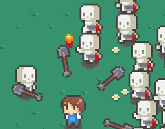
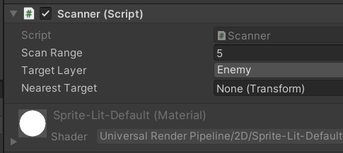
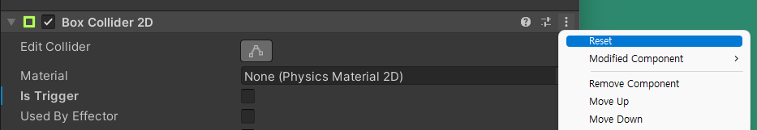
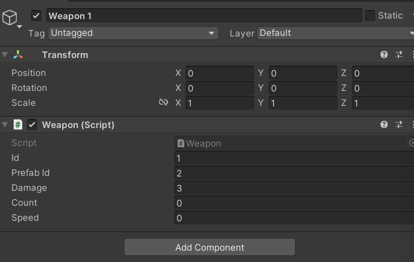
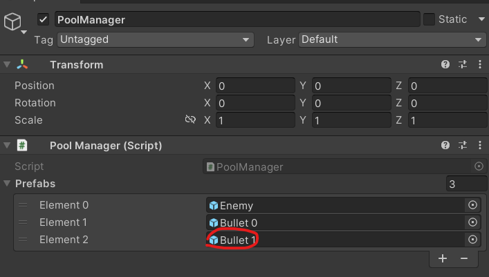
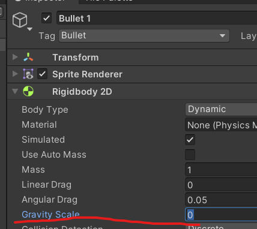

# 유니티 로그라이크 11

> **Summary**
> 원거리 공격 구현을 위한 CircleCastAll 함수 사용법, 가장 가까운 적을 찾는 방법, 콜라이더 크기 리셋 방법, 스크립트 컴포넌트화 및 총알 발사 로직을 포함한 코드 예시가 제공됩니다. 또한, PoolManager에 원거리 공격을 등록하는 방법과 FromToRotation 함수의 사용법도 설명됩니다.

---



🎥 [동영상 보기](https://www.youtube.com/watch?v=dBQHtMI-Og4&list=PLO-mt5Iu5TeZF8xMHqtT_DhAPKmjF6i3x&index=11)

> 🔥 ****CircleCastAll **: Raycast 쓸때 원형의 캐스트를 쏘고 모든 결과를 반환하는 함수**
> - 매개변수 순서
>   - 캐스팅 시작 위치
>   - 원의 반지름
>   - 캐스팅 방향
>     - 원형으로만 쏠거기때문에 0 들어가면 됨
>   - 캐스팅 길이
>     - 플레이어 자리에서만 원을 형성하기때문에 0이 들어가면 됨
>   - 대상 레이어
> ```c#
> targets = Physics2D.CircleCastAll(transform.position, scanRange, Vector2.zero, 0, targetLayer);
> ```
>
>

> 🔥 **플레이어의 위치에서 가장 가까운 적을 구하는 함수**
> ```c#
> //Scanner.cs
>
>
>     Transform GetNearest()
>     {
>         Transform result = null;
>         float diff = 100;
>
>         // ... 반복문을 돌며 가져온 거리가 저장된 거리보다 작으면 고체
>         //targets안에 CircleCastAll에 맞은에들 중에서
>         //순차적으로 targets를 돌면서 Raycast를 하나하나 꺼내는 흐름
>         foreach (RaycastHit2D target in targets)
>         {
>             Vector3 myPos = transform.position; //내 위치
>             Vector3 targetPos = target.transform.position; //레이케스트를 맞은 적의 위치
>             //거리를 구해주자
>             //Distance가 벡터2개의 거리를 알아서 구해준다
>             float curDiff = Vector3.Distance(myPos, targetPos);
>
>             // .. 현재 거리와 가져온 거리를 비교
>             //지금 하나하나 가져온 target과 지금 우리가 가지고있는 최소한의 거리
>             //가지고 온 거리가 더 작다면 diff에 그 거리를 넣어준다
>             if (curDiff < diff)
>             {
>                 diff = curDiff;
>                 result = target.transform;
>             }
>         }
>         return result;
>     }
> ```
>
>
> # 전체코드
>
> ```c#
> //Scanner.cs
>
> using System.Collections;
> using System.Collections.Generic;
> using UnityEngine;
>
> **public class Scanner : MonoBehaviour
> {
>     public float scanRange;
>     public LayerMask targetLayer; //레이어 마스크를 생성
>     public RaycastHit2D[] targets; //몬스터'들' 과 플레이어간의 거리를 계산하기 위해
>     public Transform nearestTarget; //플레이어와 가장 가까운 몬스터
>
>     void FixedUpdate() 
>     {
>         targets = Physics2D.CircleCastAll(transform.position, scanRange, Vector2.zero, 0, targetLayer);
>         nearestTarget = GetNearest(); //가장 가까운 적을 찾기 위한 함수를 매 프레임 실행
>     }**
>
>     //플레이어의 위치에서 가장 가까운 적을 구하는 함수
>     Transform GetNearest()
>     {
>         Transform result = null;
>         float diff = 100;
>
>         // ... 반복문을 돌며 가져온 거리가 저장된 거리보다 작으면 고체
>         //targets안에 CircleCastAll에 맞은에들 중에서
>         //순차적으로 targets를 돌면서 Raycast를 하나하나 꺼내는 흐름
>         foreach (RaycastHit2D target in targets)
>         {
>             Vector3 myPos = transform.position; //내 위치
>             Vector3 targetPos = target.transform.position; //레이케스트를 맞은 적의 위치
>             //거리를 구해주자
>             //Distance가 벡터2개의 거리를 알아서 구해준다
>             float curDiff = Vector3.Distance(myPos, targetPos);
>
>             // .. 현재 거리와 가져온 거리를 비교
>             //지금 하나하나 가져온 target과 지금 우리가 가지고있는 최소한의 거리
>             //가지고 온 거리가 더 작다면 diff에 그 거리를 넣어준다
>             if (curDiff < diff)
>             {
>                 diff = curDiff;
>                 result = target.transform;
>             }
>         }
>         return result;
>     }
> }
> ```
>
> 
>
>

> 🔥 **프리팹을 다른 스프라이트로 변경했을때 콜라이더 크기가 다를경우 콜라이더 컴포넌트를 Reset시켜주면 해결됩니다**
> 
>
>

> 🔥 **추가한 원거리공격을 poolmanager 에 등록해봅시다**
> 
>
> 
>
>
> 그 후에 Weapons.cs 를 수정해줍시다
>
>
> 하지만 그 전에!
>
> Scanner.cs 내부에 있는 레이케스팅을활용해 타게팅하는 함수를 이용할것이기 때문에 
>
> Player.cs 에서 Scanner 를 컴포넌트 형식으로 불러와서 전역변수로 초기화해줍시다
>
>
> ```c#
> //Player.cs
>
> ...
> **public Scanner scanner;**
> ...
> void Awake()
> {
>     ...
>     **scanner = GetComponent<Scanner>();**
> }
> ```
>
>
> 또한 Weapon.cs 에서 Player.cs를 불러와야합니다
>
> Player.cs는 Weapon.cs의 부모이기 떄문에 불러오는 방법은 간단합니다
>
> ```c#
> //Weapon.cs
> **
> Player player; //부모인 Player를 변수화**
>
> void Awake()
> {
>     //부모 컴포넌트를 가져오는 방법
>     **player = GetComponentInParent<Player>();**
> }
>
> ...
>
> //그리고 
>
> ...
>
> //총알을 발사하는 로직이며 그냥 풀매니저에서 총알을 가져올것이다
> void Fire()
> {
>     **//스캐너를 불러와 플레이어 가까이 있는 적을 타게팅한다
>     //플레이어스크립트 내부 스캐너 내부에 가장가까운 타겟이 없다면(false) 그냥 return
>     if (!player.scanner.nearestTarget)**
>         return;
>
>     //poolManger에서 프리팹아이디를 가져와서 bullet변수에 담는다
>     Transform bullet = GameManager.instance.pool.Get(prefabId).transform;
>     bullet.position = transform.position; //bullet의 시작 위치는 현재 플레이어의 시작위치
> }
> ```
>
> ### Weapon.cs의 Init 과 Update도 변경해줘야죠
>
> ```c#
> //Weapon.cs
>
> void Update()
>     {
>         switch (id)
>         {
>             case 0:
>                 transform.Rotate(Vector3.back * speed * Time.deltaTime);
>                 break;
>             **default:
>                 timer += Time.deltaTime;
>
>                 //경과한 시간이 공격속도보다 크다면
>                 //timer를 0초로 바꾸고 총알을 발사한다
>                 if (timer > speed)
>                 {
>                     timer = 0f;
>                     Fire();
>                 }
>                 break;**
>         }
>
>         if (Input.GetButtonDown("Jump"))
>             levelUp(20,5);
>     }
>
> //초기화방식이 ID에 따라 다르다
> public void Init()
> {
>     //id가 n번일때
>     switch (id)
>     {
>         case 0:
>         speed = -200; //근접무기 공전속도
>         Batch();
>
>             break;
>         default:
>             **speed = 0.3f; //원거리무기 발사속도**
>             break;
>     }
> }
> ```
>
>
> ## 총알은 발사하며 나아가야하기때문에 따로 Rigidbody를 프리팹에 추가해줍니다
>
> 
>
> Bullet 코드도 수정해줘야해요
>
> ```c#
> //Bullet.cs
>
> public class Bullet : MonoBehaviour
> {
>     public float damage;
>     public int per;
>
>     **Rigidbody2D rigid;**
>
>     void Awake()
>     {
>         rigid = GetComponent<Rigidbody2D>();
>     }
>
>     //Initialize(초기화) 함수
>     //Init(데미지,관통,방향)
>     public void Init(float damage, int per, Vector3 dir)
>     {
>         //this는 곧 Bullet.cs
>         //매개변수의 damage와 this.damage 는 엄연히 다른 변수
>         this.damage = damage;
>         this.per = per;
>
>        ** //근접무기는 관통이 -1 (무한)
>         //-1 보다 큰 관통을 가진 Bullet prefab은 관통무기라는것이기 때문에 방향값을 가지게된다
>         if (per > -1)
>         {
>             //rigid의 방향값은 dir값이다
>             //그러면 RigidBody2D의 특성에 의해 방향에맞게 rigid가 이동하겠지
>             rigid.velocity = dir;**
>         }
>     }
>
>    ** void OnTriggerEnter2D(Collider2D collision) 
>     {
>         //맞닿은 콜라이더가 에너미가 아니거나 관통수치가 -1(근접무기) 일경우 아래 코드는 실행할 이유가 없다
>         if (!collision.CompareTag("Enemy") || per == -1)
>             return;
>
>         //관통력은 줄어든다
>         per--;
>
>         if (per == -1)
>         {
>             //PoolManager에서 추후에 재활용할것이기 때문에 리지드바디를 미리 초기화해주고
>             //게임 오브젝트도 비활성화 시켜준다
>             rigid.velocity = Vector2.zero;
>             gameObject.SetActive(false);
>         }**
>     }
> }
> ```
>
>
> > 🔥 **`FromToRotation `: 지정된 축을 중심으로 목표를 향해 회전하는 함수
>
> FromToRotation (축,방향값)**
>
>

