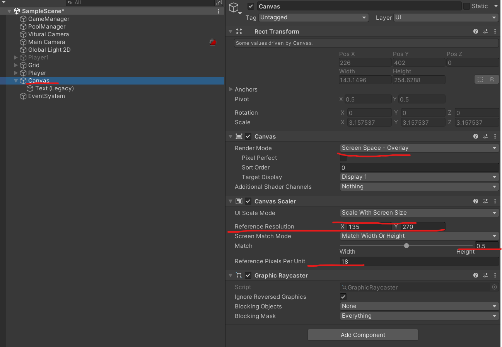

# 유니티 로그라이크 13

> **Summary**
> UI(HUD) 구성 방법, 해상도에 상관없이 UI 텍스트 설정, UI 캔버스 크기를 카메라에 맞추는 방법, 경험치 바 제작을 위한 슬라이더 활용, string.Format() 사용법, 플레이어의 위치를 따라가는 체력바 생성 방법에 대해 설명합니다.

---


🎥 [동영상 보기](https://www.youtube.com/watch?v=ip0xffLSWlk&list=PLO-mt5Iu5TeZF8xMHqtT_DhAPKmjF6i3x&index=13)

> 🔥 **캔버스를 생성하면 초반에 크기가 무지하게 큰데. 렌더보드에서 Camera로 변경해주고 렌더카메라를 Main Camera로두면 UI의 크기가 카메라에 맞게 설정됩니다**
> 
>
> 
>
>
> 어떤 해상도든 같은 스케일을 가지는 옵션은 다음과 같습니다
>
> 
>
> 
>
>

> 🔥 **HUD : Head Up Display 구성**
> 일단 HUD.cs 를 만들어줍시다
>
> > 🔥 **Ctrl + Space를 하면 추천 자동완성을 알려줍니다**
> > 
> >
> >
>
>

> 🔥 **slider로 경험치 UI바를 만들어봅시다**
> 
>
> 
>
> BackGround하고 Fill Area 둘 다 앵커포인트를 다음과 같이 변경 한 후에 Fill Area내부에 Fill에 Left와 Right를 -5라고 되어있던걸 0으로 초기화
>
> ```c#
> //HUD.cs
>
> void LateUpdate() 
>     {
>         switch (type)
>         {
>             **case InforType.Exp:
>                 float curExp = GameManager.instance.exp;
>                 float maxExp = GameManager.instance.nextExp[GameManager.instance.level];
>                 mySlider.value = curExp / maxExp;**
>         }
>     }
> ```
>
> ```c#
> //HUD.cs
>
> case InforType.Level:
>     //string.Format("쓸문자{0}",{0}에 들어갈 매개변수);
>     //F0 : 소수점이 없다 라는 뜻
>     myText.text = string.Format("Lv.{0:F0}",GameManager.instance.level);
>     break;
> case InforType.Kill:
>     myText.text = string.Format("{0:F0}",GameManager.instance.kill);
>     break;
> ```
>
>

> 🔥 **체력바를 생성하고 플레이어를 따라가게 만들어봅시다**
>
> ```c#
> //Follow.cs
>
> using System.Collections;
> using System.Collections.Generic;
> using UnityEngine;
>
> public class Follow : MonoBehaviour
> {
>
>     RectTransform rect;
>     void Awake()
>     {
>         rect = GetComponent<RectTransform>();
>     }
>
>     //플레이어의 프레임 주기를 동기화하기위해 FixedUpdate로 사용
>     void FixedUpdate() 
>     {
>         //월드 상의 오브젝트 위치를 스크린 좌표로 변환
>         rect.position = Camera.main.WorldToScreenPoint(GameManager.instance.player.transform.position);
>     }
> }
> ```
>
> 
>
> Slider로 Health를 만들어주고 플레이어 아래쪽에 설정해 준 후에 Health에 Follow.cs 코드를 넣어줍니다
>
>


