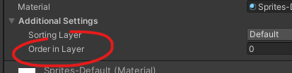
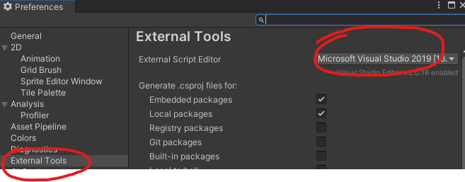
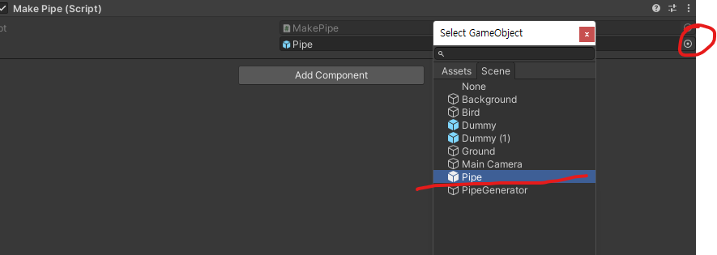

# 유니티로 플러피 게임 클론 개발01

> **Summary**
> 유니티로 플러피 게임 클론을 개발하는 방법에 대한 내용으로, VS Code 자동완성 오류 해결, 이미지 레이어 순서 설정, 애니메이션 커브 설정, 물리 법칙 적용 및 오브젝트 콜라이더 설정 방법을 포함하고 있다. 또한, Rigidbody2D를 사용한 점프 및 파이프 장애물 이동 코드를 제공하며, 프리팹과 제네레이터 개념을 설명한다.

---

🎥 [동영상 보기](https://www.youtube.com/watch?v=EqoU1PodQQ4&t=460s)

# [VS Code 자동완성 안될때 해결방법](https://nicotina04.tistory.com/233#:~:text=%EC%83%81%EB%8B%A8%20%EB%A9%94%EB%89%B4%EC%97%90%EC%84%9C%20Edit%20%3E%20Preferences,%EB%AA%87%20%EB%B6%84%20%EB%8C%80%EA%B8%B0%ED%95%98%EB%8F%84%EB%A1%9D%20%ED%95%9C%EB%8B%A4)

## 이미지 레이어 순서



## 이미지 타일화


## 애니메이션 커브설정


## 오브젝트 물리법칙적용

`오브젝트선택 - inspector창에 Add Component - Pysics 2D - ``**Rigdbody2D**`

## 오브젝트 콜라이더 설정

`오브젝트선택 - inspector창에 Add Component - Pysics 2D - ``**Capsule Colider 2D**`

콜라이더 모양 설정방법

`Capsule Colider 2D - Direction 방향설정 - Edit Colider`**   **


## 코드 에디터 설정



# 코딩부분

### BirdJump.cs

```c#
//Rigidbody를 코드내에 불러오는 과정

public class BirdJump : MonoBehaviour
{
    Rigidbody2D rb;
    //rb는 Rigidbody2D라는 클래스가 가지고있는 클래스를 받을 수 있다
    void Start()
    {
        rb = GetComponent<Rigidbody2D>();
        //Rigidbody2D라는 컴포넌트를 가져와서 rb에 담겠다 라는 뜻
    }
```

Rigidbody2D는 유니티 내부에서 물리설정을 할때 만들었던 파일을 불러오는것으로, 코드내에서 불러와 사용한다

```c#
//Rigidbody를 점프하는 과정

public class BirdJump : MonoBehaviour
{
    Rigidbody2D rb;
    public float JumpPower;
    
    //rb는 Rigidbody2D라는 클래스가 가지고있는 클래스를 받을 수 있다
    void Start()
    {
        rb = GetComponent<Rigidbody2D>();
        //시작했을때, 컴포넌트를 rb에 삽입한다
        //Rigidbody2D라는 컴포넌트를 가져와서 rb에 담겠다 라는 뜻
    }

    void Update()
    {
        if (Input.GetMouseButtonDown(0)) //마우스 왼쪽버튼 = 0
        {
            rb.velocity = Vector2.up * 4;
            //Rigidbody2D내부에 있는 velocity 는 속도를 의미하는 속성이다
            //속성값에 위쪽방향으로 힘을 줘야 점프를 한다
            //Vector2 는 xy로 2차원 좌표 기본값은 (0,1) 이지만, 3을 곱해주면 (0,3)
        }
    }
}
```

해당부분 설정하면 터치시에 플레이어볼이정상적으로 점프하는것을 확인할 수 있었다


### PipeMove.cs

```c#
//파이프 장애물을 움직이게 하는 방법

void Update()
    {
        transform.position += Vector3.left * Time.deltaTime;
        //Vector3.left는 내부적으로 (-1.0.0) 을 의미한다
        //deltaTime을 곱함으로써 30fps시에는 초당 1/3를 60fps시에는 초당 1/6를 곱한다
        Debug.Log(transform.position);
    }
```

```c#
//전역변수를 설정하여 속도를 외부에서(유니티에서) 설정하게 만들수도 있습니다

**public float speed = 1;**


    // Update is called once per frame
    void Update()
    {
        transform.position += Vector3.left * **speed** * Time.deltaTime;
        //Vector3.left는 내부적으로 (-1.0.0) 을 의미한다
        //deltaTime을 곱함으로써 30fps시에는 초당 1/3를 60fps시에는 초당 1/6를 곱한다
        Debug.Log(transform.position);
    }
```


> 🔥 ****deltatime?****
> 한프레임당 걸린 시간
>
>

# Prefab 이란?

> 🔥 **한마디로 Class개념…. 오브젝트를 만들어서 계속해서 찍어낼 수 있게 만드는 포토샵의 그룹혹은 템플릿의 코딩개념이라고 생각하면 될듯**

Prefab을 만드는 방법은 그냥 Hieararchy에 올라가있는 오브젝트를 Drag & Drop 하여 Prefab으로 만들 수 있다


# Generator 란?

> 🔥 **Prefab을 찍어내기위한 생산공장… Hirerachy에서 Empty를 생성한 후 컴포넌트를 추가하는 식으로 활용**

> 🔥 **사용방법**
> 제네레이터 내부에서 컴포넌트 추가하고 스크립트 내에서 public으로 GameObject자료형을 가진 변수 설정
>
> 
>
> 그 후 하이하이어라키에서 생산할 프리팹을 드래그앤 드롭 혹은 직접 선택하여 변수내부에 할당 가능
>
>
> 그 후 다음과 같은 코드를 작성한다
>
> ```javascript
> public class MakePipe : MonoBehaviour
> {
>     public GameObject pipe;
>     // Start is called before the first frame update
>     void Start()
>     {
>
>     }
>
>     // Update is called once per frame
>     void Update()
>     {
>         Instantiate(pipe);
>         //유니티 내부에서 등록한 pipe prefab이 Instantiate를 통해 생성된다
>     }
> }
> ```
>
> ```c#
> //timeDiff 로 유니티에서 값 조절할 수 있게 해두고
> //deltaTime이용하여 파이프를 특정 시간에 한번 생성되게 코드를 짠다
> //이때 newpipe를 생성하여 게임오브젝트를 생성시킨다
>
> public class MakePipe : MonoBehaviour
> {
>     public GameObject pipe;
>     public float timeDiff;
>     float timer = 0;
>
>
>     // Start is called before the first frame update
>     void Start()
>     {
>
>     }
>
>     // Update is called once per frame
>     void Update()
>     {
>         timer += Time.deltaTime;
>         //deltaTime을 계속 더해주면서 1이 되었을때가 1초가흐른것이다
>         if (timer > timeDiff)
>         {
>             //y3.3 ~ y-3.3
>
>             GameObject newpipe = Instantiate(pipe);
>             //유니티 내부에서 등록한 pipe prefab이 Instantiate를 통해 생성된다
>             //Instantiate한 GameObject를 newpipe로 받아준다
>             newpipe.transform.position = new Vector3(0,0,0);
>             timer = 0;
>         }
>
>     }
> }
> ```
>
> ```c#
> //벡터부분에 랜덤값을 추가하여 생성시킨다
> //x부분 벡터에 정수를 조절함으로서 프리팹 생성 위치를 설정할 수 있다
>
> newpipe.transform.position = new Vector3(0,Random.Range(-3.3f,3.3f),0);
> ```
>
>
>

