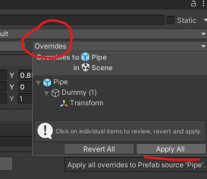
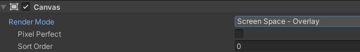
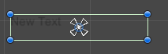
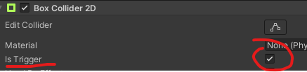
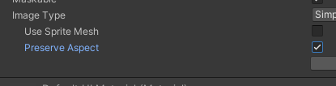

# 유니티로 플러피 게임 클론 개발02

> **Summary**
> 프리팹을 특정 초 후에 삭제하는 방법과 UI 생성 방법을 설명하며, 점수를 증가시키는 콜라이더 생성 및 게임 오버 씬 설정에 대한 내용을 포함하고 있습니다. 코드 예시를 통해 점수를 화면에 표시하고, 트리거 설정을 통해 점수를 증가시키는 방법을 설명합니다.

---

🎥 [동영상 보기](https://www.youtube.com/watch?v=EqoU1PodQQ4&t=460s)

# 프리팹 수정 후 오버라이즈 꼭 Apply



```c#
//제네레이터 내부 스크립트 파일에서 특정 초 이상 지나가면 오브젝트를 삭제하는 코드
//5초 뒤 생성된 newpipe를 삭제하는 코드

Destroy(newpipe,5.0f);
```

## UI 생성방법

하이어라키에서 우클릭 - UI - Canvas




> 🔥 **Rect Transform?**
> 
>
> 특정 좌표를 기준점으로 상대적인 위치값을 가지는것. 따라서 각기다른 화면비율에따라 UI 위치가 유동적으로 변함
>
>


## UI스크립트 작성

```c#
using UnityEngine.UI;
```

스크립트 내부에서 해당 라이브러리를 임포트해준다

```c#
//Score.cs

using UnityEngine.UI;

public class Score : MonoBehaviour
{
    public static int score = 0;
		//static을 선언하여 고정변수로 할당
		//박스콜라이더에 닿았을 때 점수를 올리기 위해서 public static으로 할당
		//ScoreUp.cs에서 점수를 올려서 이 스크립트의 변수를 사용할 수 있게된다
    void Start()
    {
        
    }

    // Update is called once per frame
    void Update()
    {
        GetComponent<Text>().text = score.ToString();
				//Score 점수를 화면상에 나타내기 위해서
    }
}
```

## 점수 증가 Collider 생성

Prefab 내부에 Empty 생성하여 Box Collider 생성



Is Trigger를 선택해둬야 콜라이더가 아니라 트리거 설정이되서 물리적 충돌이 생기지 않는다


그 후 다음과같은 코드 작성

```c#
//ScoreUp.cs

public class ScoreUp : MonoBehaviour
{
    private void OnTriggerEnter2D(Collider2D other) {
        Score.score++;
    }
}
```

보시다시피 Start / Update 없이 스코어에 점수를 할당


## GameOver 씬

게임오버 씬 생성하고 UI 캔버스 생성하고 패널 추가하여 백그라운드 추가 후 Image추가해서 사진넣을때 Preserve Aspect 추가해두면 이미지 비율에 맞게 크기 설정 가능



