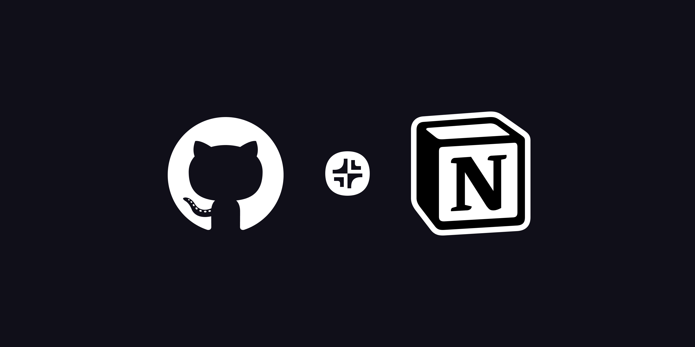
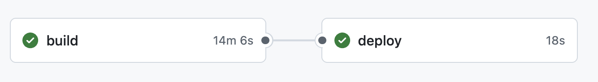
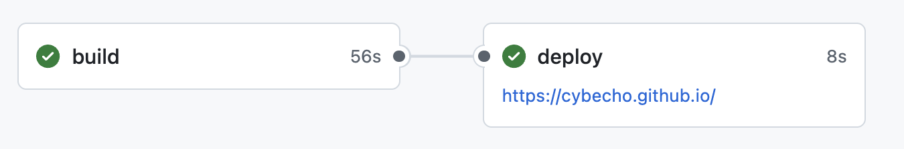

# 캐시 도입으로 빌드 속도를 10배 이상 빠르게 만들었습니다

> **Summary**
> GitHub Actions의 캐시를 활용하여 블로그 빌드 시간을 10분에서 1분으로 단축시켰다. 매번 새로 설치하던 도구와 원고를 캐시하여 효율성을 높였으며, 자동화 시스템의 비효율성을 인식하고 개선하는 과정에서 블로그 성장의 증거를 발견했다.

---



# 블로그 빌드 시간 10배 단축





결론부터 말하자면, GitHub Actions의 워크플로우를 근본적으로 이해하고 캐시를 전략적으로 활용함으로써, 10분이 넘던 빌드 시간을 1분 남짓으로 단축시킬 수 있었다.

## 비효율의 발견

내 블로그의 자동화 파이프라인은 GitHub Actions 위에서 동작한다. 사용자가 푸시를 하거나 정해진 시간이 되면, 가상의 컴퓨터(Runner)가 할당되어 일련의 작업을 수행한다. Notion에 있는 글들을 모두 가져와 웹페이지로 만들고, 이를 블로그에 게시하는 것이다.

문제는 이 가상 컴퓨터가 매번 '새로운' 컴퓨터라는 점이었다. 비유하자면, 매일 아침 새로운 책상에서 일을 시작하는데, 책상은 텅 비어있고 필요한 모든 도구와 서류를 서랍에서 처음부터 다시 꺼내야 하는 상황과 같았다.

- **매번 새로 설치되는 도구들**: 블로그를 만들기 위해 필요한 프로그램들(Node.js, Hugo 등)과 Notion API를 사용하기 위한 라이브러리들을 매번 새로 내려받아 설치했다.
- **매번 새로 옮겨적는 원고들**: Notion에 저장된 모든 글과 이미지를 처음부터 하나도 빠짐없이 전부 새로 내려받았다. 글이 10개일 때와 100개일 때의 작업량은 하늘과 땅 차이였다.
프로젝트 초기, 글이 몇 개 없을 때는 이 방식이 전혀 문제 되지 않았다. 오히려 모든 것을 새로 시작하기에 예측 가능하고 안정적이라 생각했다. 하지만 블로그가 성장하고 콘텐츠가 쌓이면서, 이 '정직한 반복'은 10분이라는 인내의 시간을 요구하는 명백한 비효율이 되었다.

## 캐시 도입과 워크플로우의 재설계

문제의 핵심은 '반복'이었다. 그렇다면 이 가상 컴퓨터에게 '기억'을 선물해 줄 수 있다면 어떨까? 어제 썼던 도구와 서류들을 책상 위에 그대로 남겨둘 수 있다면, 아침에 훨씬 더 빨리 일을 시작할 수 있을 것이다. GitHub Actions에서 이 '기억'의 역할을 하는 것이 바로 캐시(Cache)다.

나는 두 가지를 기억시키기로 했다.

1. **한 번 설치한 도구는 다시 설치하지 않기**: npm install로 설치하는 라이브러리들은 package.json 파일이 바뀌지 않는 한 항상 똑같다. 이 node_modules라는 도구 상자를 통째로 캐시해두면, 다음 작업부터는 설치 과정을 건너뛰고 바로 사용할 수 있다.
1. **이미 가져온 원고는 다시 가져오지 않기**: Notion에서 이미 가져와 내 컴퓨터(저장소)에 저장된 글과 이미지들을 캐시한다. 그리고 동기화 스크립트가 Notion의 글과 캐시된 글을 비교하여, 변경되거나 새로 추가된 것만 처리하도록 로직을 바꿨다. 모든 원고를 새로 옮겨 적는 대신, 바뀐 부분만 수정하는 스마트한 방식으로 진화시킨 것이다.
이 아이디어를 GitHub Actions 워크플로우에 적용하는 것은 간단한 코드 몇 줄을 추가하는 것으로 충분했다.

```yaml
# .github/workflows/hugo-with-notion.yml 中
# ...
- name: Setup Node.js
  uses: actions/setup-node@v4
  with:
    node-version: '20'
    cache: 'npm' # <-- 도구를 기억시키는 한 줄

- name: Cache Notion Content
  uses: actions/cache@v3 # <-- 원고를 기억시키는 마법
  with:
    path: |
      content/
      static/images/notion/
    key: ${{ runner.os }}-notion-${{ github.sha }}
    restore-keys: |
      ${{ runner.os }}-notion-
# ...

```

이 작은 변화가 가져온 결과는 극적이었다. 캐시가 적용된 후, 빌드 시간은 평균 1분대로 줄어들었다. 10분의 기다림은 사라졌다!

## 자동화의 함정과 성장의 증거

이번 경험은 나에게 많은 것을 가르쳐주었다. 처음 자동화 시스템을 구축할 때, 우리는 '동작하는 것'에 집중한 나머지 '효율적으로 동작하는가'를 놓치기 쉽다. 이것이 바로 '자동화의 함정'이다. 시스템은 조용히 비효율을 누적시키고, 우리는 그것이 임계점을 넘어 우리를 불편하게 할 때까지 알아차리지 못할 수 있다.

느려진 빌드 시간은 단순히 시스템의 비효율을 보여주는 지표가 아니었다. 그것은 내 블로그가 그만큼 성장했다는 증거이기도 했다. 쌓여가는 콘텐츠의 무게가 시스템을 느리게 만들었고, 나는 그 성장에 걸맞게 시스템을 한 단계 더 발전시켜야 할 시점이 왔음을 깨달았다.

결국, 내가 만든 시스템의 문제를 파고들어 해결하는 과정은, 단순히 기술적 능력을 향상시키는 것을 넘어 내가 만든 창작물과 더 깊은 관계를 맺는 행위였다. 비효율의 원인을 분석하고, 해결책을 구상하고, 마침내 극적인 개선을 이뤄냈을 때의 희열은 창작의 또 다른 즐거움이다. 이제 나는 더 이상 10분을 기다리지 않는다. 그리고 이 경험을 통해, 앞으로 마주할 또 다른 '성장의 고통'을 기꺼이 즐길 준비가 되었다.

