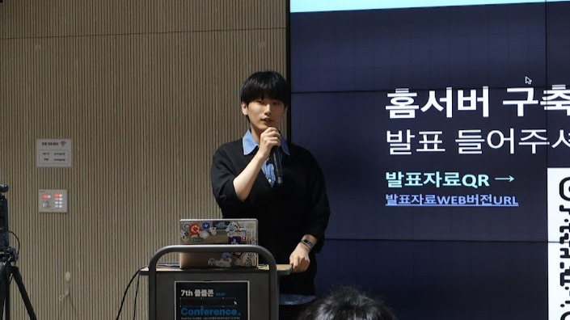

# 클클콘 회고

> **Summary**
> 클라우드클럽에서 Proxmox를 주제로 한 발표를 진행하며, 개인적인 경험과 '삽질 저장소'를 공유하는 기회를 가졌다. 발표는 Type1 하이퍼바이저의 활용과 홈서버 구축에 대한 관심을 중심으로 구성되었으며, 청중의 높은 관심을 받았다. 커뮤니티의 힘과 열정적인 공유 활동의 중요성을 느끼며, 앞으로도 지속적으로 경험을 나누고 배워나가겠다는 다짐을 밝혔다.

---

🔗 [https://www.linkedin.com/pulse/%25EC%2597%25B4%25EC%25A0%2595%25EC%259D%2584-%25EB%2588%2584%25EA%25B5%25B0%25EA%25B0%2580%25EC%2599%2580-%25EA%25B3%25B5%25EC%259C%25A0%25ED%2595%25A0-%25EC%2588%2598-%25EC%259E%2588%25EB%258B%25A4%25EB%258A%2594-%25EA%25B2%2583-%25EC%259D%25B4%25EB%25B3%25B4%25EB%258B%25A4-%25EB%258D%2594-%25ED%2581%25B0-%25ED%2596%2589%25EC%259A%25B4%25EC%259D%25B4-%25EC%259E%2588%25EC%259D%2584%25EA%25B9%258C%25EC%259A%2594-any-greater-pleasure-so-uv0vc/?trackingId=Cfte8GDhRPqCvCrdtaQS9A%3D%3D](https://www.linkedin.com/pulse/%25EC%2597%25B4%25EC%25A0%2595%25EC%259D%2584-%25EB%2588%2584%25EA%25B5%25B0%25EA%25B0%2580%25EC%2599%2580-%25EA%25B3%25B5%25EC%259C%25A0%25ED%2595%25A0-%25EC%2588%2598-%25EC%259E%2588%25EB%258B%25A4%25EB%258A%2594-%25EA%25B2%2583-%25EC%259D%25B4%25EB%25B3%25B4%25EB%258B%25A4-%25EB%258D%2594-%25ED%2581%25B0-%25ED%2596%2589%25EC%259A%25B4%25EC%259D%25B4-%25EC%259E%2588%25EC%259D%2584%25EA%25B9%258C%25EC%259A%2594-any-greater-pleasure-so-uv0vc/?trackingId=Cfte8GDhRPqCvCrdtaQS9A%3D%3D)

### 메모

내 열정을 누군가에게 피력할 수 있는건 큰 기회이자 행운이 아닐까?

최근 감사한 기회로 몸담고있는 커뮤니티인 클라우드클럽에서 컨퍼런스 발표를 진행하게 되었다.

주제는 Proxmox : 홈서버구축, 한 입 해보실래요?

신기했다, Infra의 I도 모르던 게임개발이라는 전혀 다른 도메인이었던 내가 필요에 의해 진행했던 소위말한 ‘삽질’ 이, 누군가에겐 흥미로운 여정이, 누군가에겐 이정표가 되었을 줄이야.

발표는 15분으로 구성되었고, 발표 대부분은 내가 과거부터 정리해온 ‘삽질저장소’ 라는 개인 Notion페이지 내용과, Proxmox를 제안하기 위한 벤치마크 데이터로 구성되어있다.

Proxmox라는 하이퍼바이저의 우수함보단, 내가 왜? 이 솔루션까지 다다르게 되었고, 대부분의 주니어들에겐 생소할 (나를 포함하여) Type1 하이퍼바이저를 어디에 활용할 수 있을지, 또래들의 눈높이에 맞춰 소개하는 발표로 집중을 하였다.

생각보다 청중의 관심이 많았고, 홈서버라는 온프레미스 환경이, 클라우드에대한 비용문제와, 자유로운 실습환경을 필요로하는 우리같은 주니어들에게 강한 니즈로 느껴져서 그렇지 않을까? 라고 생각했다.

이에대해 더 자세한 발표내용은 첨부한 유튜브 링크에서 확인해볼 수 있다. (QnA가 녹화되지 않은것은 아쉽다)

최근 개인적으로 정리했던 경험들이 누군가에겐 이정표가되고, 흥미로운 대화소재가 되는것에 굉장히 큰 보람을 느낀다. 이것이 바로 커뮤니티의 힘이자 공유의 힘일까? 앞으로도 어느 누군가에겐 이정표가 될 수 있도록, 앞으로도 열정적인 삽질과 공유 활동을 이어나가야겠다.

처음 Infra를 시작하는 나에게 스터디장 경험과 발표기회를 준 클라우드클럽과 윤태님에게 감사를 표하며 글을 마치고자 한다.

[나의 열정을 누군가와 공유할 수 있다는 것, 이보다 더 큰 행운이 있을까요?]

최근 운좋게 감사한 기회로, 몸담고 있는 커뮤니티인 클라우드클럽에서 컨퍼런스 발표를 하게 되었습니다. 

발표 주제는 "Proxmox : 홈서버구축, 한 입 해보실래요?" 였는데요..

발표 제안을 받고 참 신기하다는 생각을 했습니다. 반년 전 까지 Infra의 I도 모르던 게임개발이라는 전혀 다른 도메인에 있던 제가, 필요에 의해 개인적으로 진행했던 소위 말하는 '삽질'의 과정들이, 누군가에겐 흥미로운 여정이 되고, 또 다른 누군가에겐 이정표가 될 수 있다는 생각을 했기 때문일까요...?

그러하여… 감사한 마음으로, 그동안 개인적으로 기록해 온 '삽질 저장소' 노션 페이지와 Proxmox 도입을 위해 정리했던 벤치마크 데이터를 바탕으로 발표 자료를 준비했습니다.

특히 이번 발표를 준비하면서 중점을 둔 부분은 Proxmox라는 하이퍼바이저의 우수함을 강조하기보다는, 제가 '왜' 어떤 경위로 이 솔루션까지 다다르게 되었는지, 그리고 대부분의 주니어들에겐 생소할 (저를 포함해서) Type1 하이퍼바이저를 어디에 활용할 수 있을지를 우리들의 눈높이에 맞춰 소개하는 데 집중했습니다.

발표를 마치고 나서는 생각보다 QnA를 통한 관심이 많아서 놀랐습니다. 아마도 홈서버라는 온프레미스 환경이 클라우드 비용 이슈와 자유로운 실습환경을 필요로 하는 우리 같은 주니어들에게 강한 니즈로 다가왔기 때문이 아닐까 생각했습니다.

어쨌든 발표는 성황리에? 잘 마무리 하였고… 개인적인 소감을 남겨보자면, 클라우드 클럽이라는 커뮤니티에서 발표와 같은 경험을 통해, 최근 개인적으로 정리했던 경험들이 누군가에겐  이정표가 되고, 흥미로운 대화 소재가 되는 것에서 굉장히 큰 보람을 느끼는 요즘입니다.

이것이 바로 커뮤니티의 힘이자 공유의 힘이 아닐까요? 열정을 공유할 수 있고, 자극을 받을 수 있는 사람들이 가득한 오프라인 커뮤니티에서 앞으로도 어느 누군가에겐 이정표가 될 수 있도록, 그리고 또 배울점 가득한 사람들과 함께 나아가기 위해서 열정적인 삽질과 공유 활동을 계속 이어나가야겠습니다.

마지막으로 처음 Infra를 시작하는 저에게 스터디장 경험과 발표 기회를 준 클라우드클럽과 윤태님에게 감사를 표하며 글을 마칩니다.

더 자세한 발표 내용은 첨부한 유튜브 링크에서 확인할 수 있습니다.

🔗 [https://www.youtube.com/watch?v=UlMMQDJUF8s](https://www.youtube.com/watch?v=UlMMQDJUF8s)

