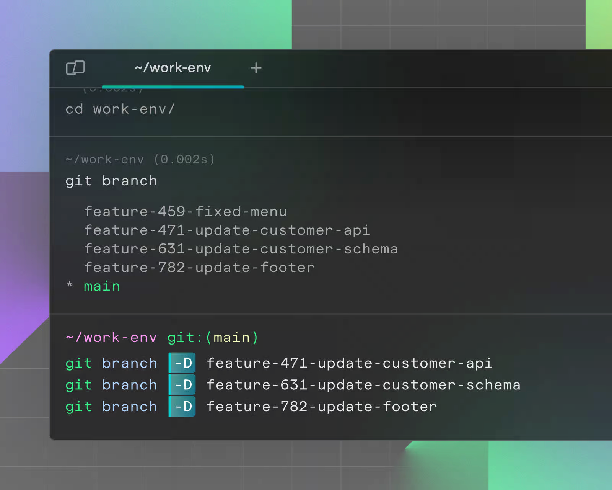

# 터미널에서 AI를 써보자 Warp

> **Summary**
> Warp는 Rust 언어로 개발된 GPU 가속 터미널 에뮬레이터로, AI 기술을 통해 자연어 명령어 변환 및 팀 협업 기능을 제공한다. macOS, Linux, Windows에서 설치 가능하며, 각 운영체제에 맞는 설치 방법이 안내되어 있다. 설치 후 계정 생성을 통해 개인화된 AI 설정과 워크플로 동기화가 이루어지며, 기존 셸 설정 파일을 쉽게 가져올 수 있다.

---

## [주제 1: Warp 터미널의 현대적 기능과 플랫폼 확장 배경]

Warp는 기존의 단순한 텍스트 입력 기반 터미널의 한계를 극복하기 위해 Rust 언어로 개발된 GPU 가속 기반 터미널 에뮬레이터이다. 인공지능(AI) 기술을 내장하여 자연어 명령어를 셸 커맨드로 변환하거나 복잡한 워크플로를 팀 단위로 공유할 수 있는 협업 기능을 제공하는 것이 특징이다. 초기에는 macOS 전용으로 출시되었으나, 개발자들의 크로스 플랫폼 요구가 증가함에 따라 Linux와 Windows 환경으로 지원 범위를 확장하였다. 이는 사용자가 운영체제에 구애받지 않고 일관된 고성능 터미널 환경과 AI 어시스턴트 기능을 활용하도록 하기 위함이다.

## [주제 2: macOS 환경에서의 설치 및 배포 방식]

macOS에서의 설치는 공식 웹사이트에서 제공하는 디스크 이미지(.dmg) 파일을 내려받거나 패키지 관리자인 Homebrew를 통해 수행할 수 있다. Homebrew를 사용하는 경우 터미널에 brew install --cask warp 명령어를 입력하여 자동 설치가 가능하다. Warp는 macOS의 네이티브 프레임워크를 우회하고 GPU를 직접 활용하여 렌더링 성능을 극대화하였으므로, 대량의 로그 출력 상황에서도 지연 시간이 발생하지 않는 기술적 우위를 가진다.

## [주제 3: Linux 배포판별 패키지 설치 절차]

Linux 환경에서는 다양한 배포판의 패키지 관리 규격에 맞춰 개별적인 설치 파일을 제공한다. Ubuntu나 Debian 계열 사용자는 .deb 파일을, Fedora나 RedHat 계열 사용자는 .rpm 파일을 활용하여 설치를 진행할 수 있다. 아치 리눅스(Arch Linux)와 같은 환경을 위해 AUR(Arch User Repository)을 통한 배포도 지원한다. Linux 버전은 Wayland 및 X11 디스플레이 서버와의 호환성을 확보하였으며, 터미널 내부의 각 명령 단위를 블록(Block) 형태로 관리하는 Warp 특유의 사용자 인터페이스를 동일하게 구현하였다.

## [주제 4: Windows 환경의 지원 상태 및 설치 경로]

Windows 환경의 경우 초기에는 WSL(Windows Subsystem for Linux)을 통한 간접적인 사용이 권장되었으나, 현재는 Windows 네이티브 버전의 배포가 이루어지고 있다. 사용자는 공식 홈페이지에서 설치 파일을 실행하여 설치를 완료할 수 있다. Windows 버전은 운영체제 특유의 입력 방식과 파일 시스템 구조를 반영하면서도, 내부적으로는 Rust 기반의 일관된 코어 로직을 공유하여 macOS나 Linux 버전과 동일한 명령 보정 및 검색 기능을 제공한다.

## [주제 5: 설치 후 초기 설정 및 계정 기반 동기화]

Warp는 설치 완료 후 최초 실행 시 사용자 계정 생성을 통한 로그인을 요구한다. 이는 개인화된 AI 설정, 사용자 정의 워크플로, 그리고 팀 간 공유되는 기술 문서 격인 'Warp Drive' 데이터를 클라우드에 동기화하기 위한 필수적인 절차이다. 사용자는 로그인을 마친 후 터미널 테마, 글꼴 크기, 단축키 등을 설정할 수 있으며, 기존에 사용하던 셸(Zsh, Bash, Fish 등)의 설정 파일 내용을 Warp 내부로 동기화하여 즉시 실무에 투입할 수 있는 환경을 구축할 수 있다.

