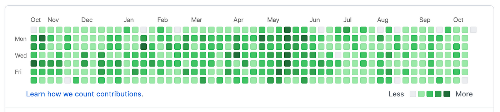
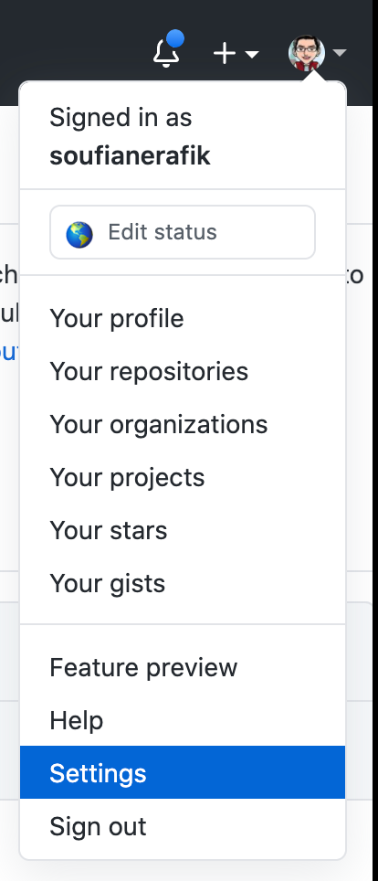
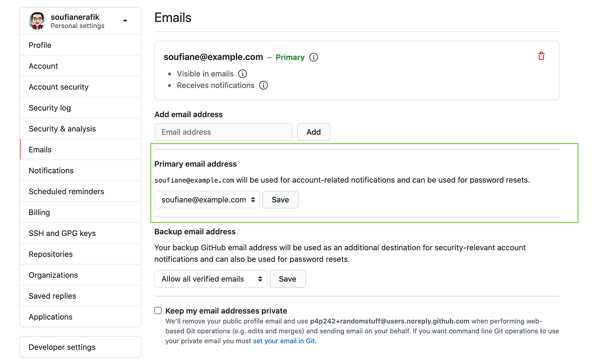
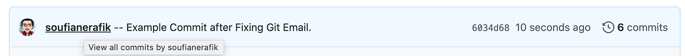

# 터미널에서 커밋 박스 미적용 오류 해결법

> **Summary**
> MacBook Pro에서 커밋이 GitHub 기여도 그래프에 표시되지 않는 문제를 해결하기 위해, 로컬 Git 이메일 주소와 GitHub 계정의 이메일 주소가 일치해야 한다. 이를 위해 GitHub 설정에서 이메일 주소를 확인하고, 터미널에서 로컬 Git 이메일을 확인한 후, 두 주소를 일치시키면 기여도 그래프에 커밋이 표시된다.

---

🔗 [https://medium.com/@soufianerafik/commits-not-showing-up-on-github-contributions-graph-c3b539ad42a1](https://medium.com/@soufianerafik/commits-not-showing-up-on-github-contributions-graph-c3b539ad42a1)

> 내 기사는 프로그래밍에 대해 잘 모르는 초보자를 위한 것이므로 기술적인 단어를 많이 사용하지 않고 최대한 간단하게 설명하려고 합니다.

저는 최근에 MacBook Pro를 포맷하고 개발 환경을 설정했으며 현재 작업 중인 개인 프로젝트에 몇 가지 변경 사항을 적용했습니다. 놀랍게도 내 모든 새 커밋이 내 기여도 그래프에 표시되지 않았습니다! 얼마나 실망스럽습니까?



기여도는 내 기여도에 포함되지 않습니다.

[GitHub의 문서를](https://docs.github.com/en/enterprise/2.16/user/github/setting-up-and-managing-your-github-profile/why-are-my-contributions-not-showing-up-on-my-profile#contributions-that-are-counted) 훑어본 후 커밋이 아래 조건을 충족하는 경우에만 표시된다는 것을 알았습니다.

- 기준 1: 커밋은 포크가 아닌 독립형 저장소에서 만들어졌습니다.
- 기준 2: 커밋이 이루어졌습니다: **리포지토리의 기본 브랜치(일반적으로 마스터) 또는**
  gh-pages 브랜치(프로젝트 사이트가 있는 리포지토리용)

- 기준 3 **: 커밋에 사용되는 이메일 주소는 GitHub 계정과 연결되어 있습니다.**
[따라서 기준 1과 2를 충족하는 경우 로컬 Git 이메일 주소와 GitHub](https://github.com/) 계정의 이메일이 일치하지 않을 수 있습니다 .

# 알겠습니다. 어떻게 고칠 수 있습니까?

**1단계:** Github 계정에서 페이지 오른쪽 상단에 있는 설정 섹션으로 이동하거나 다음 URL -> [https://github.com/settings/profile 로 간단히 이동할 수 있습니다.](https://github.com/settings/profile)



**2단계:** 그런 다음 이메일 섹션으로 이동합니다.

기본 이메일 주소는 로컬 Git의 주소와 일치해야 합니다.



# "좋아, 그럼 내 로컬 Git 이메일 주소를 어떻게 알 수 있지?"

**3단계:** 로컬 컴퓨터에서 터미널을 열고 아래 명령을 실행합니다.

```plain text
git config --global user.email
```

결과:

```plain text
git config --global user.email
soufiane.dev@example.com
```

제 경우에는 두 이메일 주소가 일치하지 않았습니다.

- 내 로컬 git 이메일은 soufiane.dev@example.com이었습니다.
- 내 원격 [Github](https://github.com/)
  이메일은 soufiane@example.com입니다.

내 기여도 그래프에 커밋이 표시되지 않는 이유가 바로 여기에 있습니다.

**4단계:** 아래 명령을 실행하여 로컬 Git 이메일 주소를 [GitHub](https://github.com/) 계정 이메일 주소와 일치하도록 변경합니다.

```plain text
git config --global user.email "YOUR_GITHUB_EMAIL_ADDRESS"
```

이제 두 주소가 일치해야 합니다.

**5단계:** 아래 명령을 실행하여 로컬 Git에서 이메일 주소를 올바르게 설정했는지 확인합니다.

```plain text
git config --global user.email
```

**5단계:** 모든 준비 완료! [이제 Github](https://github.com/) 에 변경 사항을 커밋하고 푸시할 수 있으며 기여도 그래프에 표시됩니다!



> 이게 도움이 되길 바란다

