# 파이썬으로 블로그 글 자동화1

> **Summary**
> 노션 AI를 사용하여 블로그 글을 자동 생성하고 티스토리 블로그에 자동 업로드하는 방법을 설명합니다. 강의 영상 링크와 함께 파이썬 코드 예시를 제공하며, 노션에서 토큰을 얻고 티스토리 API를 설정하는 절차를 안내합니다.

---


> 🔥 **강의영상**
> 🔗 [https://youtu.be/cnhZuV91fXM](https://youtu.be/cnhZuV91fXM)
>
> 🔗 [https://youtu.be/_52LZuqpvdI](https://youtu.be/_52LZuqpvdI)
>
> 🔗 [https://youtu.be/p6mtoIGkgqs](https://youtu.be/p6mtoIGkgqs)
>
>

> 🔥 **py -m pip install --upgrade notionai-py**

```python
#노션AI에서 글 자동생성

from notionai import NotionAI

NOTION_TOKEN = ''
NOTION_SPACE_ID = ''

topic = '자본 없이 제태크를 시작하는 방법에 대해서'

ai = NotionAI(NOTION_TOKEN,NOTION_SPACE_ID)
result = ai.blog_post(f'write a blog about {topic}')

print(result)
```

> 🔥 **py -m pip install tistory**

```python
#티스토리에 글 불러오기

from tistory import Tistory

#블로그 주소
blog_url = "https://a-004.tistory.com/"
#클라이언트 ID, SECRET
client_id = ""
client_id_secret = ""
#티스토리 인스턴트 생성
ts = Tistory(blog_url, client_id, client_id_secret)
ts.access_token = ""

page_number = 1
ts.list_post(page_number)
print(ts.list_post(page_number),"+++++++++++++++++++++++++++++++ 2 \n\n")
```

# 노션AI

## 1. 노션 페이지에서 개발자모드 접근

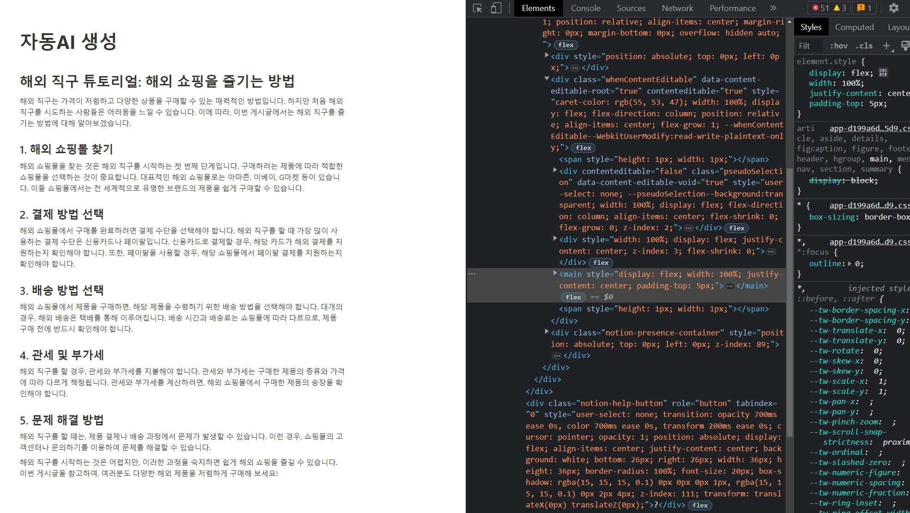

## 2. Application - Cookies로 이동

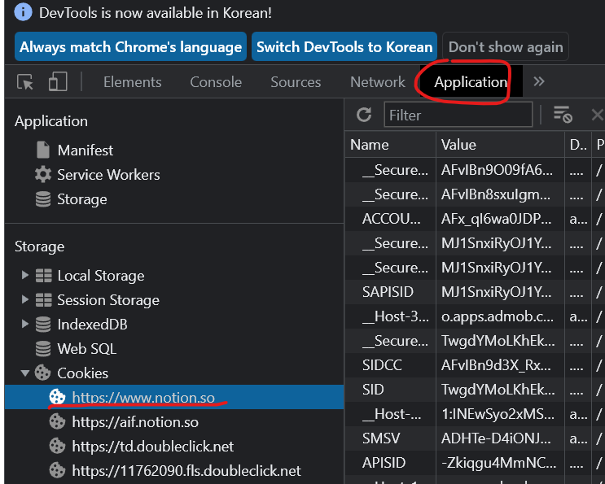

```python
8b04bb8b1c1732ab220f8f76677efebdc1dd3451e175737efee4fded151e2f8bf8d899b3ea7e1ebe6bd8ee363f5d80a587dead1a2d80b3f42b36268b532bb4503c5a7347ad92aacf35dce010dde3
```

## 3.필터창에 token을 치고 값을 얻어옴

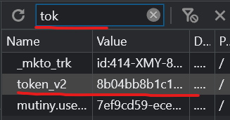

## 4. Local Storage에서 글이 적힐 PublicSpaceData공간을 할당해준다

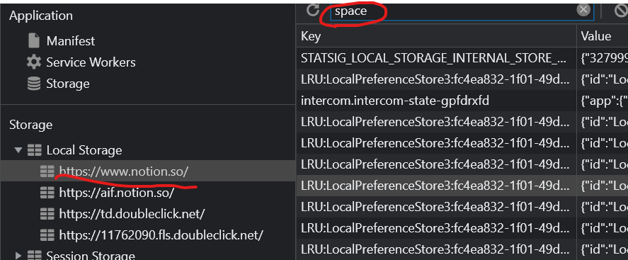

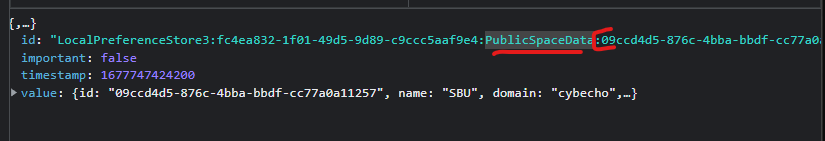

PublicSpaceData를 찾아서 우측에 데이터를 사용할것임

```python
"LocalPreferenceStore3:fc4ea832-1f01-49d5-9d89-c9ccc5aaf9e4:PublicSpaceData:09ccd4d5-876c-4bba-bbdf-cc77a0a11257"
```

## 5.근데 선생님.. 노션 횟수 차감 되는디요???

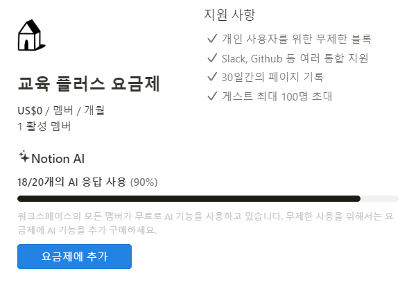

# 티스토리 자동업로드 기본 세팅

🔗 [https://www.tistory.com/guide/api/manage/register](https://www.tistory.com/guide/api/manage/register)

여기서 티스토리 API를 신청해야함

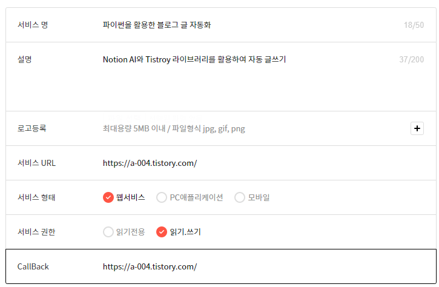

서비스 URL과 콜백은 내 블로그 주소로

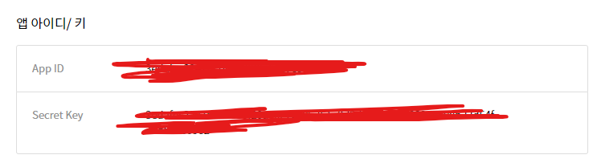

키를 받을 수 있음

## 서비스 URL 뒤에는 슬래시 /가 꼭 붙어있어야한다


## Authorize Code 얻는 방법


```python
https://www.tistory.com/oauth/authorize?client_id=[APPID]&redirect_uri=[SERVICEURL]&response_type=code
```

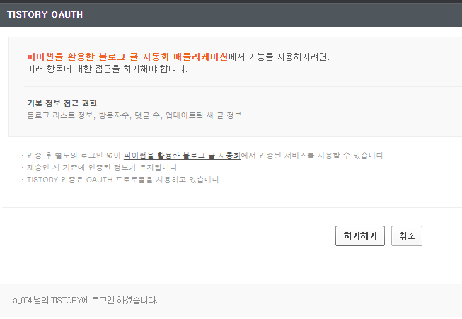

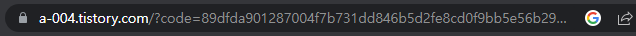

그럼 이제부터 뒤에 액세스 토큰이 뜸


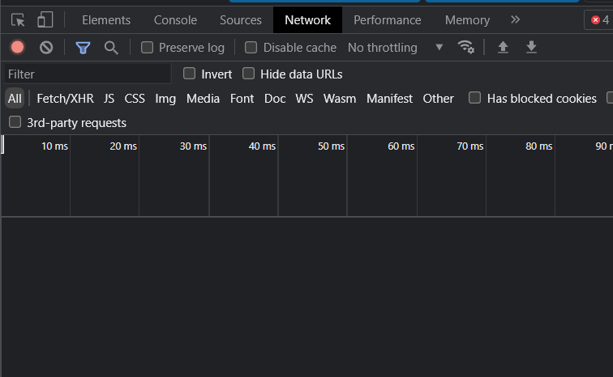

 네트워크 들어가서 아래 정보를 ‘한줄로’ 넣어준다

```python
https://www.tistory.com/oauth/access_token?
client_id=[App ID]&
client_secret=[Secret Key]&
redirect_uri=[서비스 URL]&
code=[Authorize Code]&
grant_type=authorization_code
```

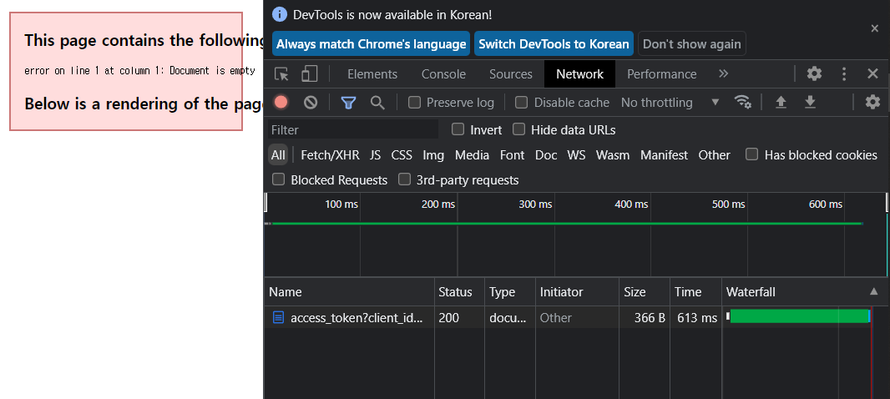

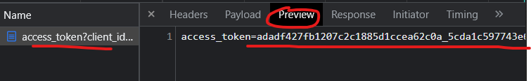

발급받은 토큰은 Preview에서 확인이 가능하다

