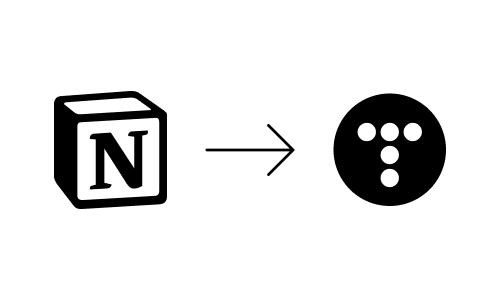

# 파이썬으로 블로그 글 자동화1

> **Summary**
> 노션 AI를 활용하여 블로그 글을 자동으로 생성하고, 티스토리 블로그에 자동으로 업로드하는 방법에 대한 강의 영상과 코드 예시를 제공한다. 노션 AI와 티스토리 OpenAPI를 사용하여 블로그 포스팅을 자동화하는 과정과 필요한 설정을 설명한다.

---



### 강의영상

> 🔥 **py -m pip install --upgrade notionai-py**

```python
#노션AI에서 글 자동생성

from notionai import NotionAI

NOTION_TOKEN = ''
NOTION_SPACE_ID = ''

topic = '자본 없이 제태크를 시작하는 방법에 대해서'

ai = NotionAI(NOTION_TOKEN,NOTION_SPACE_ID)
result = ai.blog_post(f'write a blog about {topic}')

print(result)
```

> 🔥 **py -m pip install tistory**

```python
#티스토리에 글 불러오기

from tistory import Tistory

#블로그 주소
blog_url = "https://a-004.tistory.com/"
#클라이언트 ID, SECRET
client_id = ""
client_id_secret = ""
#티스토리 인스턴트 생성
ts = Tistory(blog_url, client_id, client_id_secret)
ts.access_token = ""

page_number = 1
ts.list_post(page_number)
print(ts.list_post(page_number),"+++++++++++++++++++++++++++++++ 2 \n\n")
```

# 노션AI

# 티스토리 자동업로드 기본 세팅

