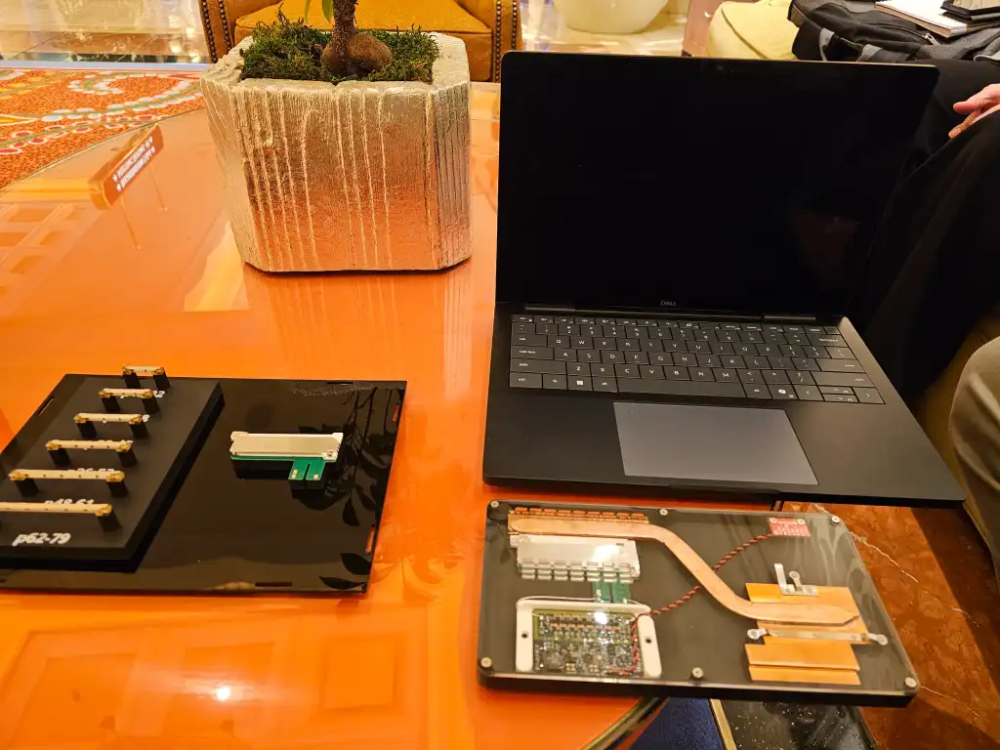

# 팬이 없는 노트북 냉각의 시대가 찾아온다? Ventiva의 ICE 기술 파헤쳐보자..!

> **Summary**
> Dell의 Ventiva Ice 9 기술은 이온화된 공기를 사용하여 노트북을 냉각하는 혁신적인 팬리스 솔루션으로, 소음이 적고 디자인의 유연성을 높입니다. 이 기술은 5,000V의 전압을 이용해 공기를 이온화하고, 기존 팬 방식보다 더 조용하게 작동하지만, 오존 발생과 고전압 전원 공급 문제 등 해결해야 할 과제가 있습니다. Ventiva는 인텔과 델과 협력하여 이 기술을 상용화하고 있으며, 팬리스 냉각의 미래를 열어갈 가능성이 큽니다.

---

🎥 [동영상 보기](https://www.youtube.com/watch?v=2lTWI7kfkt0)

### 요약

Dell이 CES 2025에서 새로운 노트북 냉각 기술 'Ventiva Ice 9'를 공개했습니다. 이 기술은 기존의 팬 대신 이온화된 공기를 사용해 노트북을 식힙니다. Dell과 Intel이 함께 만든 이 기술은 매우 조용하고 공간도 적게 차지하며, 앞으로 새로운 노트북에 들어갈 예정입니다.

### 핵심 내용

### 기술 원리

- [0:30] Ventiva Ice 9는 5,000V의 전압을 가해 공기를 이온화시켜 냉각하는 방식입니다.
- [1:17] 이 방식으로 약 8CFM의 공기 흐름을 얻을 수 있어 기존 팬과 유사한 성능을 발휘합니다.
- [1:34] 하지만 공기 이온화에는 물리적 한계가 있어 전압을 더 높이면 오히려 역효과가 발생할 수 있습니다.
### 장점

- [2:14] 기존 팬 대신 이온 구동 방식을 사용해 노트북 디자인의 유연성이 높아집니다.
- [3:19] 소음 수준이 팬 방식의 28dB에서 14dB로 크게 줄어듭니다.
### 한계점

- [4:01] 5,000V의 고전압 전원 공급이 기술적 과제로 남아 있습니다.
- [5:54] 공기 이온화 과정에서 발생하는 오존 문제도 해결해야 합니다.

## 팬 없는 노트북 냉각? Ventiva의 ICE 기술 파헤쳐보자!

[https://www.pcworld.com/article/2570821/ventivas-fanless-laptop-cooler-wins-intel-and-dell-over.html](https://www.pcworld.com/article/2570821/ventivas-fanless-laptop-cooler-wins-intel-and-dell-over.html)

최근 노트북 시장의 화두는 휴대성과 성능, 그리고 **정숙성**입니다. 특히 고성능 노트북일수록 발열 문제를 해결하기 위한 냉각 기술이 중요한데, 기존의 팬 방식은 소음 때문에 조용한 환경에서는 거슬릴 수 있다는 단점이 있습니다. 이러한 문제를 해결하기 위해 Ventiva라는 회사가 혁신적인 팬리스 냉각 솔루션, **ICE (Ionic Cooling Engine)** 기술을 개발하여 주목받고 있습니다.

### 그 전에,,, 이온화에 대해 간단히 살펴보고 갈까요?

1. **이온화, 도대체 뭘까? 번개와 공기청정기 속에 숨겨진 비밀!**
  "이온화"라는 단어를 들으면 왠지 어렵고 과학적인 느낌이 들죠? 하지만 알고 보면 우리 생활 속에서도 이온화 현상을 쉽게 찾아볼 수 있답니다. 초보자도 이해하기 쉽도록, 실생활 속 예시를 통해 이온화가 무엇인지 함께 알아볼까요?

1. **번개, 자연이 만들어내는 짜릿한 이온화 현상!**
  하늘에서 번개가 치는 순간을 상상해 보세요. 엄청난 에너지가 순간적으로 방출되면서 빛과 소리를 만들어내죠. 이때 번개는 공기 중의 질소나 산소 분자에 강한 에너지를 가합니다. 이 에너지 때문에 질소나 산소 분자는 가지고 있던 전자를 잃거나 얻게 되는데, 이렇게 **전자를 잃거나 얻어서 전기적 성질을 띠게 된 입자를 "이온"이라고 부릅니다.** 그리고 이온이 만들어지는 과정을 바로 "이온화"라고 하는 것이죠!

1. **공기청정기, 쾌적한 공기를 위한 이온화의 역할!**
  최근 많은 가정에서 공기청정기를 사용하고 있죠. 일부 공기청정기는 "음이온 발생 기능"을 가지고 있는데, 이것 역시 이온화 현상을 이용한 것입니다. 공기청정기 내부에서 전기적인 에너지를 가해 공기 중의 산소 분자를 이온화시킵니다. 

  이렇게 만들어진 음이온은 공기 중의 먼지나 세균과 결합하여 무게를 무겁게 만들고, 바닥으로 가라앉게 합니다. 결과적으로 공기 중의 오염 물질이 줄어들어 공기가 깨끗해지는 것이죠.

1. **정리하자면, 이온화란?**
  이온화란, 물질이 에너지를 받아 전기를 띠는 현상입니다. 이온화된 입자들은 서로 밀고 당기는 힘을 이용해 공기를 움직이게 하고, 이로 인해 공기의 흐름을 만들 수 있습니다.

### 팬 대신 이온으로 냉각한다? ICE 기술의 작동 원리

자, 그럼 이온화에 대한 개념을 간략히 잡았으니, 이제 본격적으로 ICE기술에 대해 알아봅시다. ICE 기술은 기존의 팬을 사용하는 방식과는 완전히 다른 원리로 작동합니다. 마치 공기청정기에서 음이온을 발생시켜 공기를 정화하는 것처럼, ICE는 공기 분자를 **이온화**시켜 공기의 흐름을 만들어냅니다.

조금 더 자세히 설명하자면, ICE 내부에는 얇은 금속 와이어가 수평으로 배치되어 있습니다. 이 와이어에 전기를 흘려보내면, 주변의 공기 분자들이 전기적으로 충전되면서 와이어에서 밀려나게 됩니다. 마치 우리가 풍선을 문지르면 정전기가 발생하여 머리카락이 달라붙는 것처럼, 전기적 척력에 의해 공기 분자들이 움직이면서 자연스럽게 공기의 흐름을 만들어내는 것이죠.

이러한 공기 흐름은 노트북 내부의 열을 외부로 배출시켜 냉각 효과를 가져다줍니다. 기존의 팬 방식과 달리 움직이는 부품이 없기 때문에 **소음이 거의 발생하지 않는다는 장점**이 있습니다.

### Ventiva의 ICE 기술을 좀 더 실생활 예시로 이해해보자.

우리가 흔히 사용하는 선풍기를 생각해 봅시다. 선풍기는 날개를 회전시켜 공기를 움직이고 이 공기 흐름으로 인해 시원한 느낌을 받습니다. 이처럼 공기의 흐름이 만들어지면 열을 제거할 수 있습니다.

Ventiva의 ICE 기술도 이와 유사한 원리로 작동합니다. 다만 선풍기와 달리 ICE에는 팬이나 날개가 없습니다. 대신 ICE 내부에 얇은 금속 와이어가 있는데, 이 와이어에 전기를 흘려보내면 공기 분자들이 전기적으로 충전되면서 이동하게 됩니다.

예를 들어, 우리가 정전기를 일으키면 머리카락이 쭉 세워지는데, 이처럼 전기 충전을 받은 공기 분자들도 와이어에서 밀려나면서 다른 중성 공기 분자들을 미는 것입니다. 이렇게 만들어진 공기 흐름이 노트북 내부의 열을 제거할 수 있습니다.

이렇게 ICE는 팬 없이도 공기 흐름을 만들어내서 노트북을 냉각시킬 수 있습니다. 기존 냉각 팬이 시끄러웠던 점을 개선한 것이죠. 다만 ICE 작동 시 오존이나 먼지 문제가 발생할 수 있어, 이에 대한 추가 기술 개발이 필요합니다.

### 이온화 현상을 이용한 냉각 기술을 조금 더 알아보자

이온화 현상을 이용한 냉각기술은, 단순히 이온을 만드는 것만으로는 냉각 효과를 얻을 수 없고, **만들어진 이온을 움직여서 공기의 흐름을 만들어내는 것**이 핵심입니다.

**1. 이온 생성: 전하를 띤 공기 분자 만들기**

Ventiva의 ICE 기술은 먼저 전기적인 에너지를 사용하여 공기 분자를 이온화시킵니다. 앞서 설명드린 것처럼, 공기 분자는 전자를 잃거나 얻어서 양이온 또는 음이온이 됩니다.

**2. 전하 간의 척력과 인력: 이온을 움직이게 하는 힘**

여기서 중요한 것은 이온은 전하를 띠고 있기 때문에, 전기장 속에서 힘을 받는다는 것입니다. 같은 전하끼리는 서로 밀어내는 척력이 작용하고, 다른 전하끼리는 서로 끌어당기는 인력이 작용합니다.

ICE 내부에는 전극이 배치되어 있어서 전기장을 형성합니다. 이 전기장은 이온화된 공기 분자들을 밀고 당기는 역할을 합니다. 예를 들어, 양이온은 음극 방향으로 끌려가고, 음이온은 양극 방향으로 끌려갑니다.

**3. 공기 흐름 생성: 열을 운반하는 바람 만들기**

이렇게 이온들이 전기장 속에서 움직이면서 주변의 중성 공기 분자들과 충돌합니다. 이 충돌 과정에서 이온의 운동 에너지가 중성 공기 분자들에게 전달되고, 이로 인해 중성 공기 분자들도 함께 움직이게 됩니다. 결과적으로 이온들의 움직임이 연쇄적으로 이어져 전체적인 공기의 흐름을 만들어내는 것입니다.

마치 당구공을 쳐서 다른 당구공들을 움직이게 하는 것과 비슷한 원리라고 생각하시면 됩니다. 이온들이 당구공 역할을 하고, 중성 공기 분자들이 다른 당구공 역할을 하는 것이죠.

**4. 열 전달과 냉각: 뜨거운 공기 내보내기**

이렇게 만들어진 공기의 흐름은 노트북 내부의 뜨거운 공기를 외부로 배출하는 역할을 합니다. 뜨거운 공기는 차가운 공기보다 밀도가 낮기 때문에 위로 올라가는 성질이 있습니다. ICE는 이러한 자연적인 대류 현상을 더욱 강화시켜 뜨거운 공기를 빠르게 배출하고, 노트북 내부의 온도를 낮추는 것입니다.

**정리하자면, 이온화 현상이 냉각을 이끌어내는 과정은 다음과 같습니다.**

1. 이온화된 공기 분자를 생성합니다.
1. 전기장을 이용하여 이온들을 움직입니다.
1. 이온들의 움직임으로 인해 공기의 흐름이 생성됩니다.
1. 공기의 흐름이 노트북 내부의 열을 외부로 배출하여 냉각합니다.
이 모든 과정은 팬 없이, 소음 없이 이루어지기 때문에 더욱 혁신적인 기술이라고 할 수 있습니다.

### Ventiva, 인텔과 델(Dell)과 협력하여 기술 개발 박차

Ventiva는 ICE 기술을 상용화하기 위해 인텔, 델(Dell)과 같은 IT 업계의 거물들과 협력하고 있습니다. 특히 델(Dell)과는 ICE 기술을 적용한 컨셉 노트북을 공개하여 기술력을 선보였습니다. 인텔과의 협력을 통해 인텔의 Evo 플랫폼에 ICE 기술을 포함시키는 것도 추진하고 있다고 합니다.

### ICE 기술의 장점과 해결해야 할 과제

ICE 기술은 팬리스 냉각 솔루션으로서 다음과 같은 **장점**을 가지고 있습니다.

- **저소음:** 팬이 없기 때문에 작동 소음이 거의 없습니다. 도서관이나 조용한 사무실에서도 쾌적하게 사용할 수 있습니다.
- **고성능 냉각:** 25W 이상의 열을 제거할 수 있을 정도로 뛰어난 냉각 성능을 보여줍니다.
- **슬림한 디자인:** 팬이 필요 없기 때문에 노트북의 두께를 더욱 얇게 만들 수 있습니다.
하지만 ICE 기술은 아직 해결해야 할 **과제**도 가지고 있습니다.

- **오존 발생:** ICE 작동 시 소량의 오존이 발생할 수 있습니다. Ventiva는 촉매 변환기를 개발하여 오존 발생량을 줄이기 위해 노력하고 있습니다.
- **먼지 축적:** ICE 내부에 먼지나 섬유질이 쌓일 수 있습니다. Ventiva는 공기 센서 기능을 활용하여 먼지 축적 문제를 해결할 방안을 모색 중입니다.
### 팬리스 냉각의 미래를 열어갈 Ventiva의 ICE 기술

Ventiva의 ICE 기술은 아직 해결해야 할 과제가 있지만, 팬리스 냉각 솔루션으로서의 잠재력은 매우 크다고 할 수 있습니다. 특히 소음에 민감한 사용자나 얇고 가벼운 디자인을 선호하는 사용자들에게 매력적인 대안이 될 수 있을 것입니다. Ventiva가 기술적인 과제를 해결하고 ICE 기술을 더욱 발전시켜, 앞으로 팬리스 냉각의 새로운 시대를 열어갈 수 있을지 기대됩니다.

