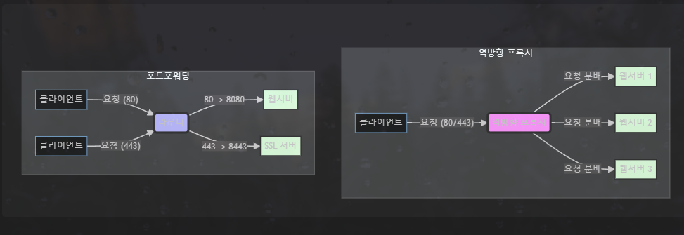

# 포트포워딩 vs 리버스 프록시 뭔 차이임?

> **Summary**
> 역방향 프록시는 클라이언트 요청을 분석하여 여러 내부 서버로 분배하며, URL 기반 라우팅과 보안 강화 기능을 제공합니다. 반면 포트포워딩은 특정 포트를 통해 요청을 전달하고 설정이 간단하지만 보안과 관리의 복잡성이 증가할 수 있습니다. 역방향 프록시는 로드 밸런싱과 SSL/TLS 인증서의 통합 관리가 가능하여 더 많은 이점을 제공합니다.

---

# 개요

