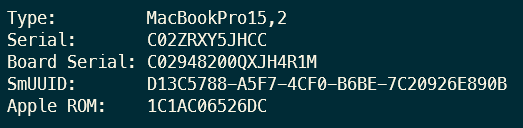

# 해킨토시 - 윈도우 랩탑에 MAC OS 설치 

> **Summary**
> 윈도우 랩탑에 MAC OS를 설치하는 방법에 대한 가이드로, 해킨토시 설치를 위한 다양한 방법과 리소스를 제공한다. 사용자는 부품 선택, 웹 검색, 해외 가이드를 참고하여 설치를 진행할 수 있으며, DELL XPS 13 9360 및 Lenovo T480과 같은 특정 모델에 대한 설치 팁과 링크도 포함되어 있다.

---

🔗 [https://dortania.github.io/OpenCore-Install-Guide/](https://dortania.github.io/OpenCore-Install-Guide/)

# 해킨토시?

🔗 [https://x86.co.kr/info/8113851?member_srl=7679385](https://x86.co.kr/info/8113851?member_srl=7679385)

🔗 [https://x86.co.kr/info/7955721?member_srl=7679385](https://x86.co.kr/info/7955721?member_srl=7679385)

🔗 [https://x86.co.kr/info/7677040?member_srl=7679385](https://x86.co.kr/info/7677040?member_srl=7679385)

가장 쉬운 방법은 해킨빌드 게시판에서 글을 읽어보시고 따라하실 수 있는 글을 선택하십니다.

그리고 그것과 같은 부품으로 조립하시고, 그 빌드에 사용된 파일을 그대로 사용하시면 됩니다.

방법 1. 해킨정보/ 해킨빌드/해킨자료 실에서 팁과 후기글을 참고 합니다.

[엑스팔육 : EFI빌드 - 1 페이지 (x86.co.kr)](https://x86.co.kr/?_filter=search&act=&vid=&mid=efi&category=&search_target=title_content&search_keyword=a320mh)

방법2. 본인의 메인보드와 cpu등으로 웹검색 합니다.

방법3. 해외 사이트 가이드를 참고합니다.

ex) dortania's opencore guide

🔗 [https://jgtonys.github.io/hackintosh/2019/04/20/laptop-to-mac/](https://jgtonys.github.io/hackintosh/2019/04/20/laptop-to-mac/)

🔗 [https://www.clien.net/service/board/park/17614418](https://www.clien.net/service/board/park/17614418)

🔗 [https://x86.co.kr/efi](https://x86.co.kr/efi)

🔗 [https://www.youtube.com/watch?v=t_UBVy3zCAc&t=47s](https://www.youtube.com/watch?v=t_UBVy3zCAc&t=47s)

🔗 [https://www.youtube.com/watch?v=GGy3V3YT6tI](https://www.youtube.com/watch?v=GGy3V3YT6tI)

🔗 [https://youtu.be/dnr-b_hQWGM?si=rPj-jws-VZc4LxK7](https://youtu.be/dnr-b_hQWGM?si=rPj-jws-VZc4LxK7)

### DELL XPS 13 9360

[9360은 kaby lake다!](https://ark.intel.com/content/www/us/en/ark/products/97540/intel-core-i7-7560u-processor-4m-cache-up-to-3-80-ghz.html)

🔗 [https://youtu.be/3PNBbmWnEqk?si=ae1IazihJ3ZMWwQs](https://youtu.be/3PNBbmWnEqk?si=ae1IazihJ3ZMWwQs)

🔗 [https://github.com/theQuert/XPS-9360-macOS](https://github.com/theQuert/XPS-9360-macOS)

🔗 [https://blog.naver.com/dladsds123/221449268758](https://blog.naver.com/dladsds123/221449268758)

🔗 [https://www.reddit.com/r/hackintosh/comments/hporlr/perfectly_working_xps_9360_big_sur_hack/](https://www.reddit.com/r/hackintosh/comments/hporlr/perfectly_working_xps_9360_big_sur_hack/)

🔗 [https://x86.co.kr/index.php?_filter=search&act=&mid=efi&category=&search_target=title_content&search_keyword=dell+xps&document_srl=5798033](https://x86.co.kr/index.php?_filter=search&act=&mid=efi&category=&search_target=title_content&search_keyword=dell+xps&document_srl=5798033)

🔗 [https://x86.co.kr/index.php?_filter=search&act=&mid=efi&category=&search_target=title_content&search_keyword=dell+xps&document_srl=4862772](https://x86.co.kr/index.php?_filter=search&act=&mid=efi&category=&search_target=title_content&search_keyword=dell+xps&document_srl=4862772)

🔗 [https://www.tonymacx86.com/threads/guide-dell-xps-9360-ventura-opencore.325299/](https://www.tonymacx86.com/threads/guide-dell-xps-9360-ventura-opencore.325299/)

🔗 [https://www.google.com/url?q=https://github.com/SummerEmber/DELL-XPS13-9360&sa=U&ved=2ahUKEwim2d6vobKCAxWjdPUHHVRTJUUQFnoECAoQAQ&usg=AOvVaw2h9oO3_vI6F9sNFh21vPic](https://www.google.com/url?q=https://github.com/SummerEmber/DELL-XPS13-9360&sa=U&ved=2ahUKEwim2d6vobKCAxWjdPUHHVRTJUUQFnoECAoQAQ&usg=AOvVaw2h9oO3_vI6F9sNFh21vPic)

MAC OS 13

🔗 [https://youtu.be/lEBk_i6on2E?si=0uv4qz5Hh72YlidY](https://youtu.be/lEBk_i6on2E?si=0uv4qz5Hh72YlidY)

🔗 [https://www.youtube.com/watch?v=Ybr4tT9rVkg](https://www.youtube.com/watch?v=Ybr4tT9rVkg)

🔗 [https://www.youtube.com/watch?v=r-o6OK8Q9hI](https://www.youtube.com/watch?v=r-o6OK8Q9hI)

MAC OS 14

🔗 [https://www.youtube.com/watch?v=BRqFtjJY9gU&t=188s](https://www.youtube.com/watch?v=BRqFtjJY9gU&t=188s)

### T480

램 업그레이드

🔗 [https://www.youtube.com/watch?v=Zcd9qih1120](https://www.youtube.com/watch?v=Zcd9qih1120)

🔗 [https://www.youtube.com/watch?v=sS5BTeHX8r8](https://www.youtube.com/watch?v=sS5BTeHX8r8)

🔗 [https://ko.ifixit.com/Guide/Lenovo+ThinkPad+T480+RAM+Replacement/139943](https://ko.ifixit.com/Guide/Lenovo+ThinkPad+T480+RAM+Replacement/139943)

해킨토시

🔗 [https://github.com/valnoxy/t480-oc](https://github.com/valnoxy/t480-oc)

> 💡 **ROM**
> ---
>
> 1C1AC065 26DC
>
>

🔗 [https://www.youtube.com/watch?v=ehuaKpVLwhw](https://www.youtube.com/watch?v=ehuaKpVLwhw)

🔗 [https://www.youtube.com/watch?v=thYDWyJuUq4](https://www.youtube.com/watch?v=thYDWyJuUq4)

🔗 [https://www.youtube.com/watch?v=t_UBVy3zCAc&t=870s](https://www.youtube.com/watch?v=t_UBVy3zCAc&t=870s)

트랙패드 감도 좋게

🔗 [https://www.youtube.com/watch?v=s5ehk9RletA](https://www.youtube.com/watch?v=s5ehk9RletA)

